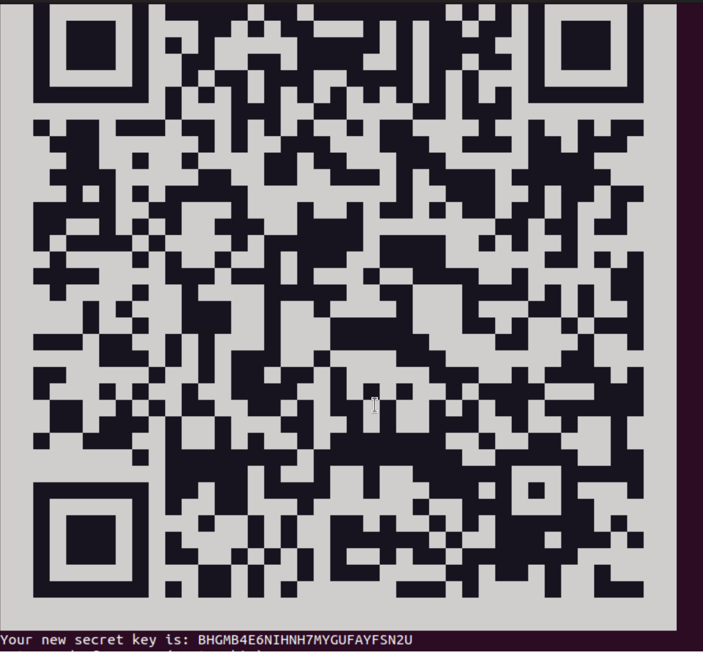

# Implementing Security Controls For Devices

### Objectives

Password algorithm - Create a unique algorithm that makes a secure password, replacing the original, weak password "ubuntu"

  ##### Principles for Secure Password

     - length
     - unpredictability
     - entropy
     - making sure it is memorable
     - special characters
     
MFA installation - Install MFA (pam_google_authenticator) and verify it via SSH

Patching Sequence - Keep ubuntu secure by patching and updating software. Understand the benefits of updating and the risks of not updating especially for places like schools or hospitals.

NIST/OWASP guidlines - NIST/OWASP guidlines are practices developed by the National Institute Standards and Technology, and Open Web Application Security Project to help protect systems and prevent systems from having security risks. 

### Notes on Password Entropy

Link: https://docs.google.com/document/d/1TeFBieNnrw9kggYTQZFMGe3J8r8IhxLfDrKi_XJu3Ow/edit?tab=t.0

These notes covered the keys to making a secure password, as well as the componenets that make up a weak password. 

## Password Algorithm Design

The original password for Ubuntu was "ubuntu". As you can tell in the notes and the NISt guidlines which were linked below, this is not a very secure password. So, a password algorithm was designed that would follow the notes and NIST guidlines to make the VM/ubuntu more secure.

My Password Algorithm

	•	Go to the online dictionary
	•	Scroll until you want to stop
	•	Pick a random word
	•	Repeat 4 times
	•	Put the words together and make every other letter upper case
	•	In between each word put a number 1–10
	•	Put a special character at the end

NIST Guidlines: https://www.nist.gov/cybersecurity/how-do-i-create-good-password

The algorithm created follows the NIST guidlines by creating a password that focuses on length, unpredictability, and memorability rather than complexity. The algorithm ensures that the password is not easy to guess and is not something like "password".

## Changing Password Ubuntu

After creating the password, the next step was to actually change the password in ubuntu from "ubuntu" to the new one created, "Book1Story2Page3Word4!!" which follows the NIST guidlines and is more secure.

Original: ubuntu

New: Book1Story2Page3Word4!!

This new password followed the algorithm created except instead of randomly scrolling in the dictionary I picked 4 words that I could think of, and made sure they were similar to eachother. This was done to save more time, as well as make the password more memorable.

   #### Steps to changing password

   1. Log in
      - Username: ubuntu
      - Password: ubuntu

   2. Open terminal

   3. Change password
      ```passwd```
      (current password: ubuntu)
      (new password: your strong password)

   4. Test with sudo
      ```sudo ls /root```

   5. Create new user
      ```sudo adduser yourname```
      ```sudo usermod -aG sudo yourname```

   6. Lock default user
      ```sudo passwd -l ubuntu```

      The result is that the password was changed from ubuntu to the one I had created using the algorithm (Book1Story2Page3Word4!!)

   #### Changing Passwords in Ubuntu Screenshots

    Step 3
    Step 4


## MFA Installation in Ubuntu

Implementing a secure password is not the only way to make a device more secure. An additional security feature is the introduce MFA, which stands for Multi Factor Authentication. This means that not only is there a password keeping the device secure, but a second factor such as an email confirmation, text, etc... This next step was to enable MFA in addition to the already secure password. 

#### Steps and Commands

1. Log in as the admin account
    Username: ubuntu
    Password: ubuntu

2. Test sudo
```sudo ls /```

3. Add your student account to sudoers
```sudo usermod -aG sudo yourusername```
```sudo reboot```

Log in as your own account and test
sudo ls /

#### MFA (pam_google_authenticator) installed and verified via SSH

4. Install Google Authenticator
```sudo apt update```
```sudo apt install libpam-google-authenticator -y```

google-authenticator answer prompts:
 Time-based tokens: y
 Update .google_authenticator file: y
 Disallow multiple uses: y
 Enable rate-limiting: y

5. Enable MFA for SSH login
sudo nano /etc/ssh/sshd_config
 Change/add:
 KbdInteractiveAuthentication yes
 UsePAM yes
 PasswordAuthentication yes  (if needed)
 ```sudo systemctl restart ssh```

sudo nano /etc/pam.d/sshd
 Add at top:
 auth required pam_google_authenticator.so
```sudo systemctl restart ssh```

6. Test SSH login with MFA
```ssh yourusername@localhost```
 Enter your Ubuntu password
 Enter 6-digit verification code from authenticator

#### Common Issues Fix

7. Fix common issues
 If nano is missing
```sudo apt update```
```sudo apt install nano -y```

 If verification code rejected, check system clock
```timedatectl status```

### MFA Installation Screenshots

    Step 2
    Step 4

## Patches in Ubuntu

After implementing MFA, there was still outdated software on the computers. The issue with outdated software is that it makes devices more vulnerable to hackers since they know how to exploit outdated software. So the final step was to get this software up to date which made the devices even more secure in addition to the updated password and MFA.

- Check for available updates
```sudo apt update```
```sudo apt list --upgradable```

- Apply updates
```sudo apt upgrade```

- View update history
```cat /var/log/apt/history.log```

- Search update logs by date
```grep "YYYY-MM" /var/log/apt/history.log```

- See installed or updated packages
```grep "Install:" /var/log/apt/history.log```

- Count installation events
```grep "Install:" /var/log/apt/history.log | wc -l```

- View most recent install
```grep -A 2 "Start-Date" /var/log/apt/history.log | tail -n 10```

- Search for a specific program/package
```grep "nano" /var/log/apt/history.log```
```grep "firefox" /var/log/apt/history.log```
```grep "google-authenticator" /var/log/apt/history.log```

- Check the most recent log entries
```tail -n 20 /var/log/apt/history.log```

- Check automatic update schedule
```ls -l /var/lib/apt/periodic/```

Note: There was an issue with the computer, so for the step asking for a screenshot of the most recent update, there was no way to show that and the only one that could be shown was an update from september.

### Patches in Ubuntu Screenshots 

 Step 1
 Step 4 
 Step 6
 Step 7
 Step 8
 Step 9
 Step 10


# Reflection

The overall goal of this project was to strengthen device security by creating secure passwords, enabling MFA (Multi Factor Authentication), and patching system softwares. These measures help to prevent, or atleast minimize common attack points that hackers may try to exploit like weak passwords, single layered authentication, and outdated software. The password algorithm emphasized the importance of creating secure passwords through unpredictability and length. Creating an algorithm allows for a way to make a more secure and memorable password. MFA installation built off of this by making sure the only layer of securing was a password, but also a secondary layer like an email verification. By doing this, it provides extra security if a passowrd was leaked or if it was guessed. System patching aimed to minimize vulnerabilites that hackers take advanateg of through outdated software. This is important especially for computers that have sensitive data like hospitals or schools. Overall all three components helped to make devices more secure by minimizing the most common ways that hackers access systems and user info. The password algorithm aligned with NIST guidlines because it emphasized entropy and length, and patching supported OWASP recomendations for trying to limit or fix known vulnerabilities. 
