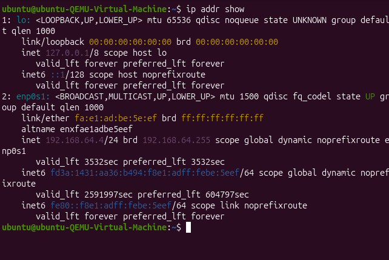
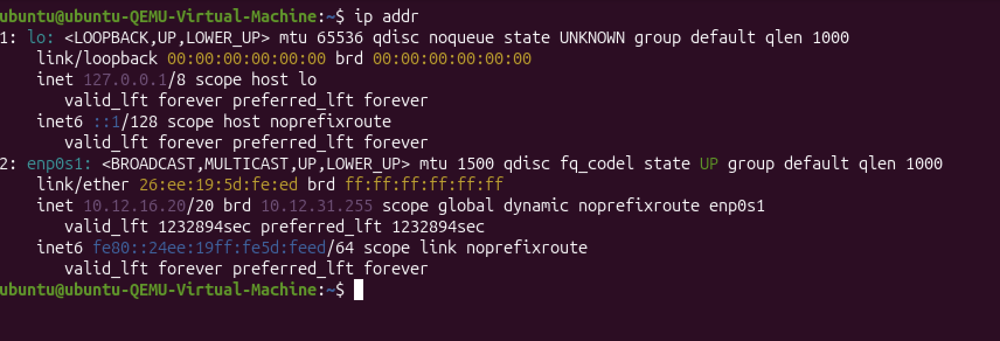
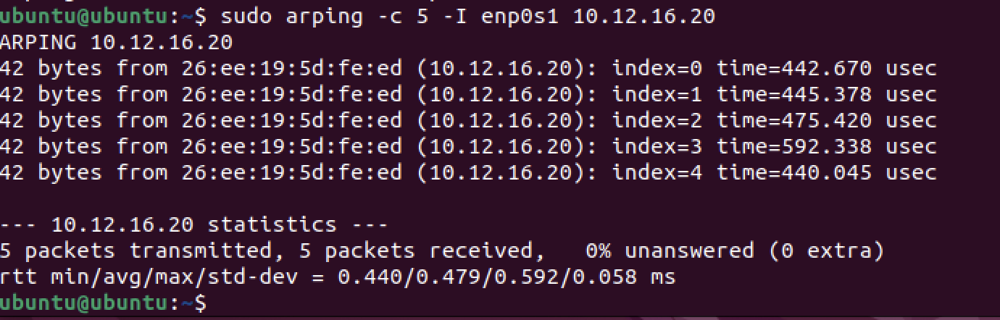
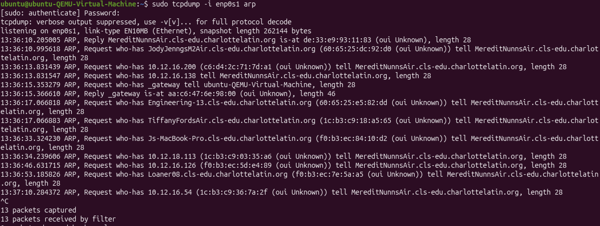
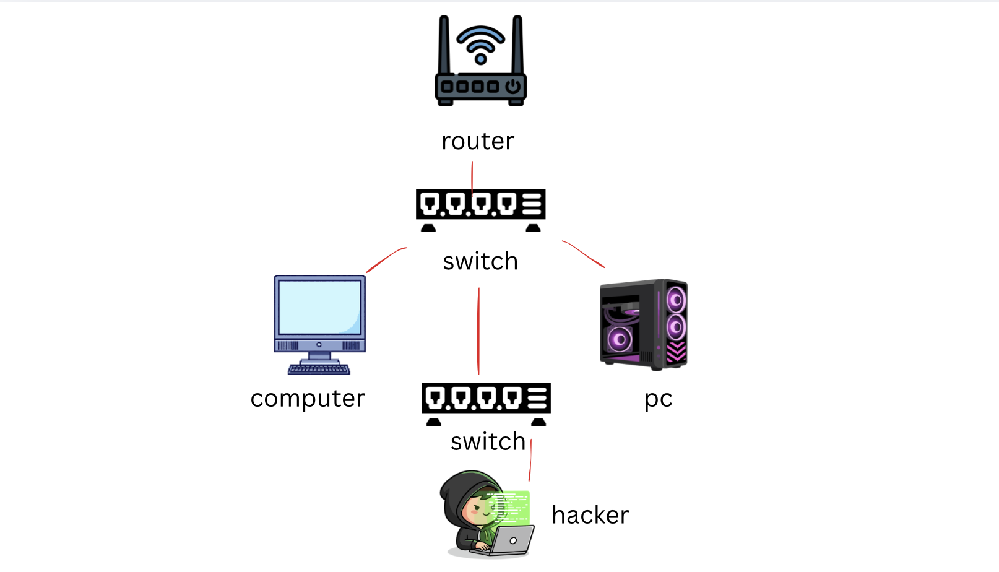
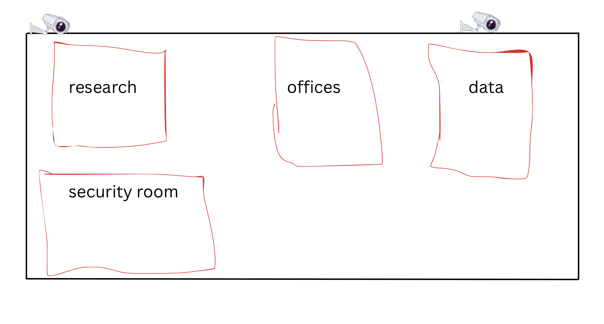

# Common Security Controls in a LAN

In the previous lesson, you explored how Ubuntu configures its network interfaces behind the scenes and practiced assigning and verifying a static IP address using Netplan. That work gave you a foundation in how devices identify themselves on a network and how addressing affects communication. In this new lesson series, we are shifting from how devices are assigned addresses to how those devices—and the network they operate on—are protected from threats inside a LAN.

Just like the last assignment, you will learn through hands-on investigation, guided discovery, and independent practice using your Ubuntu and Linux VMs. There will be no traditional lectures—instead, you will uncover how LAN attacks work by examining your own system outputs, analyzing real network behaviors, and collaboratively determining how different security controls prevent misuse.

Across the next several class periods, you will:
- Identify common internal LAN threats such as ARP spoofing, MAC flooding, rogue DHCP servers, unauthorized plug-in devices, and lateral movement.
- Analyze technical, administrative, and physical security controls used in modern networks.
- Practice a structured “Threat → Control” analysis to justify security decisions.
- Use command-line tools in your VMs to observe reconnaissance behavior and determine how VLAN segmentation, port security, DHCP snooping, and 802.1X limit attackers.
- Consider how physical access influences the security of network devices, wiring closets, and switches.

## Initial Reflection Questions (Digital Portfolio)

Write a paragraph responding to:
1. Which device inside a LAN would be the easiest for an attacker to compromise, and why?
2. Does proximity equal safety? How much can a device ‘see’ inside a LAN?

The device most likely to be compromised inside a LAN is a user workstation or other endpoints that are not really managed. These systems want to be easier to use for the user as opposed to being more complicated, and often accept network configuration details without verifying whether they are secure or where they come from. If an attacker gains access to the same LAN, they can take advantage of this trust that was automatically given and intercept traffic or impersonate network services. Physical closeness itself does not make a network safe because once connected, a device can receive broadcast traffic and communicate with nearby systems. Without controls like VLAN segmentation or authentication, devices could have a lot more visibillity than what it actually wanted to have.

## Threat Discovery Rotation Using Cards or Digital Tiles

Today you will work with a partner to investigate how internal LAN threats reveal themselves through symptoms observed on a network. Each scenario describes a real issue a network administrator might notice, but none of them give you the threat name.

Your job: analyze clues, draw conclusions, and support your reasoning with evidence.

Read this entire document before starting.

## Rotation Overview

You and your partner will rotate through five scenarios, each with:
- Observed symptoms
- Guiding questions
- Space for notes and reasoning

## Steps for Each Scenario

### Step 1 — Read
Read the symptoms carefully. Identify patterns.

### Step 2 — Discuss (with your partner)
- What do you think is happening?
- Why? Which symptoms support your idea?

### Step 3 — Digital Portfolio Entry

Create a section titled **“LAN Threat Scenario Rotation.”**

Add a table with these columns:

| Scenario Letter | Symptoms (Summary) | Your Hypothesis | Your Justification |
|-----------------|-------------------|----------------|-------------------|
| A | Default gateway does not match the actual router | ARP manipulation | A not matching gateway could mean data is being altered |
| B | Switch CPU spikes, thousands of MACs appear on one port | MAC flooding attack | An unusually high number of MAC addresses on one port could mean a mac flooding attack |
| C | Clients recieve network settings from an unknown DHCP source | Rogue DHCP server | Receiving IP settings from an unexpected source suggests unauthorized DHCP |
| D | New device appears inside the broadcast domain and communicates broadly | Unauthorized internal device | Broad communication without restriction points to weak access enforcement |
| E | A host reaches internal systems it should not access | Lateral movement | Accessing restricted systems implies internal trust is being abused |

Fill in all columns for each scenario.

## Important Notes
- Correct threat names will be revealed later.
- Focus on reasoning, not accuracy.
- Use your knowledge of ARP tables, DHCP, MAC learning, routing, etc.

## Group Comparison Discussion

After completing all scenarios, meet with another pair.

Discuss the following scenarios:
- Scenario A: A device suddenly receives the wrong gateway.
- Scenario B: Switch CPU spikes; many MAC addresses appear on one port.
- Scenario C: Clients receive IPs from an unexpected source.
- Scenario D: An unknown device appears inside the broadcast domain.
- Scenario E: A host reaches internal hosts it should never reach.

Compare:
- What threat each scenario might represent
- Which symptoms led you to your conclusion
- Differences in reasoning

### Guiding Questions
- What patterns did I notice?
- Misconfiguration or attack?
- What trust assumptions are being exploited?

## Digital Portfolio Requirement — Group Activity

After the “Group of Four” discussion, update “LAN Threat Scenario Rotation” with a reflection (5–7 sentences) addressing:
1. Which original hypotheses you feel confident about
2. Which scenario was hardest to interpret
3. How another pair influenced your thinking
4. Patterns you noticed across scenarios

The strongest conclusions apply to Scenarios B and C because their symptoms closely align with how switches and DHCP normally operate when not used as intended. Scenario D was the most difficult to interpret because i felt like a similar result could happen because of other things. A clear pattern across all scenarios is that most problems originate inside of a network rather than outside of it. Many threats resemble normal network behavior, making them difficult to identify. This highlights the importance of internal security controls on local area networks and what would happen without them.

## VM-Based Threat Evidence Hunt

You will now gather real LAN evidence using both VMs.

### VMs Used
- VM #1 — Ubuntu Desktop: typical workstation perspective
- VM #2 — Linux Server VM: infrastructure/server perspective

## Task A — Observe How Devices Learn About the LAN

### Step 1 — Commands to Run (Ubuntu VM)
Run and screenshot:
- ip addr show
- arp -a
- ip neigh
- ip route show

  

### Step 2 — Identify
- Your subnet
- Your default gateway
- Visible hosts
- ARP / neighbor table entries
- Patterns about how devices learn about other hosts

### Step 3 — Portfolio Entry
Add a section: **“Task A — LAN Observation”**, including:
1. Screenshot showing other hosts (ARP/neighbor/routing).
2. Reflection (2–3 sentences):  
How could an attacker misuse this information?

This information allows an attacker to map out the local network and identify important systems like the default gateway and active hosts. ARP and neighbor tables expose the relationship between IP and MAC addresses, which could be exploited to impersonate trusted devices. Routing details also show where traffic flows, helping an attacker decide where to intercept or disrupt communication.

## Task B — Evidence-to-Threat Analysis

### Threat list:
- ARP Spoofing
- MAC Flooding
- Rogue DHCP Server
- Unauthorized Plug-In Device
- Lateral Movement

### Step 2 — Choose Two Pieces of Evidence

Examples:
- ARP entries
- Gateway identity
- Neighbor table info
- Visible hosts
- Routing info

### Step 3 — Portfolio Entry
Create **“Task B — Evidence-to-Threat Analysis.”**

Add this table:

| Evidence from Your VM | Possible Threat Enabled | Why? (Your Explanation) |
|----------------------|------------------------|--------------------------|
| Default gateway shown in ip route show: [gateway IP] | ARP Spoofing | Knowing the gateway allows an attacker to impersonate it by sending forged ARP responses |
| ARP/neighbor entry: [gateway IP → gateway MAC] | ARP Spoofing | ARP trusts updates without verification, making it easy to hack |
| Visible hosts from arp -a / ip neigh: [list 2–4 IPs] | Rogue DHCP Server | Seeing nearby systems helps an attacker select targets after compromise |
| Multiple MACs learned on one port | Unauthorized plug in device | A lot of Mac addresses could mean too many people are on a port |

Guiding questions:
- What could an attacker change here?
- What trust does the LAN rely on?

## Task C — Mini-Simulation Without Tools

Choose one threat:
- ARP Spoofing
- MAC Flooding
- Rogue DHCP Server
- Unauthorized Plug-In Device
- Lateral Movement

### Step 2 — Partner Discussion Questions
1. What does the attacker need to know first?  
The attacker needs to identify key network details such as the default gateway and active hosts on the LAN.

2. Which device(s) would be targeted?  
A victim workstation and a network infrastructure device like the router or gateway are typically targeted.

3. What would a victim notice (if anything)?  
The victim might experience slower connections, brief outages, or no noticeable symptoms if traffic is forwarded normally.

4. Which VM resembles the impersonated device, and why?  
The Linux Server VM (VM #2) reflects an infrastructure perspective similar to a gateway, while the Ubuntu Desktop VM (VM #1) represents an end-user system.

### Step 3 — Portfolio Entry
Create: **“Task C — Threat Mini-Simulation.”**

Include:
- Chosen threat
- Answers to all four questions
- A 3–4 sentence summary explaining how the threat abuses normal LAN behavior

ARP spoofing succeeds because devices on a LAN accept ARP messages without really validating their authenticity. An attacker can send fake ARP replies that associate their MAC address with the gateway’s IP address. Once the ARP table is poisoned, traffic is redirected through the attacker’s system. This works because ARP is designed to be efficinet and does not have strong security for verification.

### Step 4 — Pair Discussion
Share key reasoning and compare similarities/differences.

## Portfolio Wrap-Up — Homework

To conclude, add the following to your portfolio.

### Part 1 — Screenshots From Both VMs

Add:
- One screenshot from VM #1  
It shows active hosts, the default gateway, and IP-to-MAC mappings. This information could be used to identify targets or impersonate trusted devices.

- One screenshot from VM #2  
It highlights infrastructure-level communication and trusted network relationships, helping attackers understand how traffic moves through the LAN.

### Part 2 — Five Common Internal LAN Threats

Create a section: **“Five Common Internal LAN Threats.”**

For each threat, include:
- Plain-language explanation
- One sentence describing how it abuses LAN trust

#### ARP Spoofing
- Explanation: A device sends fake ARP messages to impersonate another system.
- LAN Trust Abuse: Devices accept ARP updates without checking their legitimacy.

#### MAC Flooding
- Explanation: A switch is overwhelmed with fake MAC addresses.
- LAN Trust Abuse: Switches assume MAC learning on ports is legitimate.

#### Rogue DHCP Server
- Explanation: An unauthorized device hands out incorrect network settings.
- LAN Trust Abuse: Clients accept the first DHCP response they receive.

#### Unauthorized Plug-In Device
- Explanation: An unknown system connects directly to the network.
- LAN Trust Abuse: Open network ports allow devices to join without authentication.

#### Lateral Movement
- Explanation: An attacker moves from one internal system to others.
- LAN Trust Abuse: Internal systems often trust each other by default.

### Part 3 — Final Reflection

Write 3–4 sentences responding to:
“Which internal LAN threat do you believe is the most difficult for a network administrator to detect, and why?”

ARP spoofing is hard to detect because it blends into normal network activity. ARP tables change frequently during actual use, which can hide malicious updates. Evidence from ARP and neighbor tables shows how easily mappings can be altered. This demonstrates how normal LAN behavior can conceal attacks.

## Hands-On Lab — Observing ARP Requests and Replies (Bridged Mode)

Required Network Configuration (DO NOT SKIP)
- VM #1 (Ubuntu Desktop): Bridged
- VM #2 (Linux Server): Bridged

Both VMs must be bridged to the same physical network adapter.  
If the VMs are not bridged, ARP replies may not occur.

STEP 1 — Identify Network Information on VM #2 (Linux Server)

You must first determine the target information from VM #2.  
On VM #2, open a terminal and run:

ip addr
ip route

STEP 2 — Start ARP Packet Capture on VM #2

On VM #2, start listening for ARP traffic:

sudo tcpdump -i arp

sudo tcpdump -i enp0s1 arp

Important Rules (READ CAREFULLY)
- Replace with your actual interface name
- Do NOT include IP addresses in this command
- arp is the only filter you should use

If the command is correct, you will see:  
listening on enp0s1, link-type EN10MB (Ethernet)

STEP 3 — Generate ARP Requests from VM #1 (Ubuntu Desktop)

Switch to VM #1.

Run the following command, targeting the IP address of VM #2:

sudo arping -c 5 -I Example: sudo arping -c 5 -I ens33 172.16.110.132

What This Does
- VM #1 broadcasts ARP requests asking: “Who has <VM #2 IP>?”
- VM #2 responds with its MAC address

What You SHOULD See

On VM #1 (arping)
- ARP request messages
- ARP reply messages
- MAC address of VM #2
- Final statistics showing packets transmitted and received

On VM #2 (tcpdump)
- ARP requests arriving from VM #1
- ARP replies sent back to VM #1
- IP-to-MAC associations displayed

Typical output may look like:

ARP, Request who-has 172.16.110.132 tell 172.16.110.101
ARP, Reply 172.16.110.132 is-at aa:bb:cc:dd:ee:ff

If You See an Error Message

Error:

tcpdump: can’t parse filter expression: syntax error

Cause:
- You included an IP address in the tcpdump command
- You typed placeholder brackets < >

Fix:
Use only: sudo tcpdump -i arp

Written Analysis (Required)

Write a well-developed paragraph answering the following:
- What information does ARP reveal about devices on a LAN?
- Why does ARP assume devices are trustworthy?
- How does this make ARP vulnerable to spoofing?
- Why was Bridged mode required for this lab to work?

ARP reveals the relationship between IP addresses and MAC addresses on a local network. It assumes devices are trustworthy because it does not include any built-in verification mechanism. This allows attackers to send forged ARP responses that redirect traffic. Bridged mode was required so both VMs existed on the same broadcast domain and could exchange ARP traffic.

## In-Class “Mini-Project” — Visualizing an Internal LAN Attack

You will create a clean, neatly constructed diagram illustrating how an internal LAN attack can occur when no security controls are in place. This assignment helps visualize the flow of information during an attack and demonstrates your understanding of how LAN vulnerabilities are exploited.

You may complete your diagram digitally (using a diagram-making site) or by hand (uploading a clear photo or screenshot). If drawn by hand, it must be neat, labeled, and easy to read.

### Approved Diagram Tools (Choose One)
- Google Drawings
- Lucidchart
- Canva
- Figma
- Diagrams.net (formerly draw.io)
- Microsoft PowerPoint or Google Slides

Your final diagram must be exported as a screenshot and uploaded to your digital portfolio.

### What Your Diagram Must Include

#### 1 Devices Involved
- VM #1 (Workstation)
- VM #2 (Server-like device)
- Switch
- Default gateway or router

#### 1 One Internal LAN Threat (Choose One)
- ARP Spoofing
- MAC Flooding
- Rogue DHCP Server
- Unauthorized Plug-In Device
- Lateral Movement

#### 1 Sequence of Events
Use arrows or numbered steps (3–5 steps minimum) to show:
- What the attacker sends
- How the switch responds
- How victim devices are affected
- Where the LAN’s trust assumptions fail

#### 1 Annotations
- Label each major component
- Add brief, clear explanations
- The diagram should make sense to someone who did not complete the lab

### Digital Portfolio Requirements

Create a section titled **“LAN Attack Path Diagram (Homework)”** and include:
- Your completed diagram  
Upload the image, PDF, or photo.

- A thorough explanation addressing:
  - Why this attack succeeds when no internal security controls are present
  - Which security control introduced in today’s reading would stop this attack
  - How that control prevents the attack from progressing

Your explanation should connect directly to concepts from today’s reading:
- Port Security
- VLAN Segmentation
- DHCP Snooping
- Dynamic ARP Inspection (DAI)
- Access Control Lists (ACLs)

### Expectations
The diagram must be:
- Neatly organized
- Clearly labeled

## LAN Attack Path Diagram (Homework)

### Diagram 


### Explanation

The diagram shows that there are two switches where a hacker can send arp messages without them being verified. This attack works because devices within the LAN automatically trust ARP traffic without validating where the source of it is. The attacker exploits this by sending ARP messages that mislead the user into sending traffic to the attacker or hacker instead of the actual gateway. Since this looks identical to normal arp communication, it is accepted without any problems

Dynamic ARP Inspection would prevent this attack by validating ARP messages against trusted IP to MAC bindings and blocking incorrect responses. VLAN segmentation would also reduce the impact by limiting how many devices the attacker could interact with. Together, these controls stop the attack before traffic can be redirected.

---

Enterprise Physical Security Threat Analysis

Here’s a rundown of the main physical security gaps you’ll find in pharmaceutical research settings. Each point spells out a weakness straight up, not a fix.

1. Unauthorized Access to Research Laboratories
   
People without the right clearance can walk into labs and research spaces. It happens in labs, testing rooms, and places where experiments get developed. That’s a problem because these areas hold sensitive drug data, intellectual property, and regulated materials. If someone gets in than there could be theft.

2. Poor Separation Between Public and Restricted Areas
   
There’s not always a clear line between public spaces and secure research zones. so some people who might be in a public area and accidentally walks i to a place that only people who need to be there should be allowed to be. This is a big security issue if these areas arent separated since people could mess something up or be somewhere they shouldnt be without even knowing.

3. Weak Physical Security for Server and Data Rooms
   
Server and network rooms don’t always have strong physical controls. It is important to have physical security because if it were something that could be controlled remotely, then it could be hacked.

4. Bad Visitor ID and Escort Processes

Sometimes visitors aren’t properly checked in or watched by trusted people. You could make sure to have IDs for each employee, or maybe something like a face scanner so that the person could be verified that they are who they say they are.

5. Poor Monitoring of Storage

Storage areas don’t always have enough security so it is important to have people guarding these areas, because if someone stole something like research documents or haxardous materials it could be a major security risk.

6. Incomplete Surveillance in Key Interior Areas

Surveillance cameras often do not cover everything inside a building. Security cameras need to have a 360 view so that no area is missed, and someone who may know about these areas cannot avoid them.

## Physical Security Plan — Pharmaceutical Research Facility

This physical security plan uses a layered defense approach to protect people, data, and infrastructure.

### 1. Environmental Controls
- Redundant cooling systems with automated alerts
- Leak detection sensors beneath raised floors
- Backup power supplies with controlled shutdown procedures
- Sealed equipment racks to reduce dust exposure  

**Protection Provided:**  
These controls reduce the risk of hardware failure, unexpected downtime, and data loss caused by environmental conditions.

### 2. Access Control
- Smart ID badges tied to employee roles
- Time-based access permissions for sensitive areas
- Emergency lockout capability for critical rooms
- Clearly defined security zones with escalating restrictions  

**Protection Provided:**  
Access controls ensure only approved individuals can enter sensitive spaces and limit movement within the facility.

### 3. Surveillance and Detection
- Continuous camera monitoring with motion analytics
- Real-time alerts for unauthorized access attempts
- Centralized security operations dashboard  

**Protection Provided:**  
Monitoring systems deter misuse and allow security teams to quickly detect and respond to incidents.

### 4. Hardware Security
- Lockable server racks with tamper alerts
- Secured wiring closets with restricted access
- Physically blocked unused network ports
- Organized cable management to prevent accidental disconnections  

**Protection Provided:**  
These controls prevent physical tampering, unauthorized device connections, and service disruptions.

### 5. Personnel and Procedures
- Mandatory visitor check-in and escort policies
- Quarterly access audits and badge reviews
- Ongoing security training for employees
- Formal approval process for installing or removing equipment  

**Protection Provided:**  
Clear procedures reduce mistakes and ensure physical security measures are consistently enforced.

## Digital Physical Security Diagram

This diagram demonstrates how physical security supports network and cybersecurity by controlling access, and monitoring activity. Strong physical controls ensure that technical security measures remain effective and trustworthy in a pharmaceutical research environment.

## Risk Justification and Priority Controls

The highest priority physical controls are access control, surveillance, and hardware security. These measures directly reduce the risk of theft and data compromise. The security cameras make sure to gather evidence in case someone robbed a store or something.

Physical security also reinforces things like network segmentation, access control lists, and monitoring systems. When infrastructure is physically protected, attackers cannot bypass defenses by plugging in rogue hardware or accessing exposed ports. Strong physical security ensures technical safeguards remain reliable across the enterprise. If you did not have physical security, you always could be risking something but having a physical way for it to be secure means that nothing could happen from somewhere else.

## Conclusion

Physical security is a very important l requirement for both network security and cybersecurity. Without effective physical protections, technical controls can be bypassed or just not effective at all. A layered physical security strategy protects people, data, and infrastructure while supporting secure and reliable network operations, and if you did not have a layered one than you risk being attacked and are a lot more vulnerable, so it is important for mitigating risks.
