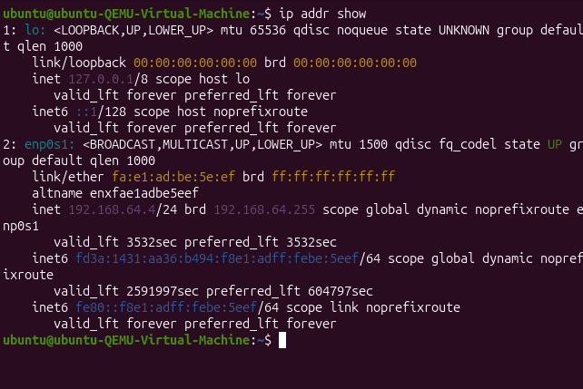
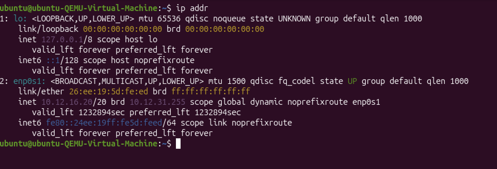
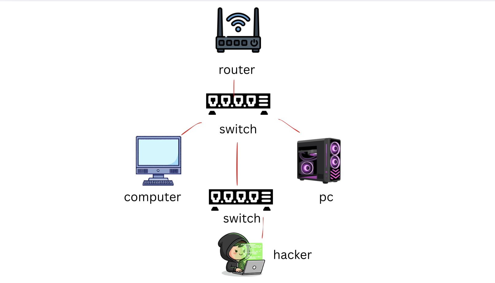
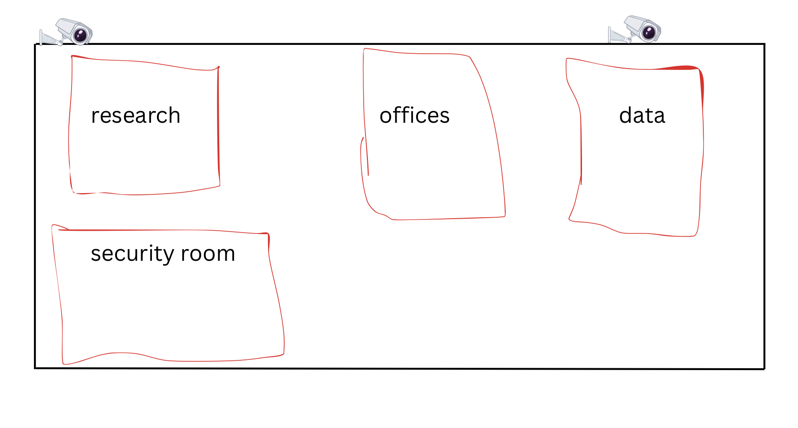

# Common Security Controls in a LAN

---

## 1. Planning & Conceptual Understanding

### Initial Reflection — Internal Trust and LAN Exposure

In a typical local area network, the device most likely to be compromised is a standard user workstation or unmanaged endpoint. These systems are optimized for ease of use rather than strict verification of network information. As a result, they automatically trust services such as ARP and DHCP to provide accurate addressing and routing details. If an attacker gains access to the same LAN, they can exploit this implicit trust to impersonate infrastructure devices or quietly observe internal traffic.

Being physically close to a network does not imply safety. Once connected, a device can receive broadcast traffic and participate in discovery protocols that reveal nearby hosts, gateways, and routing behavior. In flat LAN designs, this visibility expands significantly, allowing devices to see more of the network than intended. This demonstrates a fundamental weakness of internal networks: trust is assumed by default, making internal threats especially dangerous without segmentation and access controls.

---

### LAN Threat Scenario Rotation — Hypothesis Development

| Scenario | Symptoms (Summary) | Hypothesis | Justification |
|--------|-------------------|------------|---------------|
| A | Default gateway suddenly incorrect | ARP manipulation | Gateway information changing suggests traffic redirection |
| B | Switch CPU spike; many MACs learned on one port | MAC flooding | Excessive MAC learning forces broadcast behavior |
| C | Clients receive IP settings from unknown source | Rogue DHCP | DHCP clients accept the first valid offer |
| D | New device communicates broadly | Unauthorized internal device | Lack of port controls allows wide visibility |
| E | Host accesses restricted systems | Lateral movement | Internal trust enables unintended access |

---

### Group Reflection

The strongest conclusions were drawn from Scenarios B and C because their symptoms closely align with known switch and DHCP behaviors when abused. Scenario D proved the most difficult to interpret, as similar network behavior could also result from misconfiguration rather than malicious intent. Discussion with another group emphasized that many LAN threats rely on abusing trust instead of exploiting obvious vulnerabilities. Across all scenarios, a clear pattern emerged: internal threats are harder to detect because they resemble normal traffic. This reinforces the importance of internal monitoring and segmentation.

---

## 2. Technical & Security Development

### Task A — LAN Observation

**Evidence**

**Reflection**

ARP and routing outputs expose active hosts, IP-to-MAC mappings, and the default gateway. This information allows an attacker to identify trusted devices and plan impersonation or interception attempts. Visibility into routing behavior also helps attackers determine how traffic flows through the network.

---

### Task B — Evidence-to-Threat Mapping

| Evidence from VM | Possible Threat | Explanation |
|------------------|----------------|-------------|
| Default gateway listed in routing table | ARP spoofing | Enables gateway impersonation |
| IP-to-MAC mappings in ARP table | ARP spoofing | ARP trusts updates without validation |
| Visible neighboring hosts | Lateral movement | Reveals internal targets |
| Multiple MAC addresses tied to one port | MAC flooding | Forces switch into broadcast mode |

---

### Task C — Internal Threat Simulation Summary

ARP spoofing is effective because devices on a LAN accept ARP messages without verifying authenticity. An attacker can send forged replies that associate their MAC address with the gateway’s IP. Once ARP tables are poisoned, traffic is redirected through the attacker. This behavior blends into normal LAN operations, making detection difficult.

---

## 3. Testing, Observation & Risk Evaluation

### VM Evidence

**Workstation Perspective**

**Infrastructure Perspective**

---

### Packet Observation and Analysis

ARP traffic reveals how devices resolve IP addresses to MAC addresses and assumes all responses are legitimate. Because ARP lacks authentication, attackers can inject false mappings without resistance. Bridged networking was required so both VMs existed in the same broadcast domain, allowing ARP requests and replies to be observed directly.

---

### Risk Evaluation Reflection

ARP spoofing is one of the most difficult internal LAN threats to detect because it closely resembles legitimate traffic. ARP tables naturally change during normal operation, which masks malicious updates. Evidence from neighbor and ARP outputs shows how easily mappings can be altered. This demonstrates how routine LAN behavior can conceal active attacks.

---

## 4. Professional Integration & Portfolio Quality

### Internal LAN Threat Catalog

- **ARP Spoofing** — Impersonates trusted devices using forged ARP replies.
- **MAC Flooding** — Overwhelms switch MAC tables to force broadcast traffic.
- **Rogue DHCP** — Issues unauthorized IP configurations.
- **Unauthorized Plug-In Device** — Gains access through open network ports.
- **Lateral Movement** — Exploits internal trust to access additional systems.

---

### LAN Attack Path Diagram

**Explanation**

The diagram illustrates how an attacker impersonates the default gateway using ARP spoofing. Devices trust ARP traffic without validating its source, allowing traffic redirection. Dynamic ARP Inspection would prevent this attack by validating ARP messages against trusted bindings, while VLAN segmentation would limit the broadcast scope and reduce impact.

---

### Physical Security Integration — Pharmaceutical Research Facility

#### Identified Physical Vulnerabilities
- Unauthorized access to laboratories
- Weak separation between public and restricted zones
- Poor protection of server and network rooms
- Inconsistent visitor monitoring
- Limited surveillance coverage
- Exposed storage areas

---

### Physical Security Plan

**Environmental Controls**  
Climate monitoring, backup power, and sealed equipment racks reduce the risk of hardware failure and data loss.

**Access Control**  
Role-based ID badges and restricted zones limit who can access sensitive areas.

**Surveillance**  
Cameras and monitoring systems deter misuse and support incident response.

**Hardware Security**  
Locked racks, secured wiring closets, and disabled unused ports prevent tampering.

**Personnel Procedures**  
Visitor escort policies and security training reduce human error.

---

### Digital Physical Security Diagram

---

### Risk Justification and Priority Controls

Access control, surveillance, and hardware security are the highest-priority physical protections because they directly prevent unauthorized access to infrastructure. Physical security reinforces technical controls by stopping attackers from bypassing defenses through direct network access. Strong physical safeguards ensure that logical security mechanisms remain effective.

---

## Conclusion

This portfolio demonstrates a comprehensive understanding of internal LAN threats supported by VM evidence, technical analysis, and physical security integration. By connecting observation, testing, and control selection, the assessment shows how layered defenses reduce both technical and physical attack paths. Strong internal controls are essential for maintaining secure and resilient network environments.
