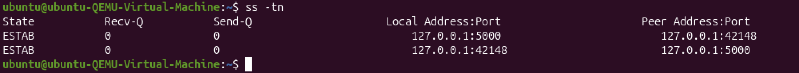
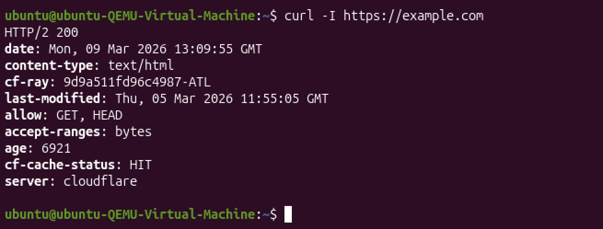
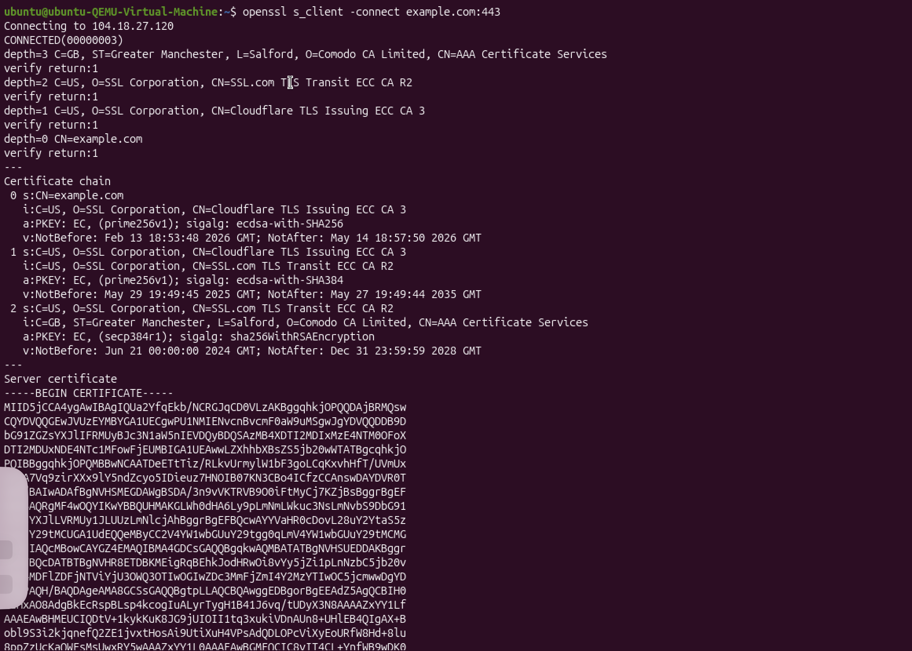
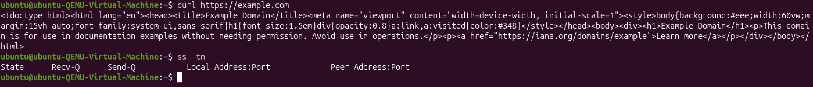
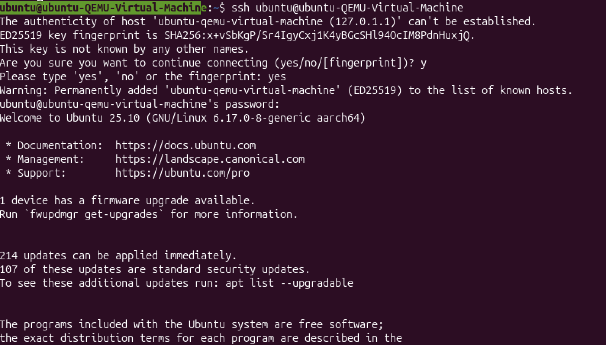
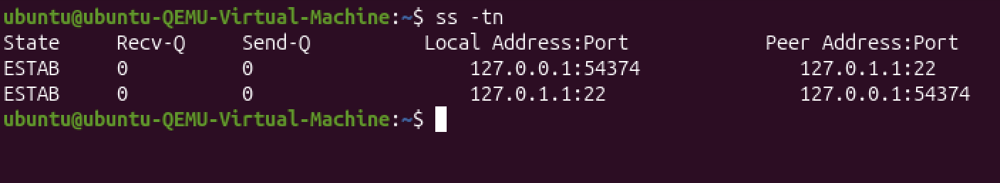
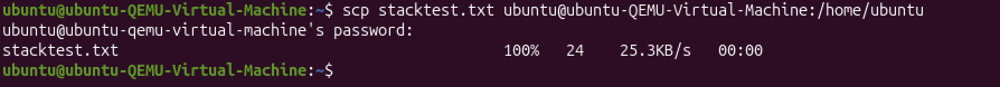
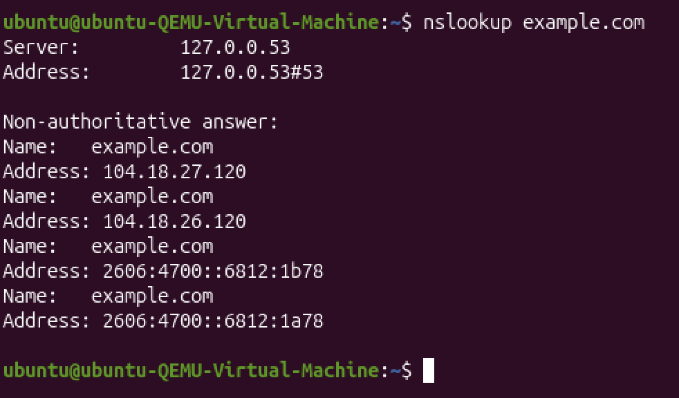
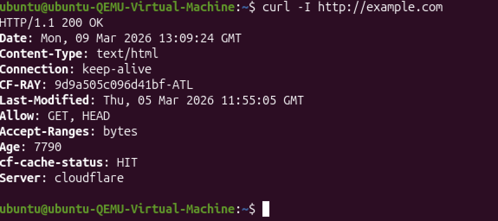

# 1. Design and Planning

## Transport Layer Reliability

### Part 1 — Build the Network

#### Investigation 1 — Connection Establishment (Three-Step Setup)

TCP connections are formed using a three-way handshake. The client begins by sending a SYN packet to request a connection. The server responds with a SYN-ACK to confirm it received the request and is ready. The client then sends an ACK to finalize the connection. After this exchange, the connection is established and data transfer can start.

#### Investigation 2 — Acknowledgment and Ordering

TCP keeps data organized using sequence numbers and acknowledgment numbers. Sequence numbers track the order of packets, while acknowledgment numbers confirm what has been received. If acknowledgments stop or are missing, the sender assumes data was lost and retransmits it.

#### Investigation 3 — Header Fields and Error Detection

The checksum field ensures that data was not corrupted during transmission. If the checksum does not match on the receiving side, the packet is discarded. Since no acknowledgment is sent, the sender will resend that data.

### Part 2 — Observing TCP Behavior

### Part 3 — Observe UDP Behavior

| Feature | TCP | UDP |
|---|---|---|
| Connection setup | Requires handshake | No setup |
| Acknowledgment | Uses acknowledgments | No acknowledgments |
| Ordering | Guaranteed order | No guarantee |
| Retransmission | Resends lost packets | No retransmission |
| Overhead | Higher | Lower |

### Part 4

TCP detects packet loss when acknowledgments stop arriving or duplicates appear. It then retransmits the missing packet using the same sequence number, allowing communication to continue even if some data is lost.

### Part 5 — Port Number Rigor

Port numbers identify which application should receive data. While the IP address identifies the device, the port identifies the specific service. For example, HTTP uses port 80 and HTTPS uses port 443. This allows multiple applications to run simultaneously over the same network connection.

# 2. Technical Development

#### Investigation 1 — Connection Establishment

TCP uses a three-step handshake before sending data. The client sends a SYN, the server replies with SYN-ACK, and the client sends ACK. After that, communication begins.

#### Investigation 2 — Acknowledgment and Ordering

If a TCP packet is not acknowledged, the sender assumes it was lost. It detects this through timeouts or duplicate acknowledgments and retransmits the packet to ensure delivery.

#### Investigation 3 — TCP Header Fields

The checksum protects data integrity. If a packet is corrupted, it is dropped and later retransmitted because no acknowledgment is received.

### Part 1 — Full Stack Analysis: HTTP vs HTTPS

HTTP and HTTPS both work at the application layer, but HTTPS includes encryption using TLS. HTTP uses port 80, while HTTPS uses port 443. Both rely on TCP, but HTTPS secures the data during transmission.

### Part 2 — DNS as a Supporting Application Protocol

DNS typically runs on port 53 and uses UDP because it is faster and has less overhead. If needed, it can switch to TCP. DNS converts domain names into IP addresses.

### Part 3 — Remote Access Using SSH

SSH provides secure remote access to systems. It runs on port 22 over TCP. TCP ensures reliability, and SSH encrypts the communication.

### Part 4 — Secure File Transfer

SCP is used to securely transfer files using SSH. Since SSH runs over TCP, SCP also benefits from reliable delivery and encryption.

### Part 5 — Stack Mapping Requirement

| Layer | Protocol | Purpose |
|---|---|---|
| Application | HTTP | Handles web requests |
| Presentation | TLS | Encrypts data |
| Session | TLS / HTTPS | Maintains session |
| Transport | TCP | Reliable delivery |
| Network | IP | Routes packets |

When accessing a secure website, HTTP handles the request, TLS encrypts it, TCP ensures reliable delivery, and IP routes it to the destination.

# 3. Testing & Evaluation

### Part 1 — Predict Before Testing

TCP is connection-oriented, meaning it establishes a connection first. UDP is connectionless and sends data immediately. TCP retransmits lost packets, while UDP does not. TCP has more overhead due to reliability features.

### Part 2 — Observing Listening Sockets (System Readiness)

If port 22 is listening, an SSH server is active. If not, the service is not running. A port is only considered active when an application is using it.

### Part 3 — Live TCP vs UDP Experiment

A LISTEN state means a program is waiting for connections, while ESTAB means a connection is active. The `ss` command helps display these states.

**UDP Analysis**

UDP sockets often show UNCONN because they do not establish persistent connections. Communication stops immediately if one side closes.

### Part 4 — Port and Ephemeral Port Analysis

A listening port waits for incoming connections, while an ephemeral port is temporarily assigned to a client. This allows multiple connections at once.

| Application | Protocol | Why |
|---|---|---|
| Online Banking | HTTPS | Secure encryption |
| Zoom Call | UDP | Low latency |
| Netflix Streaming | HTTP/HTTPS | Reliable streaming |
| File Download | HTTPS | Secure transfer |
| DNS Query | UDP | Fast lookup |

### Part 5 — Application Layer Investigation

HTTP operates at the application layer and uses TCP for reliable delivery. The “200 OK” response is interpreted at this layer.

Switching to HTTPS adds TLS encryption, which protects the data while still using TCP underneath.

### Part 6 — Presentation Layer Investigation

The TLS handshake happens before data is sent, establishing encryption and verifying certificates. This is separate from TCP’s role.

**Conceptual Distinction**

TLS does not replace TCP. TCP ensures reliable delivery, while TLS handles encryption and security.

### Part 7 — Session Layer Investigation

Connections may briefly show as active and then close after completion. Session management is handled at higher layers, not TCP itself.

| Protocol | Layer | Purpose |
|---|---|---|
| HTTP | Application | Web communication |
| HTTPS | Application | Secure web |
| TLS | Presentation | Encryption |
| DNS | Application | Name resolution |
| TCP | Transport | Reliable delivery |

# 4. Reflection and Analysis

### Assignment 1 Reflection

TCP detects lost data using sequence and acknowledgment numbers. If acknowledgments are missing, it retransmits the data. This allows communication to continue even if packets are lost. ICMP does not provide this reliability. TCP’s reliability increases overhead because it tracks more information.

### Assignment 2 Reflection

TCP is connection-based and reliable, while UDP is faster but less reliable. TCP uses acknowledgments and retransmissions, while UDP does not. Ports allow multiple applications to share a network. This was seen in testing where TCP showed connection states and UDP did not.

### Assignment 3 Reflections

A. Encryption is not handled at Layer 3 because that layer focuses on routing. TCP does not handle authentication, which belongs to the application layer. Each layer has its own role to keep networks efficient and manageable.

### Assignment 4 Reflection

SSH relies on TCP for reliable communication. Encryption is handled at higher layers, not Layer 3. HTTP depends on TCP for reliability. Port numbers ensure data reaches the correct application.

### Assignment 5 Reflection

The web uses a request-response model, so servers do not automatically send new pages. Instead, they send a status code and redirect, and the client makes another request. This improves flexibility and efficiency.
