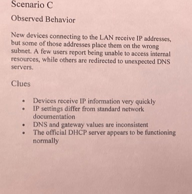
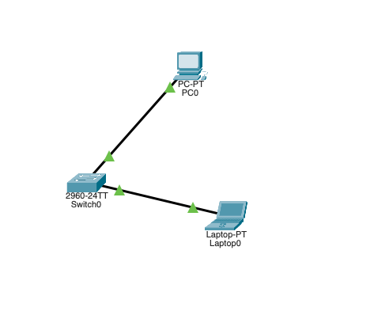
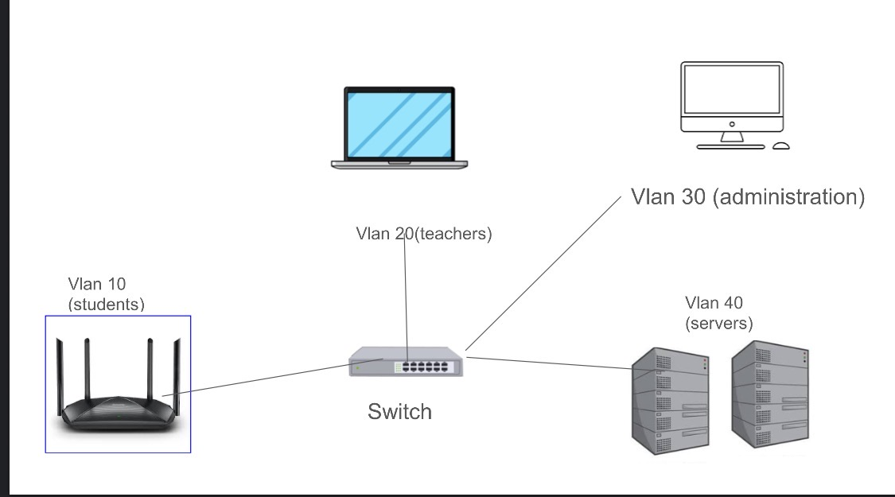

# Switch Security Portfolio

---

## 1. Planning & Conceptual Understanding
### Initial Network Security Thinking

A Local Area Network is often treated as secure simply because it exists inside an organization, but this assumption creates risk. One of the most vulnerable points in a switched LAN is a standard workstation, such as a classroom desktop or staff computer. These systems are trusted by default once connected to a switch port and are rarely monitored closely unless a problem is obvious.

Even without special permissions, a normal device on the LAN can learn useful information about the network. Basic tools reveal the default gateway, nearby devices, and address relationships. Because internal traffic is generally assumed to be safe, this information is exposed with little resistance. This shows that switched LANs are vulnerable before any security controls are applied, mainly due to implicit trust and limited internal monitoring.

## Objectives

- Identify common attacks that target network switches  
- Set up switch security features such as VLANs and port security  
- Analyze possible external threats to the network  
- Evaluate how switch security controls help prevent attacks  

---

## 2. Threat Scenario Analysis & Reasoning

| Scenario | Symptoms | Hypothesis | Justification |
|--------|----------|------------|---------------|
| **Scenario A** | Devices stay connected but internet behavior is inconsistent | Internal traffic redirection is occurring | Connectivity remains intact while routing behavior changes, suggesting manipulation rather than an outage |
| **Scenario B** | Switch performance slows significantly | One device is exhausting switch resources | Abnormal MAC learning patterns traced to a single port correlate with performance degradation |
| **Scenario C** | Devices work but resolve websites incorrectly | Incorrect DNS settings are being provided | IP connectivity remains functional while name resolution fails, indicating configuration interference |
| **Scenario D** | New device appears and communicates broadly | Unauthorized network access through a physical port | The device is undocumented and originates from an unsecured connection point |
| **Scenario E** | Internal systems accept traffic without restrictions | Lack of internal access controls | Flat network design allows unrestricted lateral communication |

---

## 3. VM Evidence Collection & Interpretation
### Collected VM Evidence

A Linux virtual machine was used to observe internal network information. Commands such as `arp` and `ip neigh` revealed the default gateway’s address, neighboring devices, and router presence without requiring administrative access.

### Evidence Explanation

This information would be valuable to an attacker because it allows internal network mapping and identification of key infrastructure. Knowing gateway addresses and nearby hosts makes it easier to influence trusted communication paths. The lack of alerts during this process shows how easily reconnaissance can occur within a switched LAN.

## Common LAN Threats

The network presents its most dangerous threats through devices which maintain active connections to the local area network. User devices such as desktops, laptops, or unmanaged workstations are often easier to compromise because they rely heavily on user behavior and may not be tightly controlled. An attacker can use a compromised device to monitor network operations while trying to gain unauthorized access and cause operational disruptions.

The attacker benefits from their presence on the LAN because default trust policies apply to all internal network traffic. This permits attackers to carry out their activities without encountering immediate obstacles from perimeter security measures which mainly protect against external threats. Internal threats can include spoofed addresses, unauthorized device connections, or attempts to move laterally between systems to reach more sensitive resources.

The switch system controls network traffic through its capacity to send data directly to specified endpoints but this function does not completely eliminate security threats. Attackers can obtain information about other devices on the network by using network protocol violations and improper switch settings. A switched LAN remains exposed to internal security threats which include reconnaissance activities and identity theft and traffic control attacks.

### Evidence, Risk, and Controls

| Evidence | Risk | Control | Explanation |
|--------|------|--------|-------------|
| Gateway visible in ARP table | Gateway spoofing | DHCP Snooping | Restricts which devices can issue network configuration |
| Neighbor discovery enabled | Internal mapping | VLANs | Limits visibility between groups of devices |
| Excessive MAC learning | Switch overload | Port Security | Limits MAC addresses per port |

---

## 4. Reflection, Synthesis & Professional Quality
### Observing Switch Security Controls

#### No Security Controls

A flat switched network allows all devices to communicate freely. This model assumes every device is trustworthy, increasing the impact of a single compromised system.

#### VLANs

VLANs reduce broadcast traffic and limit unnecessary communication. However, they do not verify traffic authenticity on their own.

#### Port Security

Port security limits which devices can connect to a switch port, helping control physical access. It does not prevent misuse by already authorized systems.

#### DHCP Snooping and Related Controls

DHCP Snooping, Dynamic ARP Inspection, and ACLs work together to enforce trust boundaries and prevent unauthorized configuration or communication.

---

## Example Secure Network Design

### VLAN Layout
- VLAN 10 — Students
- VLAN 20 — Teachers
- VLAN 30 — Administration
- VLAN 40 — Servers

### Access Rules
- Students → Servers: Denied
- Students → Teachers: Limited
- Teachers → Servers: Allowed
- Administration → Servers: Allowed

Student devices are the least trusted, while servers require the strongest protection. Controls should be enforced at access ports and between VLANs.

### Why Multiple Controls Are Needed

VLANs separate traffic but do not verify identity. DHCP Snooping ensures trusted configuration sources, Dynamic ARP Inspection validates address mappings, and ACLs restrict communication paths. Together, these controls reduce reliance on implicit trust.

---

### Final Reflection

This project changed my understanding of local area network security because I discovered how security exists before formal security measures are established. The research proved that people trust internal network systems because they believe switched LANs provide secure protection against security threats. The network's existing devices can track all network activities while they use their full access rights to communicate with all other network devices which remain hidden from users and system operators.

The examination of default switch operations showed that standard network activities like neighbor discovery and broadcast traffic will reveal significant information about network security. The research showed that switched networks allow monitoring activities because they maintain switched operations at reduced levels. Internal attackers and misconfigured devices can gather valuable intelligence without triggering security alerts which demonstrates that physical location and trust relationships should not be used as security measures in present-day LAN setups.

The implementation of VLAN segmentation demonstrated that virtual boundaries which separate networks lead to different network behavior and provide better protection against unwanted device monitoring. The separation of user systems from servers and administrative resources enabled me to control east-west traffic between systems which decreased security risks from a single compromised endpoint. The research demonstrated that network segmentation involves both operational advantages and organizational benefits because it decreases attack surfaces throughout the entire network.

The implementation of port-level security measures demonstrated that physical access to a location allows users to access the network. Any device which connects to an open port receives the same level of trust which authorized systems possess when there are no security restrictions in place. Port security implementation established the requirement that switch ports require management as secured entry points to the network.
