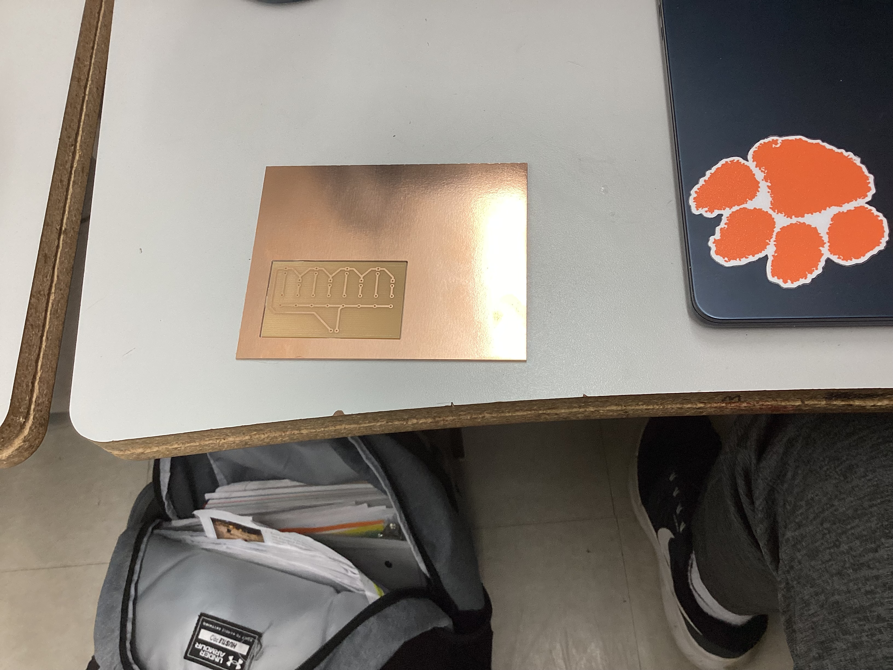

### october 27 2025

in class: We created the file for the CNC machine in Makeracam on the computers in the classroom. To do this we followed a tutorial by Mr. Dubick. After this we briefly went over how to start cutting out our design on the CNC machine, but no one actually started it. 

What we learned: I learned how to make the toolpaths and how to export this file properly so it could be accessed and put into the software that we cut the design with.

Reflection: This was important so that we knew how to do similar activities with the CNC machine in the future, and allowed us to learn the basics of how to go from start to finish. Initially, I was confused on this because instead of leaving the outside line selected and the inside line unselected for one of the steps, I reversed it which led to the board not looking the way it was supposed to. To fix this I went through our workflow and found out where my issue was. I made sure to fix it and checked that my second attempt had everything correct. Overall it was not too difficult but I learned that I needed to be precise. 

### October 28 2025

in Class: We made the CNC file again but this time without a tutorial

What we learned: I learned how to do the process of creating the file myself, while occasionally refrencing the workflow me and my partners created to ensure I did everything correctly. 

Reflection: creating the file the 2nd time by myself allowed me to make sure that I had actually learned what I needed to do. I did struggle with this because I forgot some of the steps and had to refrence the workflow that me and my partners made. I was happy that the workflow was throughout because without it i would have been very confused, so I learned the importance of documenting and creating a good workflow because most of the time it is needed.

### October 30 2025

In class: I printed the board and learned how to use the milling machine

What I learned: I learned how to use the software and what settings were needed so that the machine could correctly print out the indended design.

Reflection: Initially my partner and I struggled with this process. We tried using Trevors file first, but there was an issue that occured during the creation of the file that made the print wrong. Mr. Budgekowsi told him what was wrong, but to save time we switched over to my deisng and made sure it was right. We then made sure that the fan was on, and that we homed the machine to ensure the print went as intended. 

### October 31 2025

in class: We received the board we had printed the day before

Reflection: We printed the board the day before, however it did not finish until after class so we picked it up today. I checked our board to make sure that it looked correct, and it did look correct. This was cool to see because we started this process with creating the file and had gotten it to the final product. Since the lines were so close together, this was very easy to miss, so it is important that you check ove revery drtail

Additionally, another similar issue was that the file size was not correct. Because of this when the board was uploaded to the milling machine computer, it did not align the correct way so the file had to be chnaged and then exported again. While this was not a major issue, it definitely slowed down the progress. To prevent this, it is better to check and make sure everything is correct before exporting and saving the file because it will save more time in the long run. 

## Final board

## Workflows

## Reflection: 

One of the biggest issues encountered was that one of the lines that was meant to be selected while creating the makeracam file was not selecte.d Because of this it messed up the entire print and the entire file had to be redone. Through this I think the bigggest lesson to be learned is to g=check every detail even it it may seem small because it can have a big effect on the final product. 

Additonally another issue was ythat thge file sizr was not correct. because of this i had to export the file again after fixing the dimnesions. It is important to ensure that this is corrrect before exporting so that ypou can save more time in the end. It is a smalll detail but it made the process longer, so checking and making sure this was correct definitely would have made things faster. Checking with classmates is also something that should be done because they might have known about this and it could have prevented me from making this mistake in the first place. 

