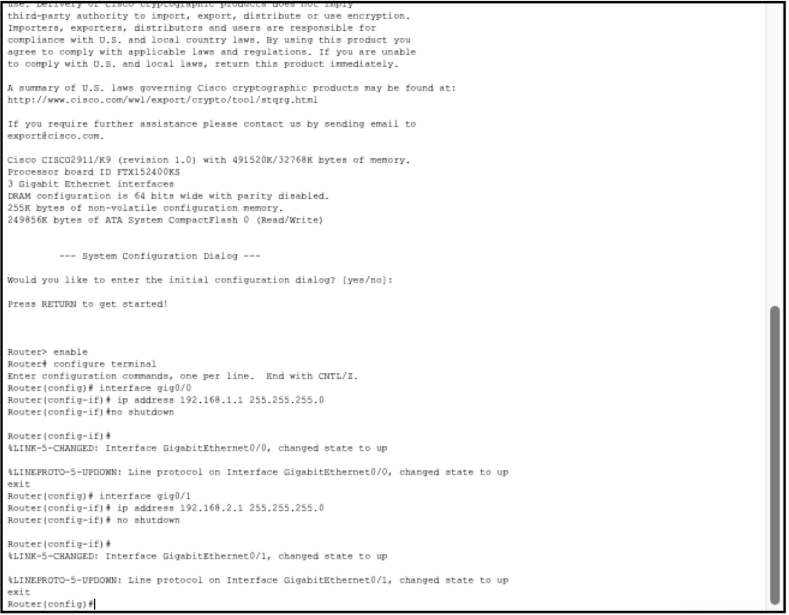
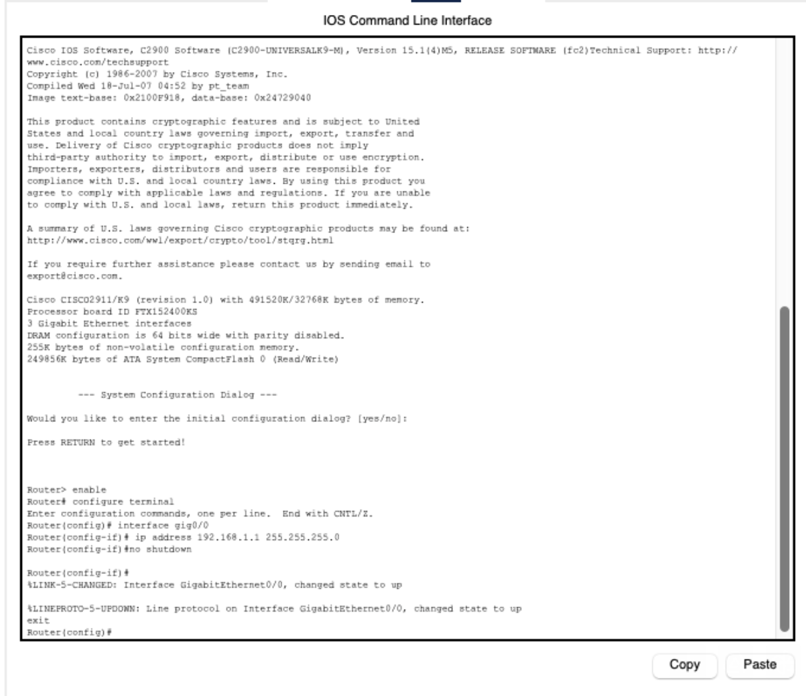

### October 27 2025

In class, we created the file for the CNC machine in Makeracam on the computers in the classroom. To do this, we followed a tutorial by Mr. Dubick. After this, we briefly went over how to start cutting out our design on the CNC machine, but no one actually started it. 

#### What we learned:
I learned how to make the toolpaths and how to export this file properly so it could be accessed and put into the software that we cut the design with.

#### Reflection:
This was important so that we knew how to do similar activities with the CNC machine in the future, and allowed us to learn the basics of how to go from start to finish. Initially, I was confused about this because instead of leaving the outside line selected and the inside line unselected for one of the steps, I reversed it, which led to the board not looking the way it was supposed to. To fix this, I went through our workflow and found out where my issue was. I made sure to fix it and checked that my second attempt had everything correct. Overall, it was not too difficult, but I learned that I needed to be precise. 

### October 28, 2025

In class: We made the CNC file again, but this time without a tutorial

#### What we learned: 
I learned how to do the process of creating the file myself, while occasionally referencing the workflow my partners created to ensure I did everything correctly. 

#### Reflection:
creating the file the 2nd time by myself allowed me to make sure that I had actually learned what I needed to do. I did struggle with this because I forgot some of the steps and had to reference the workflow that me my partners and I made. I was happy that the workflow was throughout because without it, I would have been very confused, so I learned the importance of documenting and creating a good workflow because most of the time it is needed.

### October 30, 2025

In class, I printed the board and learned how to use the milling machine

#### What I learned:

I learned how to use the software and what settings were needed so that the machine could correctly print out the intended design.

#### Reflection: 
Initially, my partner and I struggled with this process. We tried using Trevor's file first, but there was an issue that occurred during the creation of the file that made the print wrong. Mr. Budgekowsi told him what was wrong, but to save time, we switched over to my design and made sure it was right. We then made sure that the fan was on, and that we homed the machine to ensure the print went as intended. 

### October 31, 2025

In class, We received the board we had printed the day before

#### Reflection:
We printed the board the day before; however, it did not finish until after class, so we picked it up today. I checked our board to make sure that it looked correct, and it did look correct. This was cool to see because we started this process by creating the file and had gotten it to the final product. Since the lines were so close together, this was very easy to miss, so you must check over every detail

Additionally, another similar issue was that the file size was not correct. Because of this, when the board was uploaded to the milling machine computer, it did not align correctly, so the file had to be changed and then exported again. While this was not a major issue, it definitely slowed down the progress. To prevent this, it is better to check and make sure everything is correct before exporting and saving the file, because it will save more time in the long run. 

## Creating G-code

Mr. Dubick provided us with KIcad files that we imported into the MakeraCam software to create our G-code. Below are the files that were given, as well as a step-by-step on how to make the G-code. 

Once the files were downloaded, they were imported into Makeracam using File, then import PCB. Here is the screenshot of the correct file size, which was the first thing completed after the import. 

#### 1. Position the board
After setting up the workspace, the first thing I did was use the Translate tool to place the board at the coordinates (6, 6). This spot gives the CNC enough room to hold the board securely while keeping waste material to a minimum.

#### 2. Hide unnecessary files
I then hid the .drl and f.cu_pad files so only the edge.cuts and f.cu layers were visible. This makes it easier to focus on the parts that actually need to be milled.

#### 3. Create the 2D Pocket setup
With those layers selected, I chose 2D Path → 2D Pocket. A menu popped up with several options to adjust. I set the end depth to 0.05 mm and selected the 0.8 mm Corn tool along with the 0.2 mm 30° metal engraving tool. These tools are needed to remove the top copper layer without cutting too deep.

#### 4. Generate the toolpath
Once the settings looked correct, I clicked “calculate.” The software generated the toolpath that the CNC will follow for the 2D Pocket pass.

After the 2d pocket was made, the next thing to do was to make a toolpath for the holes in the board. 

#### 1. Show only the drill layers
I hid the edge.cuts, f.cu, and 2D Pocket layers so that only the two drill files were visible. 

#### 2. Start the drilling setup
With the drill files selected, I chose 2D Path → 2D Drilling to prepare the toolpath for the holes.

#### 3. Set the tool and depth
I changed the tool to the 0.8 mm Corn bit and set the end depth to 1.7 mm. This depth ensures the drill fully passes through the PCB.

The next step was print the board

#### 1. Show only the outline
I hid all layers except the edge.cuts vector so I could focus solely on the board’s outer shape.

#### 2. Set up the contour cut
With the outline selected, I chose 2D Path → 2D Contour to create the cutout toolpath.

#### 3. Choose the tool and depth
I selected the 0.8 mm Corn bit and set the end depth to 1.7 mm to ensure the contour cut goes fully through the PCB.

#### 4. Add tabs for stability
I placed three tabs along the contour so the board would stay secure and not shift when the cut is made.

This was all the steps. I exported my file and added it to the FabLab google drive. Below is the G-code file.

### G-code

#### G-code File: 
https://drive.google.com/file/d/1NBYQ276NYF-OEK4ZmoC9Pt9nEAnn9_on/view?usp=share_link

The G-code link above is what will be put into the software so that the milling machine is able to start engraving. Below are the workflows so that you know the steps to get it engraved.

## Workflows

#### Milling Machine Workflow: 
https://docs.google.com/document/d/10FMrLoLKMe2WZjPUds1aqoUNDaXnkAG7wu43AeCJjwo/edit?usp=drivesdk

The milling machine workflow linked above tells you what to do after you put the NC file into the computer

#### Makeracam Workflow: 
https://docs.google.com/document/d/1cr1MeDxlIE37IziT2Tm7Q10P0iMfA3R-lnbZcwD_I7s/edit?usp=drivesdk

Above is the workflow for MakeraCam that teches how to replicate what was done above

## Final Board

After all the above steps, this final board was the result

## Reflection: 

One of the biggest issues encountered was that one of the lines that was meant to be selected while creating the makeracam file was not selected. Because of this, it messed up the entire print, and the entire file had to be redone. Through this, I think the biggest lesson to be learned is to check every detail, even if it may seem small, because it can have a big effect on the final product. 

Additionally, another issue was that the file size was not correct. Because of this, I had to export the file again after fixing the dimensions. It is important to ensure that this is correct before exporting so that you can save more time in the end. It is a small detail, but it made the process longer, so checking and making sure this was correct definitely would have made things faster. Checking with classmates is also something that should be done because they might have known about this, and it could have prevented me from making this mistake in the first place. 

I also thought that it was slightly difficult to have to learn the MakeraCam software, but the slides that Mr. Dubick made and the steps that were clear to follow made this easier to understand. One of the most important things I learned from this project is making sure to document how something is done, especially with software or machines you are unfamiliar with, because if you need to use them again in the future, you will be able to have something to look back and reflect on, and maybe help you overcome some issues you struggled with initially.

Overall, though, this was an informative and relatively straightforward project that I think will be really helpful, especially later in the year when these machines might be needed for the senior projects. The creation of the workflows is also very helpful since it allows us to look back and make sure every step is correct, since it might be a while before these machines are used again. 
