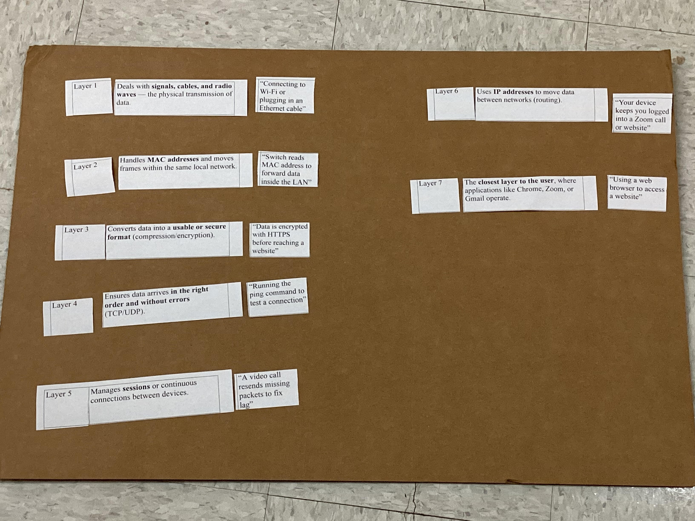
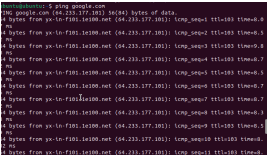
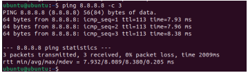
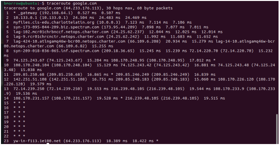
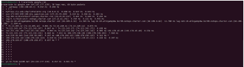
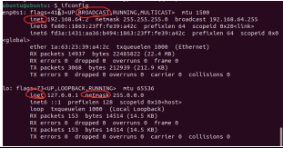
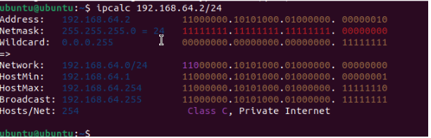
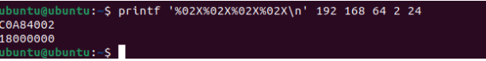
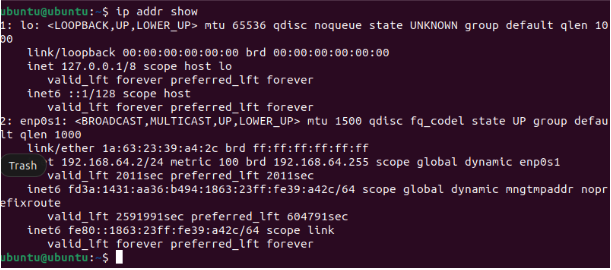
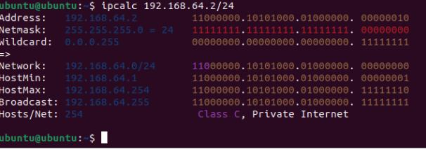

## Planning and Design

### Objectives

The objective of the LAN components document was to use commands such as ifconfig, ping, and traceroute in Ubuntu. This was focused on identifying network interfaces, testing connections, and analyzing data paths to understand how devices communicate within a network. The second document, titled "binary_denary," was a walk-through of how to convert numbers between binary and denary systems. The goal was to understand how to interpret these numbers using base 2 and base 10 values, explain how these conversions relate to IP addresses/network data, and use Ubuntu commands to check and manipulate network numbers in real time. 

### Classwork Evidence

Below are pictures of class activities relating to these documents and their objectives. 

OSI Layer activity

This is the original order that the images were put in. This order though is incorrect, and the image below is the correct order. 

Binary Base Block Activity

LAN Analogy Notes: https://docs.google.com/document/d/1tPdAwbuJMn-X8uXljjmpyBy22DPOB1oJU_mDnKtj4g8/edit?tab=t.0

## Technical Development 

LAN Components lab

  - This lab focused on using the following commands
      - ifcongfig
      - ping
      - traceroute
   
Screenshots

Binary/Denary Lab

- The objectives were listed above, but in short, convert binary and denary, and understand how to do and check this in Ubuntu.

## Testing and Evaluation

Ping results: Ping shows the response time (latency) between the computer and server, measured in milliseconds. The lower the time, the faster the connection is. In this case, the ping was to Google server 8.8.8.8, and the return was 0% packet loss and an 8 millisecond response time, which showed that there was a quick and stable connection. 

Traceroute results: Traceroute displays each hop or router that data passes through to get to its destination. This allows for analysis of where delays occur along the network path. In this case, traceroute reached Google in 23 hops with a response time of 18 milliseconds.

Netstat Results: Netstat lists the active network connections, which show local and remote addresses, ports, and connection states, which can help identify potential network issues. This command showed what ports were open and the active TCP/UDP connections.

ifconfig results: displayed the network interfaces, confirming the system is using the IP 192.168.64.6 on the local network. 

ipcalc: shows the network and broadcast IP addresses (listed below in analysis)

printf: converts ip address from normal decimals to hexadecimal, which is what computers use. Examples are 192 is C0 in hexadecimal, and 168 is A8 in hexadecimal. 

##### Overall analysis of latency, hops, and binary-hex-decimal conversions

Ping and traceroute showed a latency of 8 to 18 milliseconds and 23 hops total to reach Google's server, showing a fast route with no packet loss. ipcalc took the IP address 192.168.2/24 and broke it down to show the network address, which was 192.168.64.1, and the broadcast address, which was 192.168.64.255. This also showed the binary versions, so the IP addresses were converted into binary. 

Note: The results in screenshot form are listed above in the technical development section

### Roadmap Project

## Reflection: 

This project helped make sense of how networks actually work and how devices communicate with each other. The LAN Components lab showed how commands like ifconfig, ping, and traceroute show certain aspects of networks. Ping measured how fast data moved, traceroute showed every stop data took to reach its destination, and ifconfig listed all the main details about the network connection. Seeing how these commands worked together made network data feel a lot more real and understandable. The binary and denary parts of the project added another layer to that understanding. Learning how to convert between base 2 and base 10 made it clearer how computers handle information. Using tools like ipcalc and printf helped connect those conversions to real IP addresses and network setups, which made the math side of networking make more sense. Overall, the project helped with learning latency and hops as well as binary numbers and IP addresses. It showed how all the small pieces fit into one system and how data moves smoothly from one point to another.
