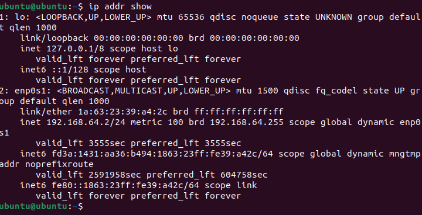
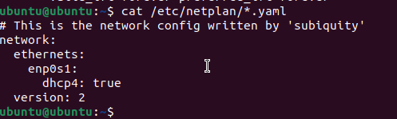
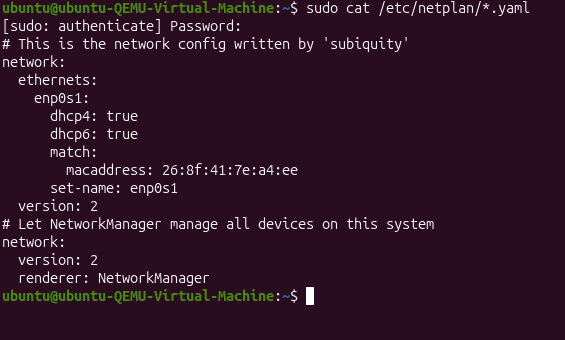
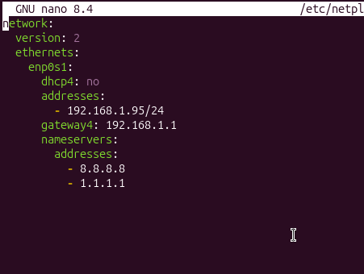
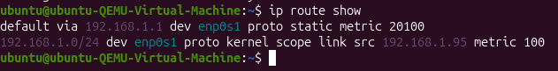
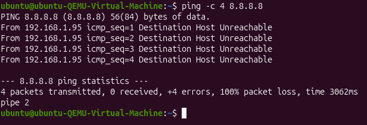

# Exploring a Network Interface Card (NIC)

Every MAC address belongs to a piece of physical hardware called a Network Interface Card (NIC). Even virtual machines use virtual NICs that operate the same way.  
In this activity, you will examine a NIC, label its features, and identify where the MAC address is located.

## 1. Observing the NIC Images
Study Image A and Image B and note the following:
- Ethernet port on a metal bracket
- Green circuit board
- Several chips and components
- Gold connector edge (PCIe connector)

Your goal is to understand the major physical features of a NIC.

## 2. Labeling the NIC
Label these components:

1. **Ethernet Port (RJ-45 Port)**  
   Where the network cable plugs in.

2. **PCIe Connector (Gold Edge)**  
   Fits into the motherboard; provides power and data transfer.

3. **Main Controller Chip**  
   The “brain” of the NIC that sends and receives frames.

4. **MAC Address Sticker**  
   Usually located on the metal bracket or near the port.

### Tasks for Image A
- Draw an arrow to the Ethernet port and label it.
- Draw an arrow to the PCIe connector and label it.
- Draw an arrow to the main controller chip and label it.

### Task for Image B
- Draw an arrow to the MAC address label and label it.
- Record the MAC address exactly as printed:  
  **04:92:22:64:IA:80:4C**
- Write one sentence explaining what a MAC address does on a local network.  
  A MAC address uniquely identifies a network interface on a local network so Ethernet frames can be delivered to the correct device at Layer 2.

## 3. Add to Your Digital Portfolio
Write one sentence each explaining:
- **What the Ethernet port is used for**  
  The Ethernet port is the physical connection on the NIC where a network cable plugs in to allow wired network communication.
- **What the PCIe connector is used for**  
  The PCIe connector allows the NIC to connect to the motherboard so it can receive power and exchange data with the computer.
- **Why the NIC needs a main chip**  
  The main controller chip is needed to process incoming and outgoing data and control how information is sent across the network.
- **Why the MAC address belongs to the NIC**  
  The MAC address belongs to the NIC because it is permanently assigned to that hardware to identify it on a local network.

### Reflection Prompt
“Why is a MAC address considered a physical address, and how does seeing a real NIC help you understand this?”  
Write 2–3 sentences.  
A MAC address is considered a physical address because it is permanently tied to the hardware that sends and receives Ethernet data. Seeing a real NIC makes it easier to understand that addressing starts at actual physical components. This shows how hardware identification is required before higher-level network communication can happen.

---

## Part B — Interpreting Your MAC Address

Now you will retrieve your MAC address from your Ubuntu VM and interpret it using the OUI (Organizationally Unique Identifier).

### 1. Retrieve Your MAC Address
Use the same command from the earlier lesson to find your MAC address.  
Example:

Record your own MAC address.  
**92:e1:0d:6f:d4:91**

### 2. Identify the OUI
The first three pairs of the MAC address are the OUI.

Example:
- Full MAC: 52:54:00:ab:cd:ef
- OUI: 52:54:00

Write down:
- Your full MAC address: **92:e1:0d:6f:d4:91**
- Your OUI: **92:e1:0d**

### 3. Look Up Your OUI
Use:
- https://maclookup.app/

Record:
- Vendor/manufacturer
- Whether it appears physical or virtual
- Any notes provided

#### Notes About Virtual OUIs
- Virtualization vendors (QEMU, VMware, VirtualBox, Hyper-V, etc.) use reserved MAC ranges.
- Some lookup tools may show:
  - “No results found”
  - “IEEE Registration Authority”
  - Only the OUI block, not the company

This is normal.

### 4. Compare Physical vs Virtual MAC Addresses
Write 4–5 sentences explaining:
1. Where the MAC address appears on a physical NIC
2. Where your VM’s MAC address came from
3. What physical and virtual MACs have in common
4. What is different
5. Why a virtual NIC still requires a MAC address

On a physical NIC, the MAC address is stored in the card’s firmware and is often printed on a label attached to the hardware. In a virtual machine, the MAC address is assigned by the hypervisor using a predefined range. Both physical and virtual MAC addresses follow the same format and serve the same purpose at Layer 2. The main difference is that physical MAC addresses are tied to hardware manufacturers, while virtual MAC addresses are generated by software. A virtual NIC still needs a MAC address so switches and network protocols can correctly deliver frames.

---

## MAC Address OUI Lookup Activity

Look up the OUIs of seven real-world MAC addresses using:
- https://maclookup.app
- https://macvendors.com
- https://standards-oui.ieee.org/oui/oui.txt

For each MAC address, record:
- Full MAC address
- OUI
- Vendor/company
- Vendor type (physical, virtual, both)
- Notes

### Digital Portfolio Table

| Full MAC Address | OUI (first 3 pairs) | Vendor / Company Name | Vendor Type | Notes |
|------------------|--------------------|-----------------------|-------------|-------|
| F0:18:98:AA:BB:CC | F0:18:98 | Hewlett Packard Enterprise | Physical | Commonly found in enterprise servers and switches. |
| 3C:5A:B4:11:22:33 | 3C:5A:B4 | Apple, Inc. | Physical | Seen in Mac computers and mobile devices. |
| 60:45:BD:12:34:56 | 60:45:BD | Samsung Electronics | Physical | Used in smartphones, TVs, and other consumer devices. |
| A4:BA:DB:22:33:44 | A4:BA:DB | Amazon Technologies | Virtual/Cloud | Often associated with cloud instances in AWS. |
| 04:1A:04:55:66:77 | 04:1A:04 | Cisco Systems | Physical | Found in enterprise routers and switches. |
| 00:50:56:AA:BB:CC | 00:50:56 | VMware, Inc. | Virtual | Standard prefix for VMware virtual NICs. |
| 52:54:00:12:34:56 | 52:54:00 | QEMU / KVM | Virtual | Reserved OUI commonly used for KVM/QEMU guests. |

### Reflection (3–4 Sentences)
Address:
- Patterns noticed in vendors
- Why virtualization vendors need registered OUIs
- How this activity improved your understanding of Layer 2 addressing

The table shows that physical MAC addresses are usually tied to well-known hardware manufacturers, while virtual MAC addresses belong to companies that create virtualization platforms. Virtualization vendors need registered OUIs to make sure their MAC addresses remain unique and do not conflict with physical devices. This reinforces how Layer 2 addressing must stay globally coordinated. The activity helped show how MAC lookups can quickly indicate whether a device is physical or virtual.

---

## Upload Evidence to Your Portfolio

Include:
- Screenshot of Terminal showing your MAC address
- Screenshot of your OUI lookup results
- Your 4–5 sentence comparison from Part B
- A 2-sentence summary answering:  
  “What does my MAC address reveal about the hardware my VM is using?”

The structure and OUI of this MAC address show that the VM is using a virtual network interface assigned by virtualization software. This confirms that the VM operates on abstracted hardware managed by a hypervisor, even though the MAC address behaves like a physical one.

---

## Part C — Understanding MAC Address Structure

Analyze your MAC address in terms of its meaning and its role in the OSI model.

### 1. Break Down Your MAC Address
Format:
- OUI: aa:bb:cc
- Device Identifier: dd:ee:ff

### 2. Explain the OUI
Write 2–3 sentences explaining:
- What the OUI represents
- How it connects the NIC to a manufacturer
- Why OUIs must be globally unique
- If yours is virtual, why a VM still needs a vendor prefix

The OUI identifies the organization responsible for assigning MAC addresses within a specific range. It links a NIC or virtual NIC to a manufacturer or vendor authority. OUIs must be globally unique to prevent address conflicts between devices from different vendors.

### 3. Explain the Device Identifier
Write 2–3 sentences explaining:
- Why each NIC needs a unique device identifier
- Why no two devices on a LAN can share a MAC address
- How uniqueness ensures correct frame delivery

The device identifier portion of a MAC address ensures that each NIC within the same OUI range is unique. If two devices on the same network shared a MAC address, data could be sent to the wrong device. This uniqueness is essential for reliable Ethernet communication.

### 4. Compare Virtual vs Physical MAC Addresses
Write 4–6 sentences explaining:
- Where physical NICs store MAC addresses
- How virtual machines generate or assign MAC addresses
- Similarities and differences
- Why Layer 2 functions identically for physical and virtual hardware

Physical NICs store MAC addresses in non-volatile memory and often display them on a printed label. Virtual machines receive MAC addresses from the hypervisor, usually from vendor-reserved address ranges. Both use the same 48-bit format and function identically at Layer 2. The difference lies in how the address is assigned and stored. From a network’s perspective, there is no functional difference between physical and virtual MAC addresses. Switches and routers treat both the same.

### 5. MAC Addresses in the OSI Model
Write 2–3 sentences explaining:
- Which OSI layer uses MAC addresses
- Why MAC addresses never leave the local network
- How routers replace MAC addresses when forwarding frames

MAC addresses operate at the Data Link Layer, which is Layer 2 of the OSI model. These addresses stay within the local network because routers replace MAC addresses at each hop. This allows Ethernet to handle local delivery while IP handles routing across networks.

---

## Final Upload

Include:
- Explanations from Steps 2–5
- Screenshot of your MAC address (optional if already uploaded)
- One-sentence summary:  
  “Why must every NIC — physical or virtual — have a globally unique MAC address?”

Every NIC, physical or virtual, must have a globally unique MAC address so Ethernet devices can deliver frames accurately without address conflicts on a network.

# 2. Understanding Logical Addressing (IPv4 and IPv6)

## IPv4 vs IPv6
- IPv4 is a 32-bit addressing system that gives each device a unique numeric address made of four decimal numbers separated by dots.
- IPv6 is a newer 128-bit addressing system that uses hexadecimal numbers and colons to provide vastly more addresses and support modern internet features.

## Addressing: Physical and Logical
Yesterday you learned that every device has a physical address (MAC address) that identifies its Network Interface Card (NIC) inside a Local Area Network (LAN). MAC addresses work extremely well for communication within a single network, but they have one major limitation:
A MAC address cannot help you reach a device outside your local network.
This brings us to the idea of logical addressing, which allows networks across the entire world to communicate.

## Why Logical Addressing Exists
Imagine trying to send a letter to someone who lives in another state. A name alone isn’t enough — you need a complete mailing address. Networking works the same way.
- A MAC address is like someone’s name. It uniquely identifies them inside a local space but is meaningless across long distances.
- An IP address is like a full mailing address. It identifies where a device is located in the global network so data can reach it from anywhere.
A MAC address allows communication only within a local network—for example, with a printer, a switch, or your home router.
To communicate across the world, the internet needs a consistent, structured, global addressing system.  
This global system is called logical addressing, implemented through IP (Internet Protocol) addresses.
Logical addresses allow devices to:
- Be located anywhere on Earth
- Change networks and still remain reachable
- Send and receive data across interconnected networks
This is what enables the internet to function.

## IPv4 — The OG Internet Addressing System
IPv4 (Internet Protocol version 4) is the first widely deployed system for global addressing.

### Key Characteristics of IPv4
- 32-bit address  
  IPv4 uses 32 bits, supporting about 4.3 billion unique addresses.
- Written in dotted-decimal format  
  Example:  
  192.168.1.10
- Network portion + Host portion  
  Some bits identify the network; the rest identify the device on that network.
- Still widely used  
  Even though it’s old, IPv4 remains everywhere.

## Why IPv4 Has Problems
By the early 2000s, it became clear that 4.3 billion addresses were not enough for a world full of laptops, smartphones, servers, and IoT devices.
This led to the adoption of IPv6.

## IPv6 — The Next Generation of Internet Addressing
IPv6 was created to solve the limitations of IPv4 and support long-term global growth.

### Key Characteristics of IPv6
- 128-bit address  
  Allows for 3.4 × 10³⁸ addresses — practically unlimited.
- Written in hexadecimal with colons  
  Example:  
  2001:0db8:85a3::8a2e:0370:7334
- Designed for future growth
- Includes major improvements
- Built-in security features
- More efficient routing
- Better support for mobility
- No need for NAT in many cases
Even though IPv6 is the future, most networks today use both IPv4 and IPv6.

## IPv4 vs IPv6 Comparison Table

| Category | IPv4 | IPv6 |
|---|---|---|
| Bits | 32 | 128 |
| Capacity | ~4.3 billion | Virtually unlimited |
| Notation | Dotted decimal | Hexadecimal with colons |
| Example | 10.0.0.25 | fe80::1f4a:e3ff:fe21:bd10 |
| Reason for IPv6 | Address exhaustion | Long-term global growth |

IPv6 is not a replacement because IPv4 failed — the world simply outgrew IPv4.

## Physical Address (MAC Address)
- Built into hardware
- Never changes (unless spoofed)
- Used within the local network
- Operates at OSI Layer 2 (Data Link Layer)
- Identifies the NIC

## Logical Address (IP Address – IPv4 or IPv6)
- Assigned manually or by DHCP
- Can change depending on the network
- Used to communicate across networks
- Operates at OSI Layer 3 (Network Layer)
- Identifies the device’s network location

## Why We Need Both
A computer needs:
- A MAC address for local communication
- An IP address for global communication
Together, they form the foundation of modern networking.

---

# Logical Addressing Lab
You already know how to use the Terminal to locate your IPv4 and IPv6 addresses. Today you will analyze what those addresses mean and how they support global communication.
This activity focuses on:
- The role of logical addressing (IPv4 & IPv6)
- Interpreting your addresses
- Understanding IPv6 link-local addresses
- Connecting addressing to global communication

## Part A – Document Your IP Addresses

### Step 1 – Retrieve your IP information

### Step 2 – Record your addresses
Find and highlight:
- Your IPv4 address
- Your IPv6 link-local address (fe80::…)

### Step 3 – Take a clear screenshot
Your screenshot must show:
- The ip addr show command
- Your IPv4 and IPv6 lines

---

# Part B – Research: IPv6 Link-Local and the Future of IPv6

## Research Question 1
Why does every interface automatically have an IPv6 link-local address?
Write a 4–6 sentence paragraph explaining:
- What an IPv6 link-local address is
- Why it begins with fe80::
- What types of communication it supports
- Why it doesn’t need DHCP or external configuration
- Why every IPv6-enabled device generates one automatically

An IPv6 link-local address is a special type of address that lets devices communicate with other devices on the same local network segment. It begins with fe80:: because that prefix is reserved specifically for link-local traffic in the IPv6 standard. Link-local addresses support important local functions like neighbor discovery, router advertisements, and basic communication on the same segment. They do not need DHCP or external setup because the device can generate the address automatically using built-in rules. Every IPv6-capable interface creates one so it can communicate locally right away, even if there is no router or DHCP server available.

## Research Question 2
Why is IPv6 important for the future of networking?
Write a 4–6 sentence paragraph explaining:
- Why IPv4 is no longer sufficient
- How IPv6 solves address exhaustion
- What new capabilities IPv6 introduces
- Why networks must support both IPv4 and IPv6 during the transition

IPv4 is no longer sufficient because there are far more devices connected today than the roughly 4.3 billion addresses IPv4 can provide. IPv6 solves this by using 128-bit addresses, which creates a massively larger pool of unique addresses. IPv6 also improves networking by supporting more efficient routing and features that help with security and modern device mobility. During the transition, networks must run both IPv4 and IPv6 because many systems and services still depend on IPv4. Using both protocols at the same time keeps compatibility while the internet gradually moves toward wider IPv6 use.

## IPv4 vs IPv6 Comparison Table

| Feature | IPv4 | IPv6 |
|---|---|---|
| Address length | Uses a 32-bit address, so space is limited. | Uses a 128-bit address, giving it a massively larger range. |
| Notation | Written as four decimal numbers separated by dots (example: 192.168.1.10). | Written in hexadecimal and separated by colons (example: 2001:db8::1). |
| Approximate capacity | Supports about 4.3 billion unique addresses. | Supports an almost unlimited number of unique addresses. |
| Example | 10.0.0.25 | fe80::1f4a:e3ff:fe21:bd10 |
| Where I see it used | Common on home networks and older systems. | Found in newer networks and modern devices that support both IPv4 and IPv6. |

## Why Logical Addressing Exists
Write a 5–7 sentence paragraph explaining:
- Why we need IP addresses in addition to MAC addresses
- How IP addresses enable communication beyond the local network
- How routers use IP addresses
- An example from your own experience (web browsing, gaming, email, etc.)

IP addresses are needed in addition to MAC addresses because MAC addresses only work inside a local network and cannot guide traffic across the internet. IP addressing provides a structured system that identifies where a device is located across different networks. Routers use IP addresses to decide the best path to send data toward its destination network. Without IP addresses, devices could not communicate beyond their local LAN. This is why activities like loading websites, playing online games, and sending emails work across long distances. For example, when I browse a website, my device uses IP addressing so my request can reach the web server and the response can return back to me.

---

# 3. Dynamic vs. Static Addressing & When to Use Each

## Addressing: Physical and Logical
Yesterday, you explored logical addressing and learned how IPv4 and IPv6 give devices a location on the network. Today, you will learn how devices actually receive those IP addresses—and why networks don’t assign every device an address the same way.
On any network, devices can receive an IP address in two main ways:
1 Dynamically (automatically assigned)
2 Statically (manually assigned)
Understanding the difference is essential for designing, maintaining, and troubleshooting networks.

## Dynamic Addressing (DHCP)
Dynamic addressing means that a device’s IP address is assigned automatically by a server using the Dynamic Host Configuration Protocol (DHCP).

### How Dynamic Addressing Works
- When a device connects to a network, it does not choose an IP address on its own.
- Instead, it sends out a request asking the network for one.
- The DHCP server then assigns an available IP address from a pool.

### Key Characteristics of Dynamic IP Addressing
- Automatically assigned by a DHCP server: No manual configuration required.
- Lease-based: Addresses are temporary and must be renewed.
- Ideal for end-user devices: Smartphones, laptops, guest devices, and personal computers.
- Highly scalable: Useful for large networks such as schools, corporations, hospitals, and universities.

### Why Dynamic Addressing Works Well
Dynamic addressing is efficient, flexible, and requires almost no user involvement. For most everyday devices, it is the best choice.

## Static Addressing
Static addressing means that an IP address is manually assigned and remains fixed unless someone changes it.

### Key Characteristics of Static IP Addressing
- Manually configured: The administrator sets the IP address, subnet mask, gateway, and DNS.
- Permanent: The address stays the same until reconfigured.

### Common Uses for Static Addresses
Devices that must always be reachable at the same address:
- Servers (web, file, authentication)
- Printers
- Routers and firewalls
- Security cameras and access control devices
- Network appliances that require consistent remote management

### Why Static Addressing Is Important
Devices providingnetwork services must be consistently reachable. Changing their IP addresses would break communication.

## How DHCP Works (The Four-Step Process)
Dynamic IP assignment follows a sequence commonly called DORA:
1 DHCPDISCOVER – The device broadcasts: “Is there a DHCP server? I need an IP!”
2 DHCPOFFER – A DHCP server responds with an offered address and settings.
3 DHCPREQUEST – The device requests to use that specific address.
4 DHCPACK – The server confirms, and the device receives its IP address.
This all happens automatically in under a second.

## Advantages and Disadvantages of Dynamic vs. Static Addressing

| Address Type | Advantages | Disadvantages |
|---|---|---|
| Dynamic (DHCP) | Easy to manage; automatic; scalable for large networks | Devices may receive different addresses over time; requires a DHCP server |
| Static | Predictable and permanent; ideal for critical devices | Time-consuming to configure; mismanagement may cause IP conflicts |

## Deciding When to Use Each Address Type
A well-designed network uses both static and dynamic addressing appropriately.

### Use Dynamic Addressing When:
- Devices frequently join or leave the network
- Users move between locations
- Minimal setup is preferred
- The network supports large numbers of devices

### Use Static Addressing When:
- The device must always be reachable
- Other systems rely on it
- It provides essential security or network services
- Remote access or port forwarding is needed

---

# Activity: Dynamic vs. Static Addressing (Across Two VMs)

You will investigate how your two virtual machines receive their IP addresses and whether each uses DHCP or static addressing.
All work must be documented in your digital portfolio.

## Task 1 – Determine Whether Each VM Uses DHCP
You will perform the steps below on both:
- VM #1: Original Ubuntu VM

  
- VM #2: New Linux VM

### Step 1 – Open the Terminal in Each VM

## Part A – View Current IP Information
Run in both VMs: ip addr show
Record or screenshot:
- IPv4 address
- IPv6 link-local address (fe80::)

## Part B – View Network Configuration Files for Both VMs

### Ubuntu VM #1
Also document:
1 Which Netplan file loaded
2 Whether the file contains dhcp4: or dhcp6:
3 Exact lines indicating DHCP or static addressing(dhcp4 true)

### Linux VM #2
Your Linux VM may use Netplan, NetworkManager, or other systems.
Documentation:
1 Which configuration system the VM uses
2 Lines showing DHCP is enabled

## Compare the Two VMs
Write 3–4 sentences comparing:
- Configuration tools used
- Whether DHCP is used for IPv4 or IPv6
- Differences in syntax
- Why two Linux systems may configure networking differently

The first VM uses Netplan, where DHCP is shown with YAML lines like dhcp4: true . The second VM uses NetworkManager, which shows DHCP through automatic settings for IPv4 and IPv6. Netplan uses YAML files, while NetworkManager relies on its own tools and configuration formats. Different Linux systems may use different network managers depending on the distro and how it was installed.

## Part C – Analyze DHCP Settings
For each VM, answer:
1 Does it use DHCP for IPv4?
2 Does it use DHCP for IPv6?
3 Which configuration method does it use?
4 Are both VMs configured the same way?
Include screenshots of configuration files.

VM #1 – Ubuntu (Netplan-Based)
1 DHCP for IPv4? Yes, indicated by dhcp4: true.
2 DHCP for IPv6? Yes, if dhcp6: true is present.
3 Configuration method: Netplan YAML configuration under /etc/netplan/.
4 Same as VM #2? No, a different configuration system is used.

VM #2 – Linux with NetworkManager
1 DHCP for IPv4? Yes, indicated by automatic method settings (e.g., method set to auto).
2 DHCP for IPv6? Yes, also enabled via NetworkManager configuration.
3 Configuration method: NetworkManager configuration files and tools.
4 Same as VM #1? No, the configuration syntax and management stack are different.

---

# Task 2 – Scenario Analysis (Static vs. Dynamic Addressing)
Decide static vs. dynamic addressing for each device:
1 School web server
2 Classroom printer
3 Student laptops
4 Security cameras
5 Teacher workstation
For each device:
- Write STATIC or DYNAMIC
- Provide a two-sentence justification

---

# Digital Portfolio Requirements
Your portfolio must include:
1. Two Screenshots of IP Information
- One from VM #1
- One from VM #2
2. Two Screenshots of Network Configuration Files
Showing DHCP lines for each VM.
3. Explanation of Static vs. Dynamic Addressing
A paragraph (4–6 sentences) explaining:
- Dynamic addressing
- Static addressing
- Why networks need both
- When each is used
4. Scenario Analysis Table

| Device | Static or Dynamic? | Justification (2 sentences) |
|---|---|---|
| School web server | Static | A school web server must keep the same IP address so DNS records and user bookmarks remain valid. Changing the address would disrupt access to web services and applications. |
| Classroom printer | Static | A classroom printer benefits from a fixed IP address so that print queues and drivers can reliably reach it. If the address changed dynamically, existing printer mappings would stop working. |
| Student laptops | Dynamic | Student laptops frequently join and leave the network, so dynamic addressing via DHCP simplifies management. Automatic assignment reduces configuration errors and prevents IP conflicts in large environments. |
| Security cameras | Static | Security cameras require consistent IP addresses so monitoring systems, NVRs, and alerting tools can always connect. Address changes would break recording schedules and remote viewing. |
| Teacher workstation | Dynamic | A teacher workstation typically does not host critical services and can function well with an automatically assigned address. DHCP makes deployment easier and reduces manual configuration work. |

---

# 4. Configuring and Verifying IP Addresses on a Linux VM

## Part A — Understanding Netplan (Reading + Conceptual Prep)

### 1. Netplan Overview
Netplan is the default network configuration system for many Ubuntu Server–based distros. It uses simple YAML configuration files to define: • Static or dynamic (DHCP) addressing • Gateway • DNS servers • Interface naming • Routing behavior These files live inside: /etc/netplan/ During boot or when you run netplan apply, the YAML is converted into system network configuration.

### 2. YAML Is Indentation-Sensitive
For Netplan to work: • Use spaces ONLY, no tabs • Keep indentation consistent (usually 2 spaces per level) • Keep list items properly aligned • Ensure the structure matches Netplan’s expectations exactly One misplaced space = a non-working network.

## Part B — Static IP Configuration Lab (VM #2 Only)

### Step 1 — Find Your Network Interface Name
Open the Terminal in VM #2 and run: ip link show Identify your active network interface. Common names: enp0s1, enp0s3, ens160, eth0. Write down the exact name.

### Step 2 — Locate and Open the Netplan YAML File
List the Netplan directory: ls /etc/netplan You may see a file such as: • 00-installer-config.yaml • 01-netcfg.yaml • 50-cloud-init.yaml Open the file using: sudo nano /etc/netplan/.yaml Example: sudo nano /etc/netplan/50-cloud-init.yaml

### Step 3 — Convert DHCP to Static IP
Inside the YAML file, you will see something like: network: version: 2 ethernets: enp0s1: dhcp4: true You will replace it with static addressing: network: version: 2 ethernets: enp0s1: dhcp4: no addresses:
- 192.168.1./24 gateway4: 192.168.1.1 nameservers: addresses:
- 8.8.8.8
- 1.1.1.1

Choosing a Non-Conflicting Address Your teacher will assign a scheme. Example: If your seat number is 12, use: 192.168.1.62/24 (= .50 + seat number) Save the File Press: • Ctrl + O → Enter • Ctrl + X

### Step 4 — Apply Your Static IP Settings
Run: sudo netplan apply If errors occur, your YAML indentation is wrong.
You may also run: sudo netplan try This checks for errors before applying.

### Step 5 — Verify the Static IP Configuration
Run the following commands and record their results:
1 IP Address ip addr show Confirm your interface now shows your static address.
2 Routing Table ip route show You should see a line like: default via 192.168.1.1 dev enp0s1
3 Connectivity Test ping -c 4 8.8.8.8

Document:
- Did your static IP appear correctly?
- Does the routing table show a default route?
- Does ping work?
- If something failed, what troubleshooting steps did you attempt?

Troubleshooting examples include:
- Fixing typos
- Adjusting indentation
- Correcting the gateway address
- Verifying your VM’s virtual network mode

## Digital Portfolio Requirements
Your post must include:
1. Screenshot of Your Edited YAML File 
• Must clearly show dhcp4: no, the static address, the gateway, and DNS servers.
2. Screenshot of All Three Verification Commands
• ip addr show 
The static IP address appears correctly on the interface in the ip addr show output.
• ip route show 
The routing table includes a valid default route
• ping -c 4 8.8.8.8 
ping -c 4 8.8.8.8 succeeds, confirming external connectivity.
3. Written Explanation
Write a paragraph explaining the difference between: • Physical addressing (MAC) • Logical addressing (IP) • Static vs. Dynamic IP assignment

Physical addressing uses MAC addresses to identify network interfaces at Layer 2 inside a local network. Logical addressing uses IP addresses to identify devices and route traffic across different networks. Static IP assignment gives a device a fixed address that must be set manually, which is useful for servers and infrastructure devices that need to stay reachable. Dynamic IP assignment uses DHCP to assign addresses automatically using temporary leases, which works best for client devices that connect and disconnect often. 

4. Reflection (3–4 sentences)
Answer: • What part of IP configuration was most challenging today, and why? • What did you learn about how sensitive YAML and networking settings are?

The most challenging part of IP configuration for me was keeping the YAML format exactly correct, because a small spacing or indentation mistake can prevent Netplan from applying the settings. This lab shows how networking depends on configuration files and how quickly connectivity can break when the file is not perfect. It also made me realize that you must verify changes using commands like ip addr show, ip route show, and ping to confirm the system is actually working. Overall, it showed that networking configuration requires a lot of attention to detail.

Final Reflection Paragraph:
These labs showed how physical addressing with MAC addresses and logical addressing with IP addresses work together to move traffic from local links to remote networks. The comparison of DHCP and static addressing demonstrated why client devices such as student laptops benefit from dynamic leases, while servers, printers, and security cameras require fixed addresses to remain reachable. The differences between VM #1 using Netplan and VM #2 using NetworkManager showed that Linux can use different tools to reach the same networking goals, as long as the configuration is correct. YAML sensitivity in the Netplan configuration emphasized how small formatting mistakes can completely break connectivity. The Layer 2 and OUI activities highlighted how mac address structure reveals whether a device is physical or virtual. 
