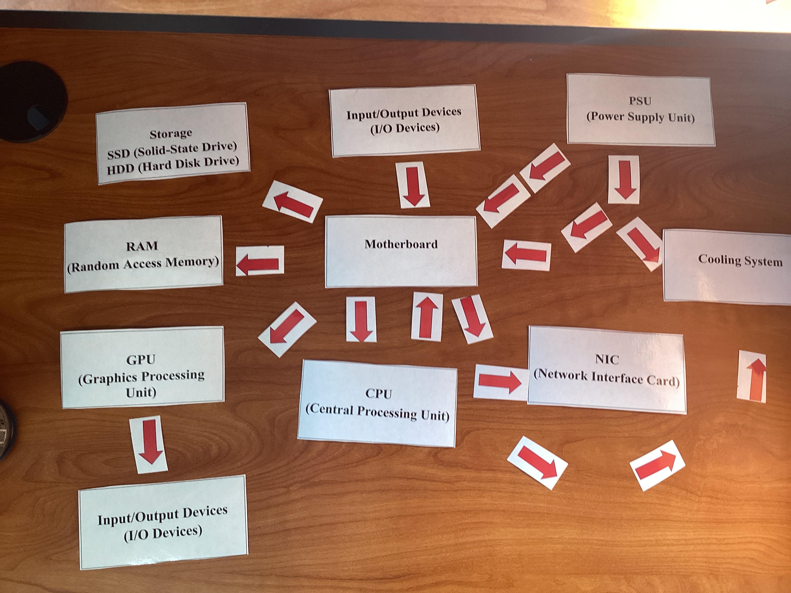

# Project Introduction

This was the first project of the year. In this project, we used component cards and strips to help us learn about software and hardware components. We learned what the functions of the components were, as well as how they all worked together.

## Activities

We did small activities such as:
- Silent Signals  
- Metal to Magic  
- Component Song  

## Silent Signals

This was the first part of our project. We started with a 3D-printed card that had a white side and a blue side. The objective was to communicate with our partner using only the card—no gestures, signals, or words.  

Since we couldn’t talk, we had to use a different type of “language,” almost like a code. At first, my partner and I tried tapping on the card to answer questions. However, we realized this counted as a signal and didn’t follow the rules.  

We then came up with a compromise. For example, one of the questions asked: *“Do you prefer the ocean or the mountains?”* I pointed to the blue side, which looked like the ocean, to show that I preferred the beach. The white side became the symbol for the mountains since the blue side had been used for the ocean.

## Reflection

This project was difficult because our options were very limited, and creativity was essential. The tapping method worked well compared to other approaches, but it didn’t really follow the guidelines as we had thought. We relied on luck for many of the questions since it was challenging to come up with consistent solutions.  

Overall, I found this project informative. It helped me discover new forms of communication that I wouldn’t have otherwise thought of.

## component song

the second step of our project was creating the "component song". Using suno, a website that generates ai songs and lyrics, I created my component song that was informative of how components function and how they are all integrated to work with eachother. 

song lyrics and link

Metal to magic

adddd

Hardware components

| **Hardware**      | **Purpose**                                                                                     |
|-------------------|-------------------------------------------------------------------------------------------------|
| **CPU**           | Executes instructions from programs                                                             |
| **RAM**           | Temporarily stores data and instructions the CPU is currently using                            |
| **SSD/HDD**       | Computer's long-term data storage system                                                        |
| **GPU**           | Processor specialized for parallel processing; useful for graphics processing and matrix multiplication |
| **Motherboard**   | Main circuit board inside the computer; connects all hardware components and allows communication via buses |
| **PSU**           | Device that powers the system                                                                   |
| **NIC**           | Translates data between computer and network; enables WiFi capabilities                         |
| **Cooling System**| Keeps components cool to prevent overheating and thermal throttling                            |
| **I/O Devices**   | Tools the user utilizes to interact with the computer (keyboard, microphone, mouse, camera, display, etc.) |

software components

| **Software**        | **Purpose**                                                     |
|---------------------|-----------------------------------------------------------------|
| **Firmware/UEFI**   | Starts the PC and hands off to OS; motherboard firmware         |
| **Drivers**         | Lets the OS talk to hardware                                    |
| **OS**              | Manages files, hardware, programs, UI, and much more            |
| **Libraries/Runtimes** | Pre-written code for apps; shared building blocks for apps   |
| **Applications**    | Programs for the user to interact with to complete tasks        |

software and hardware flowcharts

paragraph

hardware flowchart

software flowchart

(image)

Build a pc activity

Metal to magic reflection

