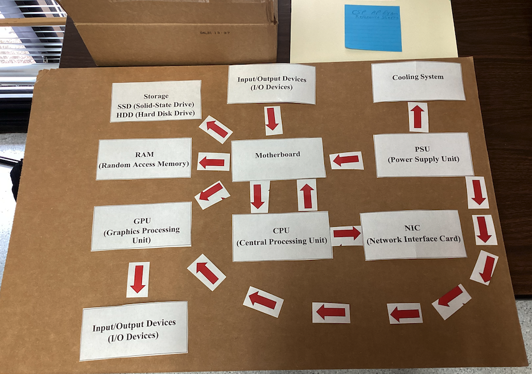

# Project Introduction

This was the first project of the year. In this project, we used component cards and strips to help us learn about software and hardware components. We learned what the functions of the components were, as well as how they all worked together.

### Activities

We did small activities such as:
- Silent Signals  
- Metal to Magic  
- Component Song  

## Silent Signals

This was the first part of our project. We started with a 3D-printed card that had a white side and a blue side. The objective was to communicate with our partner using only the card—no gestures, signals, or words. Since we couldn’t talk, we had to use a different type of “language,” almost like a code. At first, my partner and I tried tapping on the card to answer questions. However, we realized this counted as a signal and didn’t follow the rules. We then came up with a compromise. For example, one of the questions asked: *“Do you prefer the ocean or the mountains?”* I pointed to the blue side, which looked like the ocean, to show that I preferred the beach. The white side became the symbol for the mountains since the blue side had been used for the ocean.

## Reflection

This project was difficult because our options were very limited, and creativity was essential. The tapping method worked well compared to other approaches, but it didn’t really follow the guidelines as we had thought. We relied on luck for many of the questions since it was challenging to come up with consistent solutions.  

Overall, I found this project informative. It helped me discover new forms of communication that I wouldn’t have otherwise thought of.

## component song

the second step of our project was creating the "component song". Using suno, a website that generates ai songs and lyrics, I created my component song that was informative of how components function and how they are all integrated to work with eachother. 

song lyrics and link

Metal to magic

adddd

### Hardware components

| **Hardware**      | **Purpose**                                                                                     |
|-------------------|-------------------------------------------------------------------------------------------------|
| **CPU**           | Executes instructions from programs                                                             |
| **RAM**           | Temporarily stores data and instructions the CPU is currently using                            |
| **SSD/HDD**       | Computer's long-term data storage system                                                        |
| **GPU**           | Processor specialized for parallel processing; useful for graphics processing and matrix multiplication |
| **Motherboard**   | Main circuit board inside the computer; connects all hardware components and allows communication via buses |
| **PSU**           | Device that powers the system                                                                   |
| **NIC**           | Translates data between computer and network; enables WiFi capabilities                         |
| **Cooling System**| Keeps components cool to prevent overheating and thermal throttling                            |
| **I/O Devices**   | Tools the user utilizes to interact with the computer (keyboard, microphone, mouse, camera, display, etc.) |

### software components

| **Software**        | **Purpose**                                                     |
|---------------------|-----------------------------------------------------------------|
| **Firmware/UEFI**   | Starts the PC and hands off to OS; motherboard firmware         |
| **Drivers**         | Lets the OS talk to hardware                                    |
| **OS**              | Manages files, hardware, programs, UI, and much more            |
| **Libraries/Runtimes** | Pre-written code for apps; shared building blocks for apps   |
| **Applications**    | Programs for the user to interact with to complete tasks        |

## Software and hardware flowcharts

We first learned about the functions of each component of the PC, so we then needed to learn how each part worked together. This activity was individual, and we were assigned a piece of cardboard, componenent strips, and arrows. the cardboard was used to place the componene t strips down on. Our objective was to show how each componenet work together using these cards, as well as the arrows to show the connections. We needed to put the cards in order of how each are used when typing the sentence "The quick brown fox jumped over the lazy dog."

## Hardware flowchart

In general, I thought that I did a good job with figuring out what components work with what, but I also think this could have been organized better since there are lots of arrows in one place. 

The above example is what we were given as a reference by Arshiya in class as one of the ways this could have been correct.

## Software flowchart

Making the software flowchart was hard for me, and I wasnt sure if i was supposed to use arrows or not, but there is supposed to be an arrow in between each card. I did not make any connections, but I could have made some between cards like the os and device drivers.

## Build a pc activity

Prior to this activity, we did the 2 that I have already discussed. With the information that we learned from the previous activities, we were tasked with building a PC with a budget of 2000 dollars that would have the best performace for whatever category we chose. There were categories such as 4k video editing, gaming, graphic design, ect...

### The base parts are as follows:

- **CPU:** mid-range 4-core processor  
- **RAM:** 8 GB  
- **Storage:** 256 GB SSD  
- **GPU:** basic integrated graphics  
- **PSU:** 500W basic model  
- Standard cooling  
- Basic NIC (network card)  
- Motherboard that supports most modern upgrades  

The parts we were able to purchase are as follows

| **Component**    | **Upgrade Option**                         | **Cost**  |
|------------------|--------------------------------------------|-----------|
| **CPU**          | Mid-range 6-core processor                  | $150      |
|                  | High-end 8-core processor                   | $300      |
| **RAM**          | 16 GB total RAM                            | $150      |
|                  | 32 GB total RAM                            | $300      |
| **Storage**      | 512 GB SSD                                | $150      |
|                  | 1 TB SSD                                  | $250      |
|                  | 2 TB HDD (extra, for bulk storage)        | $100      |
| **GPU**          | Mid-range graphics card (good for gaming, video) | $250      |
|                  | High-end graphics card (best for gaming, ML) | $400      |
| **Cooling System** | Enhanced air cooling                      | $100      |
|                  | Liquid cooling system                      | $200      |
| **NIC**          | 2.5 Gbps network card                      | $100      |
| **Other**        | Extra case fans, RGB lighting, style upgrades | $50       |

I chose that I was going to make a PC focused on 4k video editing. I felt like the componenent that needed to be upgraded the most was the RAM because 8 gigabytes, especially for video editing is not very effective. Since video editing relies a lot on memory, I decided to upgrade to 32 gigabytes ($300). The next upgrade I decided to get was to upgrade the CPU to a high end 8 core processor. The CPU is like the brain of the computer and everything needs to run through it. Video editing requires a significant amount of cores especially since you often have multiple applications open at a time. This upgrade cost me another $300. I decided next that I was going to upgrade the graphics card, which for editing is important especially for 4k since you need to have good visuals. Graphics cards, however, are expensive so I opted for the mid range graphics card instead of the high end one for $250 dollars. My final upgrade was the SSD. Video editing requires you to download a ton of videos, photos, etc... and therefor I felt like the base amount wasnt suffiecent. 512 gb isnt ideal, but I didnt think of it as an absolute necessity because you can free up stoarage any time and many videos and photos you wont need to keep. This upgrade cost me $150. In the end my total came out to exactly $1000. I would of liked to upgrade other things like the cooling fan since 4k editing can make your PC overheat, but I felt like the other upgrades were more of a necessity. 

# Metal to magic reflection

This project was very helpful to me, especially since I hadnt really had any prior experience with computers, their parts, and how they work together. I would say the most important thing I learned was in the first activity where we talked about the functions of the hardware and how they work together, because we use terms like the CPU, GPU, etc... every day and knowing that information is essential to my success in the class. I also enjoyed the component song part, because it allowed me to be creative, while also learning more about the computers. Something that I still want to try to learn more from this project was the software. I felt like I understood the hardware more than I did the function of the software, but I still think I learned a lot since I really didnt have any understanding of it to begin with. The build a PC activity was also helpful, and since it was interactive and fun, I felt like I learned a lot about not only what parts are important for computers, but also what parts are more or less important depending on your objective with your computer. 

