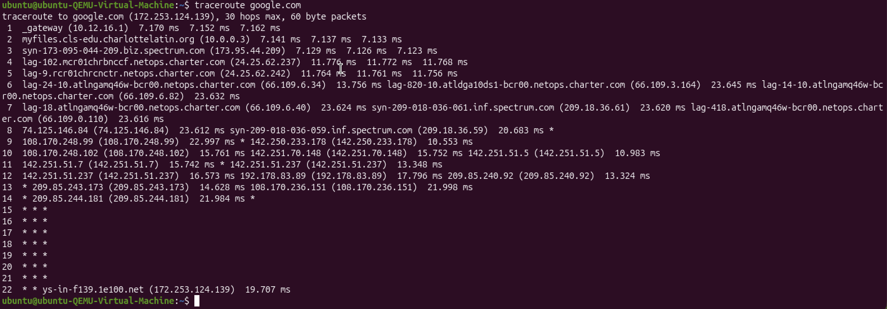
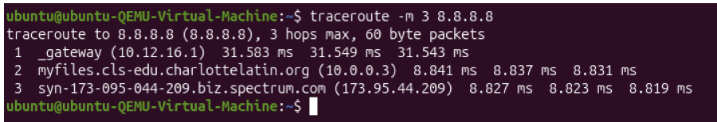
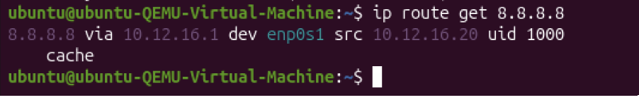
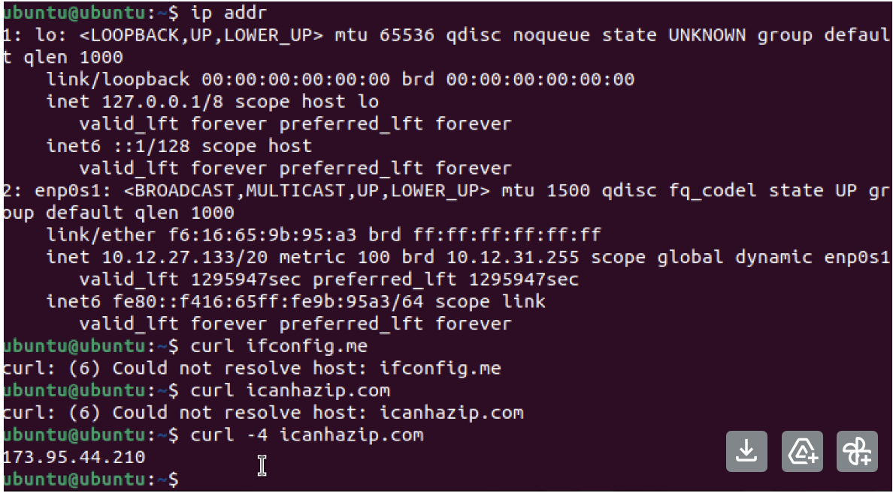
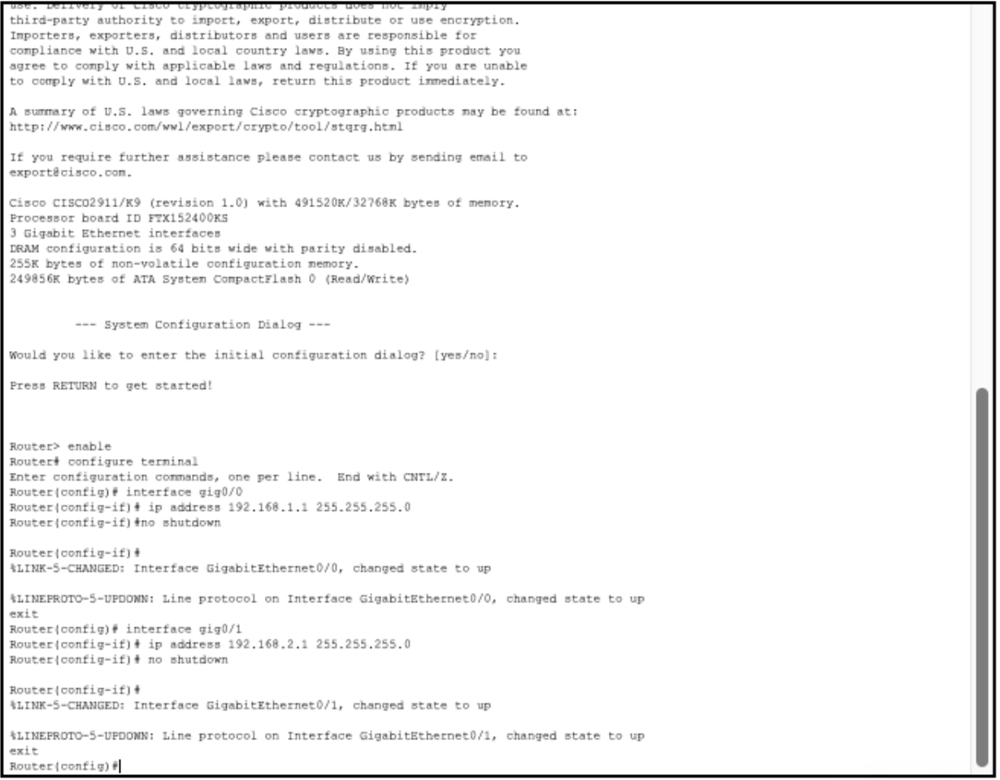
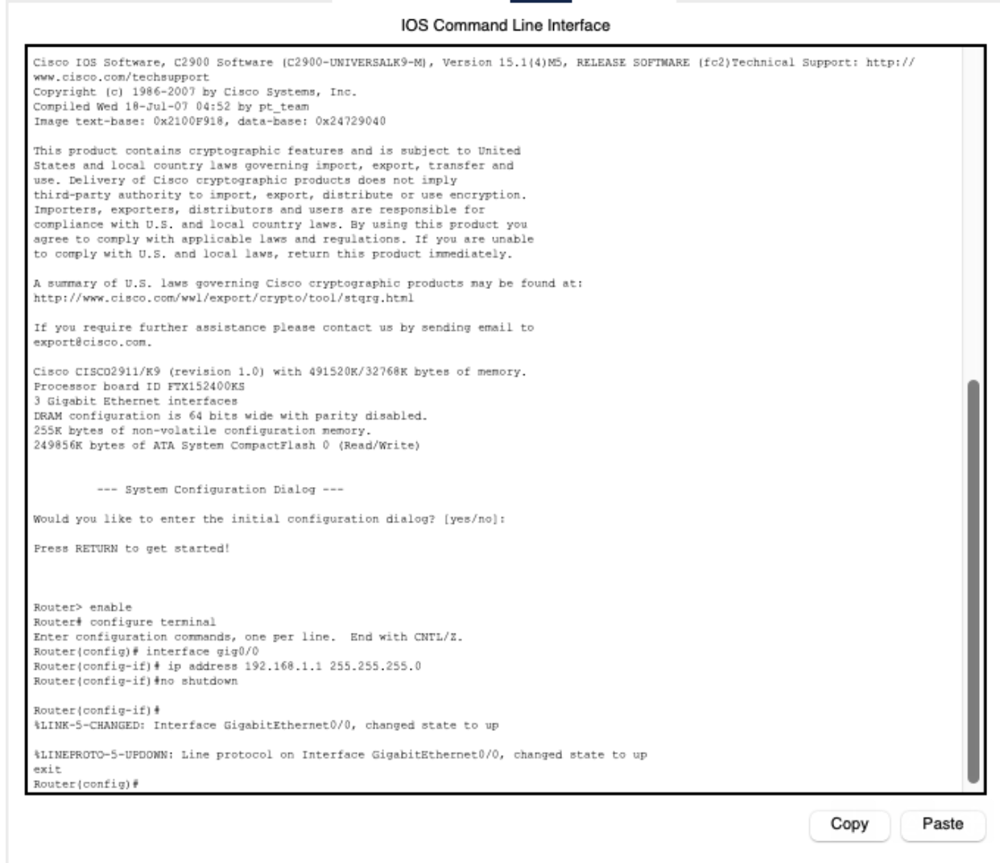
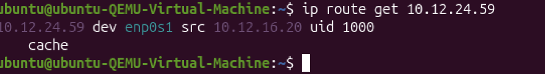
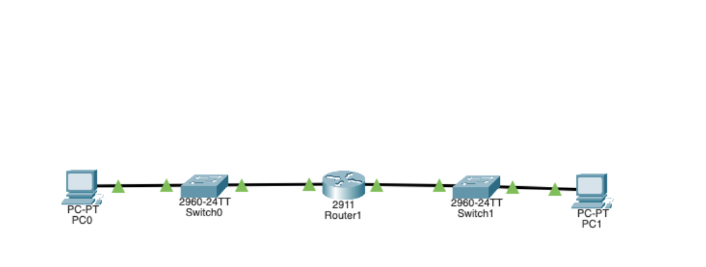

# Design & Planning

The purpose of this investigation was to understand how a computer identifies itself on a network at Layer 3 and how it decides where packets should go when communicating with other systems. Instead of just reading about routing, the idea was to actually observe the behavior using commands and screenshots from the machine itself. At first this seemed pretty straightforward, but once I started digging into the outputs it got a little confusing honestly. There are a lot of details in the routing information and it took some time to really understand what each line meant.

To begin, I looked at the network configuration of two virtual machines. These screenshots show the interface information and IP settings that the operating system assigns to the machine.

In the screenshot above, the interface `enp0s1` is active and has an IP address assigned. This tells us that the machine successfully joined a network and has the information necessary to communicate with other devices. The operating system stores these details internally so it knows how to send and receive packets.

Another snapshot from a second environment shows a similar setup.

Seeing both systems helped confirm that every device on a network needs its own IP address and interface configuration. Even though the machines are virtual they behave just like physical computers on a network.

One thing I noticed pretty quickly is that devices on the same subnet can communicate without needing a router. The packets never actually leave the local network. At first I thought the router might always be involved but that turned out not to be the case. If the destination is local the system just sends the frame directly through the switch.

Another interesting observation is that the routing table stored in the operating system basically acts like a decision guide. When the computer wants to send traffic somewhere it checks the table first and then decides whether the packet should go directly to the destination or to the gateway. This part was kinda tricky at first because the table looks complicated but once you understand the basic idea it makes more sense.

Overall this stage helped me understand how the operating system keeps track of network identity and routing paths.

---

# Technical Development

After examining the initial configuration, the next step was to analyze both the internal and external network identities of the machine. This part focused on understanding private addressing and how a device appears to the internet.

The following screenshot shows the IP configuration of the system.

The address assigned to the interface is a private IPv4 address. Private addresses are meant to be used only inside local networks and are not routed across the public internet. Because of this they can be reused by many different networks without causing conflicts.

Common private ranges include:

- 10.0.0.0 through 10.255.255.255  
- 172.16.0.0 through 172.31.255.255  
- 192.168.0.0 through 192.168.255.255  

The address shown in the screenshot clearly falls inside one of these ranges. This means the device is communicating inside a local network and is not directly exposed to the internet.

Next I checked the public IP address that the machine appears to use when accessing websites.

The interesting part here is that the public IP address is completely different from the private one assigned to the interface. At first that seemed strange because it looked like the computer somehow had two addresses at once. After looking into it more, the explanation is Network Address Translation, or NAT.

NAT is performed by the router at the edge of the network. When devices send packets to the internet the router replaces the private source address with its own public address. When responses come back the router translates them back to the correct internal device.

This system allows many computers to share a single public IP address. Without NAT every device would need its own public address which would be impossible because IPv4 space is limited.

To better understand how packets move through a network, I also built a small simulated topology.

The layout includes two PCs connected through switches with a router positioned between the networks. Each side of the router represents a different subnet.

The router configuration process is shown in the console screenshot.

Here the router is assigning IP addresses to its interfaces and bringing them online using the `no shutdown` command. Once this was done the router could forward packets between the two networks.

At first I expected the switches to somehow help route the packets but that is not how they work. Switches only move frames inside a single network using MAC addresses. When packets need to cross network boundaries the router must handle the forwarding.

To test this idea I removed the router from the topology completely.

Once the router was gone communication between the two PCs stopped immediately. They could still talk to devices within the same network segment but not across networks. This really made it clear that routers are essential for inter network communication.

Honestly this part of the lab felt kinda difficult at first because it was easy to mix up what the switch and router were actually doing. After watching the packet simulation a few times it started to make more sense though.

---

# Evidence

The next part of the investigation focused on collecting evidence using network diagnostic tools. The commands used included traceroute and routing table lookups.

The traceroute output below shows the path packets take when traveling toward an external destination.

One of the first things that stands out is the first hop. The first hop shown in the traceroute output corresponds to the default gateway of the network. This is the router responsible for forwarding packets outside the local subnet.

Looking further down the list you can see additional routers along the path. Some of the early addresses belong to the ISP infrastructure. These routers are part of the network that connects the local environment to the wider internet.

Later hops represent routers in larger backbone networks that handle traffic across regions and countries.

Another command used during testing was `ip route get`.

When running the command `ip route get 8.8.8.8`, the output shows that the next hop is the gateway `10.12.16.1` and the interface used is `enp0s1`.

This directly matches the traceroute output where the first hop was the same gateway address. That consistency confirms that the routing table correctly predicted the path that packets would take.

Another observation involved the TTL value used in traceroute. TTL stands for Time To Live and it limits how many routers a packet can pass through before being discarded.

When traceroute displays stars instead of IP addresses it usually means that a router along the path did not respond to the TTL expiration message. This can happen because some routers block ICMP responses for security reasons.

Even though the routers may not respond, the packets are still being forwarded normally.

The combination of traceroute and routing table commands provided a much clearer picture of how traffic actually moves through the network. Before running these tests I mostly understood the concept in theory but seeing the real outputs helped a lot.

---

# Final Reflection

This investigation showed how computers make routing decisions and how packets travel through multiple networks before reaching their destination.

One of the most useful commands during the experiment was `ip route get`. This command reveals how the operating system decides where to send a packet. For example when the destination `8.8.8.8` was queried the system indicated that the packet should be forwarded to the gateway `10.12.16.1`.

This gateway address also appeared as the first hop in the traceroute results. That connection between the routing table and traceroute output confirmed that the computer first sends packets to the router before they continue through the internet.

From there the packets travel through several routers belonging to the ISP and other network providers before eventually reaching the destination server.

Another important takeaway was the difference between switches and routers. Switches operate at Layer 2 and forward frames based on MAC addresses. They do not examine IP addresses and cannot make routing decisions. Routers operate at Layer 3 and determine the best path for packets based on destination networks.

Understanding this difference made the topology experiment make more sense. When the router was removed the networks could no longer communicate because there was no device capable of forwarding traffic between them.

The role of NAT also became clearer during the investigation. The machine had a private IP address internally but appeared with a completely different public address when communicating with external servers. This translation allows large numbers of devices to share a limited pool of public IPv4 addresses.

Overall the lab made the process of routing much easier to visualize. Instead of thinking about networking as something abstract it became clear that every packet follows a series of decisions made by routing tables and routers along the path. Watching traceroute reveal each hop was actually pretty cool and helped connect the theory to what is really happening behind the scenes.
