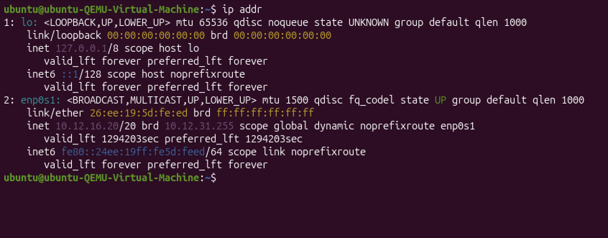
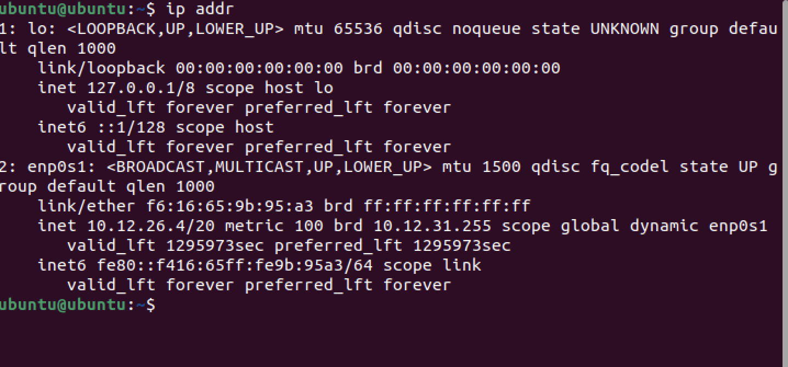

# Design & Planning

### Virtual Machine 1

### Virtual Machine 2

### Reflection

The screenshots above show traceroute commands both to google and 8.8.8.8. It shows information about the machine’s IP configuration, network interface status, and routing behavior. This information allows the system to determine where packets should be sent when communicating with other devices. From examining the interface information in the screenshots, the system shows an active network interface (`enp0s1`) that has been assigned an IP address and is operational. This shows that the machine has successfully connected to a network and has the correct configuration to communicate with other devices. If this configuration was removed or not set correctly, the computer would still be able to communicate with devices on the same local network as long as the interface is active. However, it would lose the ability to reach things like the internet. Without correct routing information the system would not know how to forward packets further the local subnet so that is why correct routing is important.

---

# Technical Development

## Internal Network Identity

### Reflection

The IP address assigned to the interface in this screenshot falls within a private IPv4 address range. Private address ranges are reserved for use within local networks and are not routed across the public internet.

These ranges include:

- 10.0.0.0 to 10.255.255.255  
- 172.16.0.0 to 172.31.255.255  
- 192.168.0.0 to 192.168.255.255  

Because the address displayed in the interface configuration falls inside one of these ranges, it is intended only for communication inside the local network environment. Private addresses can be reused by many different organizations or households because they are not globally unique. This is why multiple networks around the world may contain devices with identical private IP addresses.

---

## External Network Identity

| Question | Private Address | Public Address |
|--------|--------|--------|
| Are they identical? | No | No |
| Explanation | A private address is used only within the local network and cannot be reached directly from the internet. | A public address is assigned by an internet service provider and represents the network when communicating with external systems. |

### Reflection

The machine appears to have two different IP addresses because it participates in two different addressing contexts. The private address is used for communication inside the local network, while the public address represents the network when communicating with the internet. This occurs because the router performs **Network Address Translation (NAT)**. When packets leave the local network, the router replaces the internal source address with its public IP address. When responses return, the router translates the destination address back to the correct internal device. Because of this process, multiple internal systems can access the internet while sharing a single public IP address.

---

## Network Construction

### Topology Layout

The network topology used in the simulation consisted of two PCs connected to switches with a router placed between them. Each side of the router represented a different IP network.

### Address Configuration

Each PC was assigned an IP address corresponding to its respective subnet. This allowed the router to distinguish between the two networks and correctly forward traffic between them.

### Router Interface Setup

The router configuration shows two interfaces being assigned IP addresses and enabled using the `no shutdown` command. Once both interfaces were active, the router was able to route packets between the connected networks.

---

## Observing Same-Network Communication

### Packet Simulation

(video recording captured during simulation)

### Reflection

When two devices exist within the same subnet, packets are delivered directly without involving a router. The sending device determines the destination MAC address using ARP and sends the frame to the switch. The switch then forwards the frame based on its MAC address table. Because the destination device resides within the same network, there is no need for the router to participate in the communication.

---

## Observing Inter-Network Communication

### Packet Movement from PC0 to PC1

(video recording captured during simulation)

### Reflection

When communication occurs between devices on different networks, the router becomes responsible for forwarding the packet. The router receives the incoming frame, removes the original Layer 2 header, and constructs a new Ethernet frame before sending the packet onto the next network. While the MAC addresses change at each hop because they are only relevant within the local network segment, the source and destination IP addresses remain constant throughout the journey.

---

## Failure Scenario

### Communication After Router Removal

### Reflection

When the router was removed from the network topology, communication between the two networks immediately failed. The devices could still communicate with others on the same subnet, but packets destined for the other network could not be delivered. This occurs because switches operate at Layer 2 and cannot make routing decisions. Only a router can determine the correct path for packets traveling between separate IP networks.

---

# Evidence

## Investigation 2 — Multiple Destination Tests

### Loopback Test

### Reflection

When traffic is sent to the loopback address, the packets never leave the device. The operating system handles the communication internally, which means no physical network interface or gateway is required. Loopback testing is useful for verifying that the system’s networking stack is functioning correctly.

---

### Communication Within the Same Network

### Reflection

When packets are sent to another device within the same network, the routing table identifies the destination as directly connected. The system therefore sends the packet straight to the destination without using the default gateway. Another concept demonstrated during this stage is **TTL (Time To Live)**. Each router that forwards a packet reduces the TTL value by one. If the value reaches zero, the packet is discarded to prevent routing loops.
Traceroute relies on this mechanism by intentionally sending packets with small TTL values.

---

### Communication Outside the Network

### Reflection

When the destination lies outside the local subnet, the system consults the routing table and identifies that the packet must be sent to the default gateway. The routing table contains a default route (`0.0.0.0/0`) that directs unknown destinations to the router. The router then determines the next hop and forwards the packet toward the destination network.

---

## Investigation 3 — Routing Decision Process

### Traceroute Observation

### Reflection

The traceroute output reveals the sequence of routers that a packet traverses on its way to the destination. The first hop shown in the screenshot corresponds to the default gateway of the local network. Subsequent hops represent routers within the ISP infrastructure and eventually routers on the broader internet. The presence of private addresses early in the traceroute path is common because the traffic initially travels through routers inside the local network or ISP infrastructure before reaching publicly routed networks.

---

### Routing Table Verification

### Reflection

The command `ip route get 8.8.8.8` shows the local routing decision made by the operating system. The output indicates that packets destined for this address will be forwarded through gateway `10.12.16.1` using interface `enp0s1`. This corresponds with the traceroute results, where the first hop in the path was the same gateway address. This confirms that the routing table accurately determines the initial step in the packet’s journey.

---

# Final Reflection

This investigation demonstrated how devices determine the path that packets take when communicating across networks. The routing table plays a critical role in this process by identifying whether a destination is directly connected or requires forwarding through a gateway. For example, the routing table output showed that traffic destined for `8.8.8.8` would be forwarded to the gateway `10.12.16.1`. The traceroute output confirmed this decision by showing the same address as the first hop in the packet’s path. From there, the packets continued through several routers belonging to the ISP and other network providers before reaching the final destination. Another key concept reinforced by this investigation is the distinction between Layer 2 and Layer 3 devices. Switches operate at Layer 2 and forward frames based on MAC addresses within a single network. Routers operate at Layer 3 and make forwarding decisions based on IP addresses, allowing communication between separate networks. The role of NAT was also evident in the experiment. While the machine used a private IP address internally, it appeared to external servers with a different public address assigned by the ISP. This translation allows multiple devices within a network to share a single public IP address. By combining routing table analysis, traceroute observations, and simulated network testing, it becomes possible to trace the full path that packets take from a device to a destination across interconnected networks.
