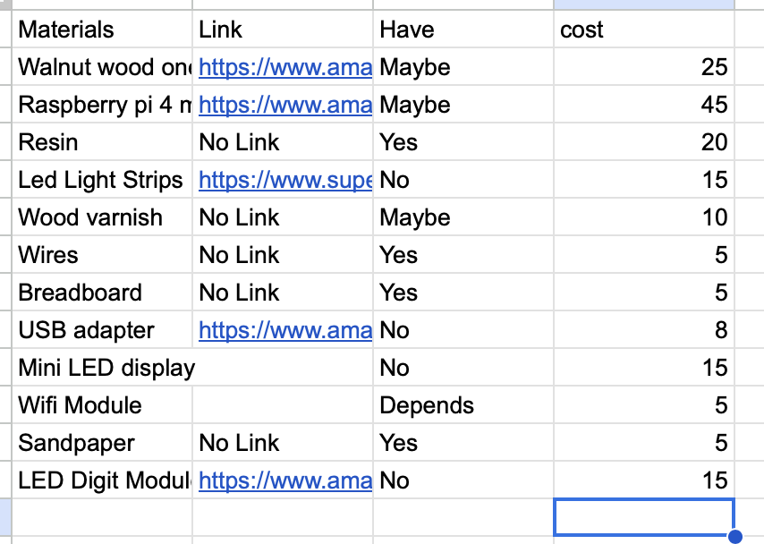

## Daily Journal

8-28 - Laser cut personal box to hold materials

9-1 - Begun the wood pen project

9-3 - Glued wood pen pieces together and waited for them to dry until the next day

9-5 - We drilled a hole through the two wooden pieces that we glued together, and then put the metal shaft in the hole with super glue

9-8 - Sanded down the sides of the pen and then started to turn it

9-10 - Finished turning the pen

9-12 - I assembled the pen and made sure that everything worked

9-18 - I wanted to do the pearl project, but was still deciding

9-24-25 - I tried to decide what I am doing for my project. I am considering doing the Pearl  project, but am not sure because of football

9-25-25 - I decided that I was not doing the pearl project and started to think of other ideas I could do

9-26 - I had an idea to do a wooden scoreboard that updates live games, specifically the Carolina , Panthers, so you can see the score in real time on the board

9-29 - I did research on my project, figuring out things I would need to make it work. I used the link below for comparing the Raspberry Pi models and seeing which one worked best for the project https://socialcompare.com/en/comparison/raspberrypi-models-comparison

9-30 - I researched what type of wood I would need. The link for the wood I am thinking of using is below https://www.amazon.com/Walnut-Hardwood-Unfinished-Woodworking-Engraving/dp/B0BGJPDKC9/ref=sr_1_1_sspa?dib=eyJ2IjoiMSJ9.gUsOiHq67dtfxt1U_VQ4dTYEUkbNh_famtHiYpJ5QpqRtA450h0VsWHSnaWjj0zqvM7zEEwvhbwYppn6R_9OvC--dLu8DRhQ26Y-jhZQoUUdOIvVgbapU-lnD4R4os2WCAcf_VSNgXVwKYJkVH6Vr2obWF4-sm0zrIJ99PERhLIfu_FNWLlYVxMhvm_kSW-xF-tJoaxWwSjV8v9V_MJ5snNNw2XJ7ShlCgHCYGeMDCIL6M1moYHb_DjMOYRo7pv_cgMampEofQqZKQ6uHCzUT98-5MhG8X5-98tjNxbW7VA.Dcw0PzxSFJHqbMRiCVxZK1h3RdOviEKmLT9FpwL4a7o&dib_tag=se&keywords=walnut+wood&qid=1760012287&sr=8-1-spons&sp_csd=d2lkZ2V0TmFtZT1zcF9hdGY&psc=1

10-1 - I did more research on my project to try and figure out how I would make it work. To get live data, I needed to use an API. Most of them are paid for, but I found an ESPN one that should work. If this does not work, then I may need to find another solution. https://site.api.espn.com/apis/site/v2/sports/football/nfl/scoreboard

10-2 - I found more materials like these LED strips that will light up the engraved panthers logo https://www.superlightingled.com/side-emitting-4mm-ultra-thin-led-neon-flex-strip-lights-p-6099.html

10-3 - I created a Google Doc that helps me and my teacher visualize my idea and see any potential errors https://docs.google.com/document/d/1nw5ylel2ZrbF-HW83ZcTL0ofzCo5Q5WhvYyqAbZ7k_Q/edit?tab=t.0

10-6 - I found more pieces like this led light module below which will help me display the score of the game https://www.amazon.com/EC-Buying-MAX7219-Electronic-Components/dp/B0BXDJS22V/ref=zg_bs_g_306759011_d_sccl_3/139-5931038-1637611?th=1 or https://www.amazon.com/uxcell-Cathode-Segment-Display-Digital/dp/B07GTQWF4R/ref=zg_bs_g_306759011_d_sccl_2/139-5931038-1637611?th=1 or https://www.amazon.com/HiLetgo-Digital-Segment-Display-Arduino/dp/B01DKISMXK/ref=sr_1_3?crid=1WDQOB053FNZK&dib=eyJ2IjoiMSJ9.Np0RE7e9EVySouEVPqbavddCHAgqzqR3dO0dPpNf7-f7-6RpaLmcr3cG_zv0TgJlyAj4dtKT-_eYC5HFY5TcJkD1th9UX-K6PcksFYs0TV49oD95dAhoJoFOL-YkqKOI2TAWU5D1s2PfgrRPRfjgo1X1djVEaPNbdCTHrZYi7ii3KoPjiE8kcgRZIWMU8PQQY9NPFeEIfQKYrLOiLFRNfjctv4Yfl8nji9CJJDM4C7T_LGYziRJDJhXgNsdJ2LBPxlL24Jc6C1Kl__bhguirUt1j3do_XCt_UaBI5hCqv6Y.jSnkcrvbavJX5rROSa5QzcNYsbus0bBEislMH5VtWo0&dib_tag=se&keywords=led%2Bdigit%2Bmodule%2B2%2Bdigits&qid=1760014000&s=industrial&sprefix=led%2Bdigit%2Bmodule%2B2%2Bdigits%2Cindustrial%2C67&sr=1-3&th=1

10-7 - I worked through some of the fundamentals of the project and how I would get it to work. I realized I needed a Raspberry Pi with a wifi module so it could connect to the live scores that I would program it to receive and display.

10-8 - I looked over the laser cutting workflow to make sure I knew how to use it

10-9 - I added more things to the Google Doc that I linked for 10-6 to give me a better idea of how I would do my project

10-10 - I finished the spreadsheet with all of my materials and included the ones that we may have at the fabla,b like wiring, sandpaper, wood varnish, resin, etc... https://docs.google.com/spreadsheets/d/1inqLF94JXjDDkbQPFtxw10qv6yk3-GvXojiwrM2xEpA/edit?gid=0#gid=0

10-13 - I worked on 3d printing and laser cutting. I printed a snake, and then while it was printing reviewed my project for any missing materials.

### Daily Journal Entries

**10-13**  
Worked on general fabrication prep by using the laser cutter and 3D printer. While working, I reviewed my wooden scoreboard project plan and checked for any missing materials or tools that might be needed later.

**10-15**  
Began early planning for the scoreboard design. Thought through overall layout, size, and how scores would be displayed. Considered how electronics could fit cleanly inside a wooden structure.

**10-22**  
Researched possible electronic components for the scoreboard, including LED displays and basic wiring layouts. Looked into how scores could be updated manually or through simple code.

**10-29**  
Reviewed material needs and potential build steps. Identified wood thickness, finishing materials, and basic electronics requirements. Noted areas of the design that may need to change once fabrication begins.

**11-6**  
Reviewed project requirements and focused on visibility and readability of the scoreboard. Considered how far away scores should be readable and how placement would affect viewing.

**11-7**  
Researched different methods for displaying numbers on a scoreboard, including LED digit modules and light strips. Compared options based on simplicity and reliability.

**11-8**  
Sketched different scoreboard layout ideas, including placement of scores, labels, and electronics access panels. Considered how internal spacing would affect wiring and maintenance.

**11-13**  
Started outlining the physical structure of the scoreboard. Considered frame construction, mounting or stand options, and how to keep the scoreboard stable while remaining portable.

**11-14**  
Looked into basic Raspberry Pi and Arduino control options for driving LED displays. Reviewed example projects to understand how scores could be updated through code.

**11-18**  
Compared different LED modules and power supply options. Evaluated brightness, power requirements, and cost to determine the best fit for the project.

**12-8**  
Reviewed the overall scoreboard concept and identified areas that still needed refinement, especially related to electronics placement and wiring paths. Updated documentation to reflect current progress.

**12-10**  
Planned next steps for coding and testing the display logic. Organized research notes and examples to prepare for writing and testing code.

**12-13**  
Continued refining ideas for how final scores would be displayed clearly and consistently. Considered how the user would interact with the scoreboard to update scores.

**12-14**  
Reviewed safety considerations related to electrical components and wood construction. Noted areas where edges should be rounded and electronics enclosed.

**12-16-2025**  
Prepared for upcoming coding, electronics testing, and fabrication. Finalized short-term goals for completing the scoreboard and moving into the build phase.

1-6-2025

I decided to change some of my project. originally, I had planned to laser cut the logo onto a wooden board. However, I felt like it would be more creative to make my board multilayered, laser cutting a different part of the stadium on each board, which when combined, would create a 3d effect similar to the image below. Additionally, I found it too difficult to do the scores of the athletic games of charlotte Latin, because doing so would not allow me to do what i had intended to do which was to update the scores live. After talking to Mr. Teets I found out that this wad not possible to do for Charlotte Latin. Instead, I shifted the focus to doing the scores of NFL games, specifically Panthers games. The stadium is for an aesthetic effect, and below the words "Carolina panthers" will be engraved, as well as the logo. Below this will be the led display. This will either be small led boards or a neon light display which will feature the panthers name in the retro font. actually retro font for name listed above but something else to display scores probably.

### Description of final project choice, why chosen, and what successful project would do

The project that I will be doing is a wooden scoreboard that displays the scores from athletic gmes at Charlotte latin. Because charlotte Latin is a small school, they do not live update scores for games so the way that this scoreboard will work is that it will display the final scores. 

### Attribution of project serving as inspiration, including the original author/maker and source (adafruit, instructables, etc.)

https://www.google.com/url?sa=t&source=web&rct=j&opi=89978449&url=https://github.com/mikemountain/nfl-led-scoreboard&ved=2ahUKEwi81qLmx8iRAxWDt4QIHfQpEyUQFnoECA0QAQ&usg=AOvVaw0yMOJSYy-Hm38hfJqaSJoA

This is the project that inspired me since the creator made a scoreboard for NFL games.

### Description of how project is different than source

The project that I used as inspiration is completely made out of LED's but my scoreboard will be wooden and only a small part will be LED. The inspiration also does NFL scores and updates live, while mine does the scores at Charlotte Latin and does not update live.

### Design Specification Considerations _ document that you completed

- Overall scoreboard size
- Wood type selection 
- Score display method for final score
- Power source and simple wiring layout
- Mounting or stand design for stability and portability
- Weather resistance for indoor vs. outdoor use
- Ease of manually updating final scores
- Safety considerations (rounded edges, enclosed electronics, heat management)

### Instructions

### Final materials list including costs

### What tools will you use? Including hand tools and Fab Lab equipment. Did you include machine settings?

- sanding machine
- laser cutter
- cnc machine

### What files did you include? Arduino, Corel Draw, Fusion 360,… these are your digital design and manufacturing file

- I currently do not have any files since I am working on coding my project

### Detailed photos and or videos. Can the media be accessed?

- I do not have any photos

### Inclusion of important decisions you are making and why you are making them

- Deciding whether or not to do school games or NFL games - I decided to do school games so it could be displayed at school for others to see how our teams are doing  - 
- Choosing a wooden scoreboard for durability
- Selecting walnut wood for its strength and appearance
- Using LED digit modules for clear visibility and easy score updates
- Incorporating a Raspberry Pi to allow flexibility for future upgrades
- Designing the scoreboard to be portable while remaining stable
- Prioritizing safety by enclosing electronics and rounding exposed edges

### Discussion of mistakes, issues, challenges, and how you overcome them

At this stage of the project, most challenges have occurred during the planning and coding phase rather than the physical construction. These include:

- Realizing that displaying live scores was too complex for the project and shifted the goal to final scores only
- Encountering difficulty deciding how scores will be stored and updated within the code
- Needing to learn new Raspberry Pi libraries and display control methods
