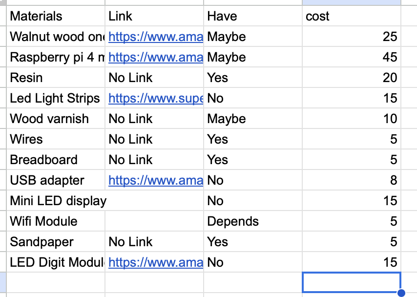

## Project Log

### 8-28
Laser-cut personal box to hold materials

### 9-1
Begun the wood pen project

### 9-3
Glued wood pen pieces together and waited for them to dry until the next day

### 9-5
We drilled a hole through the two wooden pieces that we glued together, and then put the metal shaft in the hole with super glue

### 9-8
Sanded down the sides of the pen and then started to turn it

### 9-10
Finished turning the pen

### 9-12
I assembled the pen and made sure that everything worked

### 9-18
I wanted to do the pearl project, but was still deciding

### 9-24-25
I tried to decide what I am doing for my project. I am considering doing the Pearl project, but I am not sure because of football

### 9-25-25
I decided that I was not doing the pearl project and started to think of other ideas I could do

### 9-26
I had an idea to do a wooden scoreboard that updates live games, specifically the Carolina Panthers, so you can see the score in real time on the board

### 9-29
I did research on my project, figuring out things I would need to make it work. I used the link below for comparing the Raspberry Pi models and seeing which one worked best for the project  
[Raspberry Pi Model Comparison](https://socialcompare.com/en/comparison/raspberrypi-models-comparison)

### 9-30
I researched what type of wood I would need. The link for the wood I am thinking of using is below  
[Walnut Wood for Project](https://www.amazon.com/Walnut-Hardwood-Unfinished-Woodworking-Engraving/dp/B0BGJPDKC9/ref=sr_1_1_sspa)

### 10-1
I did more research on my project to try and figure out how I would make it work. To get live data, I needed to use an API. Most of them are paid for, but I found an ESPN one that should work. If this does not work, then I may need to find another solution  
[ESPN NFL Scoreboard API](https://site.api.espn.com/apis/site/v2/sports/football/nfl/scoreboard)

### 10-2
I found more materials like these LED strips that will light up the engraved Panthers logo  
[Side Emitting LED Strip](https://www.superlightingled.com/side-emitting-4mm-ultra-thin-led-neon-flex-strip-lights-p-6099.html)

### 10-3
I created a Google Doc that helps me and my teacher visualize my idea and see any potential errors  
[Scoreboard Planning Document](https://docs.google.com/document/d/1nw5ylel2ZrbF-HW83ZcTL0ofzCo5Q5WhvYyqAbZ7k_Q/edit)

### 10-6
I found more pieces like this LED light module below which will help me display the score of the game  

[LED Digit Module Option 1](https://www.amazon.com/EC-Buying-MAX7219-Electronic-Components/dp/B0BXDJS22V/ref=zg_bs_g_306759011_d_sccl_3/139-5931038-1637611?th=1)  

[LED Digit Module Option 2](https://www.amazon.com/uxcell-Cathode-Segment-Display-Digital/dp/B07GTQWF4R/ref=zg_bs_g_306759011_d_sccl_2/139-5931038-1637611?th=1)  

[LED Digit Module Option 3](https://www.amazon.com/HiLetgo-Digital-Segment-Display-Arduino/dp/B01DKISMXK)

### 10-7

I worked through some of the fundamentals of the project and how I would get it to work. I realized I needed a Raspberry Pi with a wifi module so it could connect to the live scores that I would program it to receive and display.

### 10-8

I looked over the laser cutting workflow to make sure I knew how to use it

### 10-9

I added more things to the Google Doc that I linked for 10-6 to give me a better idea of how I would do my project

### 10-10

I finished the spreadsheet with all of my materials and included the ones that we may have at the fab lab, like wiring, sandpaper, wood varnish, resin, etc  
[Project Materials Spreadsheet](https://docs.google.com/spreadsheets/d/1inqLF94JXjDDkbQPFtxw10qv6yk3-GvXojiwrM2xEpA/edit?gid=0#gid=0)

### 10-13

I worked on 3D printing and laser cutting. I printed a snake, and then while it was printing, I reviewed my project for any missing materials.

### 10-13

Worked on general fabrication prep by using the laser cutter and 3D printer. While working, I reviewed my wooden scoreboard project plan and checked for any missing materials or tools that might be needed later.

### 10-15

Began early planning for the scoreboard design. Thought through overall layout, size, and how scores would be displayed. Consider how electronics could fit cleanly inside a wooden structure.

### 10-22

Researched possible electronic components for the scoreboard, including LED displays and basic wiring layouts. Looked into how scores could be updated manually or through simple code.

### 10-29

Reviewed material needs and potential build steps. Identified wood thickness, finishing materials, and basic electronics requirements. Noted areas of the design that may need to change once fabrication begins.

### 11-6

Reviewed project requirements and focused on the visibility and readability of the scoreboard. Considered how far away scores should be readable and how placement would affect viewing.

### 11-7

Researched different methods for displaying numbers on a scoreboard, including LED digit modules and light strips. Compared options based on simplicity and reliability.

### 11-8

Sketched different scoreboard layout ideas, including placement of scores, labels, and electronics access panels. Consider how internal spacing would affect wiring and maintenance.

### 11-13

Started outlining the physical structure of the scoreboard. Consider frame construction, mounting or stand options, and how to keep the scoreboard stable while remaining portable.

### 11-14

Looked into basic Raspberry Pi and Arduino control options for driving LED displays. Reviewed example projects to understand how scores could be updated through code.

### 11-18

Compared different LED modules and power supply options. Evaluated brightness, power requirements, and cost to determine the best fit for the project.

### 12-8

Reviewed the overall scoreboard concept and identified areas that still needed refinement, especially related to electronics placement and wiring paths. Updated documentation to reflect current progress.

### 12-10

Planned next steps for coding and testing the display logic. Organized research notes and examples to prepare for writing and testing code.

### 12-13

Continued refining ideas for how final scores would be displayed clearly and consistently. Consider how the user would interact with the scoreboard to update scores.

### 12-14

Reviewed safety considerations related to electrical components and wood construction. Noted areas where edges should be rounded and electronics enclosed.

### 12-16-2025

Prepared for upcoming coding, electronics testing, and fabrication. Finalized short-term goals for completing the scoreboard and moving into the build phase.

### 1-6-2025

I decided to change some of my projects. Originally, I had planned to laser cut the logo onto a wooden board. However, I felt like it would be more creative to make my board multilayered, laser cutting a different part of the stadium on each board, which when combined would create a 3D effect similar to the image below. Additionally, I found it too difficult to do the scores of the athletic games of Charlotte Latin, because doing so would not allow me to do what I had intended to do, which was to update the scores live. After talking to Mr. Teets, I found out that this was not possible to do for Charlotte Latin. Instead, I shifted the focus to doing the scores of NFL games, specifically Panthers games. The stadium is for an aesthetic effect, and below the words "Carolina Panthers" will be engraved, as well as the logo. Below this will be the LED display.
### 1-9-2026

I worked on creating the files that I will be using for the stadium cutout. I followed the tutorial linked below to achieve this.
  
 https://www.google.com/url?sa=t&source=web&rct=j&opi=89978449&url=https://www.youtube.com/watch%3Fv%3DNtvDkJ6fSHA&ved=2ahUKEwjf1vWchJOTAxUC5ckDHYFVPK4QwqsBegQIFxAB&usg=AOvVaw0bay2pX-SBXOl57I8WC2bt

### 1-13-2026

I finished working on the stadium layers and am now able to start laser cutting my boards

### 1-15-2026

I laser cut the first two layers of the plywood using the design I created. I was only able to get 2 layers done because each layer took a really long time, roughly 45 minutes for each. I came in after school to work on this.

### 1-21-2026

I laser cut the 3rd layer and only need to do one more layer

### 1-23-2026

I was able to get the last layer complete. All 3 of the previous layers turned out perfect, but this layer was a little off-center. After thinking through how to fix this, I decided it would be best to cut off a little wood from both this layer and the other 3 layers to make everything match up. I will sand down the sides if anything is uneven.

### 1-27-2026

I sanded down the sides of the board to make everything match up. I was able to get it looking pretty good, but ultimately will need to sand down the sides to get it looking how I want it to be.

### 1-29-2026

I sanded down the sides to make everything even. While I was using the sanding machine, I also sanded the entirety of each wood piece using 220-grit sandpaper. This was prep for staining the wood so that everything would apply evenly, as well as just making the board feel smoother.

### 2-3-2026

I worked on staining the wood today. I went outside and applied Prestain, let it sit for about 10-15 minutes, and then applied the stain. I did this for all 4 boards. Once the stain had sat on the wood for 5 or so minutes, I wiped off the excess until the paper towels were clean. I let this dry overnight.

### 2-5-2026

Since my boards were still potentially wet, I did some research on the screens I will be using. I decided on the 1.5-inch i2c screens since these seem to be the best for my project and are not too expensive.

[Scoreboard](100.png)

### 2-10-2026

The wood had finished drying, so I put the polycrylic coating on everything. This made it smoother, protects the wood long term, and makes it shinier.

### 2-12-2026

I put on a second layer of polycrylic coating to make the previously listed effects more apparent

### 2-18-2026

I worked on coding at home. I found out that the screens I ordered were not going to work. I was struggling with getting the screens to display something, like making the entire screen blue, for example. The screens turned on, but the screens not responding meant that there was a lack of communication. I figured this was a coding issue because the screens may have just not been very compatible with what I was doing, so I ordered new ILI9341 screens.

### 2-20-2026

The new screens arrived, and I was able to get them to respond. The next thing i will need to do is implement the ESPN API so that they can display scores.

### 2-24-2026

I finalized the code and was able to get everything to work for the screens.

### 2-26-2026

- I glued the wood pieces together and let them dry overnight. I used wood glue and clamped everything down to let it dry.

### 3-3-2026

- The wood dried, and the project was mostly complete, other than removing the tape I had used to ensure that if any glue got on the 3d stadium, it would not damage the wood and would be able to be removed. I started working on my slide presentation, which is linked below.

[Slides](https://docs.google.com/presentation/d/1-kbJa4P99hYIVPB8eSnyjjQ61_I4RpYqxASMjxnAdSI/edit?slide=id.gd431007ba2_0_208#slide=id.gd431007ba2_0_208)

### Description of final project choice, why chosen, and what successful project would do

The project that I will be doing is a wooden scoreboard that displays the scores from NFL games, specifically the Carolina Panthers games. The project will automatically update the scores based on the game live. So, for example, if the Panthers score a touchdown, the score will then be displayed on the screens on the board. This is achievable by using the ESPN public API, and creating a code that will search for games and scores and retrieve them.

### Attribution of project serving as inspiration, including the original author/maker and source (adafruit, instructables, etc.)

https://www.google.com/url?sa=t&source=web&rct=j&opi=89978449&url=https://github.com/mikemountain/nfl-led-scoreboard&ved=2ahUKEwi81qLmx8iRAxWDt4QIHfQpEyUQFnoECA0QAQ&usg=AOvVaw0yMOJSYy-Hm38hfJqaSJoA

This is the project that inspired me since the creator made a scoreboard for NFL games. My project is different in the sense that the board is made completely out of wood, only uses 2 screens that are wired differently, as well as a 3d stadium design made up of 4 layers of wood.

### Description of how project is different than source

The project that I used as inspiration is completely made out of LEDs's but my scoreboard will be wooden with a 3d stadium, and only a small part will be LED. The inspiration also does NFL scores and updates live like mine, but it is a completely different project and design.

### Design Specification Considerations _ document that you completed

- Overall scoreboard size
- Wood type selection 
- Score display method for final score
- Power source and simple wiring layout
- Mounting or stand design for stability and portability
- Weather resistance for indoor vs. outdoor use
- Ease of manually updating final scores
- Safety considerations (rounded edges, enclosed electronics, heat management)

### Instructions

### Final materials list including costs

- wood
  - The wood I used for the project was provided by the lab, so there were no external costs associated with it
- LED Modules
  - I used 2 LED modules, which I ordered from Amazon for 10 dollars each or 20 dollars total. The screens were roughly 2.8 inches tall and 1.6 inches wide
- Wood Stain
  - I used wood stain to make my wood darker. This was not provided by the lab, but luckily, Colin Kanofsky provided me with some of the stain that he did not use
- Polycrylic Protective Coating
  - This was provided by the lab and used as a protective layer to add shine, so there were no external costs
- Female to Female Jumper Wires
  - These were provided by the lab, so there were no external costs
- Raspberry Pi 2 W
  - I bought this item since there were no Raspberry Pis in the lab that I could use for my project. This cost me about 30 dollars

## Project Management

Did you include a plan?

- Yes, I did outline a plan and was able to follow it for the most part, but went out of order for some things like the coding and did most of it at home since i did not have time to do it at school.

Did you meet your deadlines?

- Yes, I felt like I met the deadlines since I was able to have the project completed by the time we did our presentations. There are some little things i still need to do like stain the back of the board and sand it, but that is pretty much it.

### What tools will you use? Including hand tools and Fab Lab equipment. Did you include machine settings?

- sanding machine - This will be used to sand down the wood, which is necessary to make it smoother, as well as so that when applying the stain, it will be even
- laser cutter - This will be used to make the 3d stadium design out of the 4 layers, as well as cut the holes for the screens to fit through
- Soldering Iron - This is mainly for attaching the pin header on the Raspberry Pi and maybe soldering 2 wires together if there are any shared pins between screen 1 and 2

### What files did you include? Arduino, Corel Draw, Fusion 360,… these are your digital design and manufacturing files

- The only file used for this project is the ones linked below, which are the stadium layers

[Stadium Layers](https://drive.google.com/drive/u/4/folders/1wfCeDENAcJTLqPhomfxzF8sW2yyE52ty)

### Detailed photos and or videos. Can the media be accessed?

- Videos of the scoreboard working with an NBA game. The NFL does not have any games until the fall, so I had to pick a different sport to display how the scoreboard will work. In the Google Drive linked below, there is a time-lapse to show how the scoreboard works for a longer portion of the game, as well as a regular video, which makes it easier to see how everything updates.

#### Picture of Scoreboard

[Videos](https://drive.google.com/drive/u/1/folders/1W4EseaekX1IRiQ3N3lFisRfh8MS-XwA6)

### Inclusion of important decisions you are making and why you are making them

- Deciding whether or not to do school games or NFL games - I decided to do NFL games because, after talking with Mr. Teets, who is involved with updating and managing the scores of the sports programs, I found out that I would not be able to achieve my goal because the scores wouldn't be able to update live
- Choosing a wooden scoreboard for durability
- Selecting plywood because it is the right size and was already provided
- Using LED digit modules for clear visibility and easy score updates
- Incorporating a Raspberry Pi to allow flexibility for future upgrades
- Designing the scoreboard to be portable while remaining stable
- Prioritizing safety by enclosing electronics and rounding exposed edges

### Discussion of mistakes, issues, challenges, and how you overcome them

I encountered a few challenges during this project. The first issue was that I underestimated how long this would take, and it required me to come in a lot after school to work on some of the things. I also changed my plan on this project a few times. Initially, I had not planned to stain the wood, but I thought in the end it would make everything look better. I also did not plan to use the Polycrylic coating on the wood, but after figuring out its purpose and the benefit of using it, I decided to put 2 layers of it on the board. The biggest issue I had was with the screens. I had ordered 2 I2C screens because they only required 4 pins and were the right size for my board. However, I found out that for my specific project, there were not enough libraries to use, and the entire coding piece of this would be very difficult. I tried to make these work for a few days, but ultimately knew it would be better to find different screens since it was so close to the due date of the project. I ended up switching to the ili9341 screens, which were much easier to work with.

## Final Summary

This project taught me a lot about how much planning, testing, and revision goes into making something that looks simple in the end. When I first started, my ideas were much less developed, and I was still deciding between completely different directions for the project. Over time, I moved from smaller woodworking projects into a much larger idea that combined woodworking, design, electronics, and coding. I learned that a project like this is not just about building the final object. It is also about research, figuring out materials, testing components, and making decisions when something does not go the way you expected. Through this process, I learned more about Raspberry Pi systems, live data through APIs, screen compatibility, laser cutting, sanding, staining, and finishing wood. I also learned how much detail matters when trying to combine digital and physical parts into one working project.

One of the biggest things I learned about completing a large project is that flexibility matters just as much as planning. At the beginning, I thought my project would focus on Charlotte Latin sports, but after learning that live score updating would not really be possible in the way I wanted, I had to shift directions and focus on NFL games instead. I also changed the design itself. Originally, I planned to engrave the logo on a flat board, but later realized that a multilayered stadium design would be much more creative and visually interesting. That change made the project stronger, but it also made the process longer and more difficult. I had to spend extra time creating the stadium layer files, laser cutting each layer, fixing alignment issues, sanding the edges so everything matched, and finishing the wood so it looked polished. This showed me that large projects rarely go exactly according to the first plan, and sometimes the best result comes from being willing to improve the idea as you go.

I also learned a lot about problem-solving and persistence. The biggest challenge was the screen issue. I originally chose smaller I2C screens because they seemed like the easiest option and only required a few pins, but once I started working with them, I realized they were not a good fit for my project. Even though the screens powered on, I could not get them to communicate correctly, which meant I had to step back and rethink my approach. Instead of forcing a bad solution, I ordered different ILI9341 screens, which ended up working much better. That experience taught me that troubleshooting is a major part of any engineering or design process. Not every issue can be solved by pushing harder on the same idea. Sometimes, the better solution is to recognize that a part of the project is not working and make a smarter change before wasting more time.

This project also taught me a lot about myself. I learned that I am able to stay committed to a long project even when it becomes more complicated than I originally expected. I had to come in after school, keep adjusting my design, and continue working through problems instead of giving up when parts of the project became frustrating. I also realized that I care a lot about presentation and detail. I did not just want the scoreboard to function. I wanted it to look good, too, which is why I spent extra time staining the wood, applying polycrylic, and making the stadium design multilayered instead of flat. That showed me that I like projects that combine creativity with technical work, especially when I can build something that is both useful and visually interesting.

If I continued this project, the next step would be improving and expanding it rather than completely redesigning it. I would want to clean up the final construction even more, fully finish the back of the board, and make the electronics enclosure even neater. After that, I would focus on adding more advanced features such as displaying additional game information, improving how the scores refresh, or making the system easier to switch between different games or sports. I would also want to test it during actual NFL games in the fall so I could see it work in the exact setting it was designed for. Overall, this project showed me that large projects take patience, revision, and persistence, but they are also some of the most rewarding because in the end you get to see a real idea become something physical and functional.
