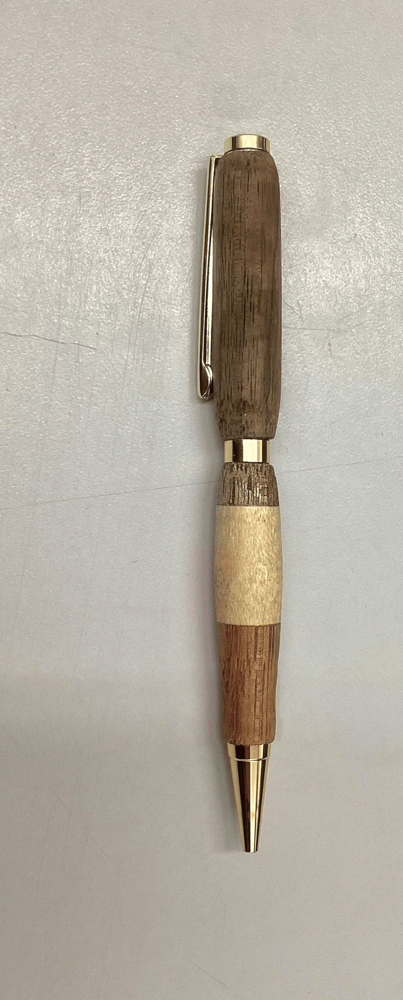
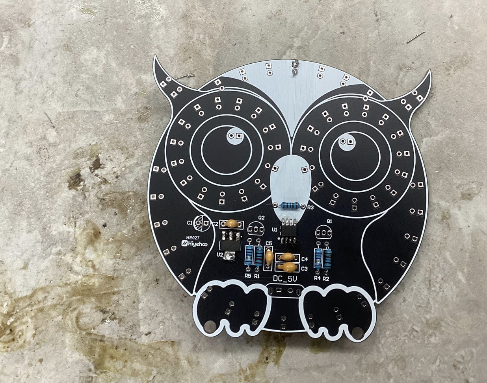

# Daily Journal

8-28 - Laser cut personal box to hold materials

9-1 - Begun the wood pen project

9-3 - Glued wood pen pieces togeher and waited for them to dry until the next day

9-5 - We drilled a hole through the two wooden pieces that we glued together and then put the metal shaft in the hole with super glue

9-8 - Sanded down the sides of the pen and then started to turn it

9-10 - Finished turning the pen 

9-12 - I assembled the pen and made sure that everything worked

9-18 - I wanted to do the pearl project but still was deciding

9-24-25 - I tried to decide what I am doing for my project. I am considering doing the Pearl ,project but am not sure because of football

9-25-25 - I decided that I was not doing the pearl project and started to think of other ideas I could do

9-26 - I had an idea to do a wooden scoreboard that updates live games, specifically the Carolina ,Panthers so you can see the score in real time on the board

9-29 - I did research on my project, figuring out things I would need to make it work. I used the link below for comparing the Raspberry Pi models and seeing which one worked best for the projectct https://socialcompare.com/en/comparison/raspberrypi-models-comparison

9-30 - I researched what type of wood I would need. The link for the wood I am thinking of using is below https://www.amazon.com/Walnut-Hardwood-Unfinished-Woodworking-Engraving/dp/B0BGJPDKC9/ref=sr_1_1_sspa?dib=eyJ2IjoiMSJ9.gUsOiHq67dtfxt1U_VQ4dTYEUkbNh_famtHiYpJ5QpqRtA450h0VsWHSnaWjj0zqvM7zEEwvhbwYppn6R_9OvC--dLu8DRhQ26Y-jhZQoUUdOIvVgbapU-lnD4R4os2WCAcf_VSNgXVwKYJkVH6Vr2obWF4-sm0zrIJ99PERhLIfu_FNWLlYVxMhvm_kSW-xF-tJoaxWwSjV8v9V_MJ5snNNw2XJ7ShlCgHCYGeMDCIL6M1moYHb_DjMOYRo7pv_cgMampEofQqZKQ6uHCzUT98-5MhG8X5-98tjNxbW7VA.Dcw0PzxSFJHqbMRiCVxZK1h3RdOviEKmLT9FpwL4a7o&dib_tag=se&keywords=walnut+wood&qid=1760012287&sr=8-1-spons&sp_csd=d2lkZ2V0TmFtZT1zcF9hdGY&psc=1

10-1 - I did more research on my project to try and figure out how I would make it work. To get live data, I needed to use an API. Most of them are paid for, but I found an ESPN one that should work. If this does not work, then I may need to find another solution. https://site.api.espn.com/apis/site/v2/sports/football/nfl/scoreboard

10-2 - I found more materials like these LED strips that will light up the engraved panthers logo https://www.superlightingled.com/side-emitting-4mm-ultra-thin-led-neon-flex-strip-lights-p-6099.html

10-3 - I created a Google Doc that helps me and my teacher visualize my idea and see any potential errors https://docs.google.com/document/d/1nw5ylel2ZrbF-HW83ZcTL0ofzCo5Q5WhvYyqAbZ7k_Q/edit?tab=t.0

10-6 - I found more pieces like this led light module below which will help me display the score of the game https://www.amazon.com/EC-Buying-MAX7219-Electronic-Components/dp/B0BXDJS22V/ref=zg_bs_g_306759011_d_sccl_3/139-5931038-1637611?th=1 or https://www.amazon.com/uxcell-Cathode-Segment-Display-Digital/dp/B07GTQWF4R/ref=zg_bs_g_306759011_d_sccl_2/139-5931038-1637611?th=1 or https://www.amazon.com/HiLetgo-Digital-Segment-Display-Arduino/dp/B01DKISMXK/ref=sr_1_3?crid=1WDQOB053FNZK&dib=eyJ2IjoiMSJ9.Np0RE7e9EVySouEVPqbavddCHAgqzqR3dO0dPpNf7-f7-6RpaLmcr3cG_zv0TgJlyAj4dtKT-_eYC5HFY5TcJkD1th9UX-K6PcksFYs0TV49oD95dAhoJoFOL-YkqKOI2TAWU5D1s2PfgrRPRfjgo1X1djVEaPNbdCTHrZYi7ii3KoPjiE8kcgRZIWMU8PQQY9NPFeEIfQKYrLOiLFRNfjctv4Yfl8nji9CJJDM4C7T_LGYziRJDJhXgNsdJ2LBPxlL24Jc6C1Kl__bhguirUt1j3do_XCt_UaBI5hCqv6Y.jSnkcrvbavJX5rROSa5QzcNYsbus0bBEislMH5VtWo0&dib_tag=se&keywords=led%2Bdigit%2Bmodule%2B2%2Bdigits&qid=1760014000&s=industrial&sprefix=led%2Bdigit%2Bmodule%2B2%2Bdigits%2Cindustrial%2C67&sr=1-3&th=1

10-7 - I worked through some of the fundamentals of the project and how I would get it to work. I realized I needed a Raspberry Pi with a wifi module so it could connect to the live scores that I would program it to receive and display.

10-8 - I looked over the laser cutting workflow to make sure I knew how to use it

10-9 - I added more things to the Google Doc that I linked for 10-6 to give me a better idea of how I would do my project

10-10 - I finished the spreadsheet with all of my materials and included the ones that we may have at the fabla,b like wiring, sandpaper, wood varnish, resin, etc... https://docs.google.com/spreadsheets/d/1inqLF94JXjDDkbQPFtxw10qv6yk3-GvXojiwrM2xEpA/edit?gid=0#gid=0

10-13 - I worked on 3d printing and laser cutting. I printed a snake, and then while it was printing reviewed my project for any missing materials.

# Projects

## Pen Project

#### Overview

This was the first project of the year. The goal was to create a functional pen made up of two pieces of wood, and the other tools given to use in the pen kit. 

#### Steps

1. We chose pieces of wood from a box that we thought would look good on our pen
2. we cut the pieces of wood so that it was slightly longer than the brass tube that would later be inserted through the middle
3. Once the wood was cut to the appropriate length, the pieces were glued together
4. clamps were used so that the wood would be tightly glued and centered
5. The next day, the glue was hardened so a hole was drilled through the middle of the two pieces
6. The sanding machine was used to smooth out the corners of the wood so that when the pen turning machine was used the risk for chipping would be lower and it would be smoother
7. The wood was then put on the pen turning machine, and a metal toolbar was used to shave it down to a smaller, rounder size
8. After we got the wood to the right size it was sanded down to make it smoother
9. a liquid was used to make it smoother and shinier
10. A machine was used to press the pieces of wood and the other parts from the pen kit into the final pen

Tools used:

- Sanding machine
- Pen turning machine
- Pen pressing machine
- Saw

#### Finished Picture of Pen

#### Reflection

This project was really fun, and it helped me learn more about a lot of the machines that I hadnt ever used or havent used in a while. One of the things that I struggled with was gluing the wood agaisnt the grain, which made it so that when turning the pen, it would chip very easily. I also got one of the tools stuck in my wood when drilling the hole in the middle. I then had to use a hand drill to do it instead. The project was hard, but really fun and helped me learn a lot of things that ill need to use for my capstone project.

## Owl Soldering Project

#### Overview

The owl project was a kit consisting of a board, led lights, usb-c port, resistors, and other items. The goal was to install all of the parts, and have it light up like an ornament. 

#### Steps

1. install the resistors
2. install capacitator
3. install LED lights
4. Surface mount

#### sucesses

In the end, I got my board to work. In the process, I learned a lot about soldering, and got more experience. 

#### Setbacks

I glued a lot of my LEDS on the wrong side of my board. Because I already did so many, I had to restart my board completely. I struggled with this because we really only had a couple of days in class to work on it so I had to find time outside of class to come and work on it. I eventually got all the LED's on the right side of the board, however I had an issue with the USB-c port. My USB-c port fell off because I did not get it all the way in when soldering. I had to use the solder sucker to get it out, and the redo it. I got more experiecne because of this so in the end it was probably a good thing.

#### How I overcame setbacks

I realized that I needed to put more work into the proejct after class. I also learned that if I wanted to overcome then i needed to communicate with my teacher.

#### What did I learn

I learned how to use the solder sucker, as well as how to be better at soldering. I got better at cleaning the tip of the soldering iron and being more careful about where I place components. I learned it is better to go slower and make sure everything is right than try to rush through everything and have to start over, because in the end it will take longer that way. 

#### Pictures of Owl Project

## Capstone Project: Wodden Scoreboard

#### Link to design specs and spreadsheet

Design Specs: https://docs.google.com/document/d/1B3yqlRBjaSyJo14gAYQvdTI4_eG2g5yNZneb4KKwpP4/edit?tab=t.0

Spreadsheet: https://docs.google.com/spreadsheets/d/1inqLF94JXjDDkbQPFtxw10qv6yk3-GvXojiwrM2xEpA/edit?gid=0#gid=0

#### What I am doing

I have been working on planning out my project. My project is a wooden scoreboard that updates live sports games, specifically the Carolina Panthers. The scoreboard will be made out of a piece of wood about an inch think, and will have a panthers logo engraved into it. Below, there will be an LED display that shows the score of the game. On the right side of the panthers there will be an NFL logo engraved which acts as a logo for the team they are palying agsainst. In addition to the score, there will be leds displaying who has the ball, what yard line the team is on, and the quarter and time remaining. Below is a link to a google doc I made that goes more in depth ablout specifics.

Google Doc: https://docs.google.com/document/d/1nw5ylel2ZrbF-HW83ZcTL0ofzCo5Q5WhvYyqAbZ7k_Q/edit?tab=t.0

