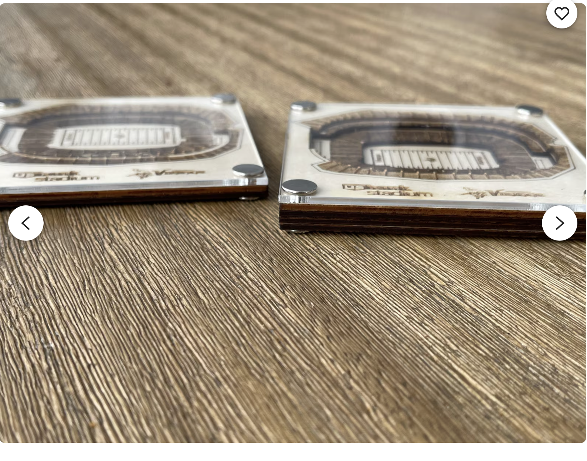

Project Overview

My project is a 3d, wooden scoreboard that displays scores from Panthers NFL games. This idea came from a combination of two inspirational projects. listed below

1st project: NFL Scoreboard

This project was a scoreboard completely made out of LEDs, which updated live when teams scored in an NFL game. The scoreboard featured clock time, what down it was, as well as displayed each team's logo. This is the core idea of my project, but it differs in the fact that mine will be made mostly out of wood. This is where the second project also has inspiration

2nd project: Wooden Coasters

This project inspired me to make my scoreboard out of wood. It also inspired me to make the scoreboard 3d. As seen in these wooden coasters, there are 4 layers of wood. Each layer is a different piece of the stadium, with the top layer being the top of the stands, and the bottom being the field. This creates a miniature replica of the stadium. For my project I will be doing the same thing, except it will be bigger, slightly thicker, and will be Bank of America Stadium where the Carolina Panthers play.

Additionally, below the 3d stadium will be the Panthers logo as well as the old Panthers font, which you can see in the picture below. Between the stadium and the logo/panthers font will be the LED display that will show the scores.

### Tools needed

Laser cutter:

The laser cutter will be important because it will need to engrave each layer of the stadium into my wood, as well as holes I will potentially need to put in an LED that will display scores

soldering iron:

I will need to use this so that I can connect any wires that are needed for the scoreboard
Below are some of the materials I will need

### Materials

[Walnut plywood (1/4 inch thick](https://lonestaradhesive.com/products/1-4-walnut-plywood-12x19?variant=52480538935571&country=US&currency=USD&utm_medium=product_sync&utm_source=google&utm_content=sag_organic&utm_campaign=sag_organic&tw_source=google&tw_adid=&tw_campaign=20957650293&tw_kwdid=&gad_source=4&gad_campaignid=20957651508&gbraid=0AAAAAqwolij8gKq07yb8xhRC9alc7rsyN&gclid=Cj0KCQiAyP3KBhD9ARIsAAJLnnagwwtK9tLARAZiDVeM5XS63_sv9lstfnapxXvEPmFIDqBT6i0PGokaAls1EALw_wcB)

I will need 6 pieces of this plywood. My goal was to make the scoreboard roughly an inch and a half thick. Each piece of plywood is 1/4 inch thick, meaning that 6 pieces will be right around an inch and a half. Since the 3d part of the stadium will be 4 layers, I will have two extra layers that serve as a base layer, which will have no engraving. I thought this wood looked very cool and unique, so that is why I chose it.

[Bank of America Stadium SVG file](https://www.google.com/aclk?sa=L&ai=DChsSEwiT5IHjwvyRAxVJSEcBHTNNIfQYACICCAEQDhoCcXU&co=1&gclid=Cj0KCQiAyP3KBhD9ARIsAAJLnnYkPNSqKr3lQBSfT7Nr-duJuzMl8lXFjyzlv-dPxAA5LDnVbPwbkcQaAiBsEALw_wcB&cid=CAAS3gHkaBDx4Ayv1cOILNajxhmU6r9cioMK8Bva7OLwxiv_XwkrZmb5zF-u-9TssZKvqnPWRVxzW4q6csu1i9Z_NPCN_EHJfK-tIVYGWElkZ0fNWJmhzzz6LS3y6_xr3vF-N0foYxpsfduuc3S69wJaQphAnMMzEW5QpW-PBbCpdaWCdDgADWZBrhAm7P7ML6QVXvT63LsR7k5ZzS4fQV1Xr0A6dUACVifw9Xj0QhjDoGVN56kZ-c227LY5aXVggHn37_mZUrI9MnFpo05vjyoXx8gs0M5HZOBo9d9UtyeLmEo&cce=1&sig=AOD64_32MlyyV_ZvpQLhJbfajvzbFzjelQ&ctype=5&q=&ved=2ahUKEwj7oPniwvyRAxX0KVkFHWuAKpEQ9aACKAB6BAgLEBk&adurl=)

This is an SVG file that has 4 layers. This will allow me to engrave the stadium on each layer of the plywood. It is also possible for me to make my own file, but it would be difficult since I would have to use Google Earth satellite images to get an outline of the stadium, and it may not turn out as good as a file that has already been made and enhanced.

Raspberry Pi 3

I will need a Raspberry Pi because it will act as the computer that will retrieve the scores from the game and display them

Wood glue

Wood glue will be needed to glue each piece of wood together

Wires

Although I am not at this stage yet, I will likely need some wires so that I can connect anything that may be needed for the scoreboard

LED displays

I am still working on exactly what display I will buy, but I want it to look good and go along with the wood.

Additional Info:

I will need to use a software like inkscape so that I can get all the layers of the stadium laser cut
