## Exploring IP Addresses

Answer the following in complete sentences in a well-written paragraph on your digital portfolio:

Are your internal and external IP addresses the same or different?
They’re different. The internal one only works inside your own network, and the external one is what shows up online.

Which IP belongs to your local network?
The internal/private IP is the one that your local network uses.

Which IP belongs to the internet?
The external or public IP is the one that’s used when you’re actually on the internet.

Why might a virtual machine use Network Address Translation (NAT) when connecting to the internet?
A VM uses NAT so it can go online through the host computer’s connection without needing its own public IP.

How does Shared mode make it easier to connect multiple virtual machines on one computer?
Shared mode helps because all the VMs can use the same internet connection without a bunch of extra setup.

IP a in shared:  

IP a in bridged: 

Whatismyipaddress results

Shared: 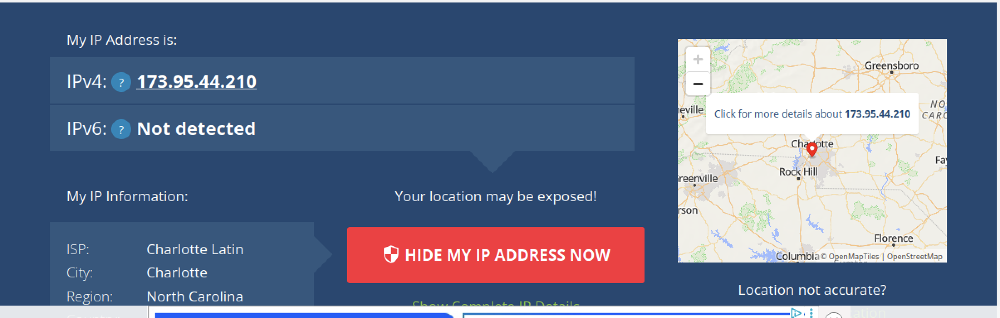

Bridged: 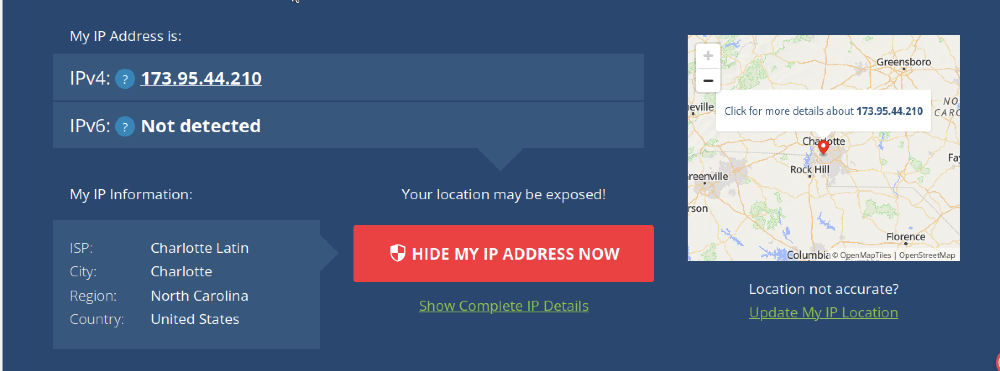

Answer the following in complete sentences in a well-written paragraph on your digital
portfolio:

How did your internal IP address change when you switched to Bridged mode?
The internal IP changed because switching to Bridged mode put the VM on a different part of the network, so it got a new private IP address.

Did your external IP address change or remain the same?
The external IP stayed the same since the VM was still using the same internet connection from the provider.

In Bridged mode, does your virtual machine act more like a separate computer or a computer behind another device?
In Bridged mode, the VM acts more like its own separate computer on the network instead of being hidden behind the host.

Why might an organization choose Bridged mode instead of Shared (NAT) mode?
An organization might choose Bridged mode so the VM can directly communicate with other devices on the network without extra steps.

What security or management challenges could come with using Bridged mode?
Bridged mode can cause issues because each VM is fully visible on the network, which can make security and managing devices more complicated.

Table: | Mode         | Internal (Private) IP | External (Public) IP | Notes                                                                 |
| Mode         | Internal (Private) IP | External (Public) IP | Notes                                                                 |
|--------------|------------------------|------------------------|------------------------------------------------------------------------|
| Shared (NAT) | 192.168.64.3/24        | 173.95.44.210         | The internal and external are different, but the external stays the same. |
| Bridged      | 10.12.25.4/20          | 173.95.44.210         | The internal and external are very different in this mode. |

#### Write a short paragraph (5–7 sentences) beneath your table addressing the following:

• Which mode made your VM appear as its own device on the local network?
• Which mode provided a safer, more controlled environment?
• How does NAT help manage limited IPv4 addresses and improve security?
• What did you learn about how data travels from a device to the internet?

Bridged mode is what made the VM show up as its own device on the network instead of being hidden behind the host. Shared (NAT) mode was the more secure option because it keeps the VM tucked behind the main computer, which gives you more control. NAT helps deal with the shortage of IPv4 addresses by letting a bunch of devices share one public IP while still having their own private ones. It also improves security since outside devices can’t directly reach the VM. I learned that data has to go through your router and whatever network setup you’re using before it reaches the internet, and then comes back to the right device.

#### Write a short reflection (1 paragraph, 5–8 sentences) below your screenshots that answers these:

• How did your IP addresses change between Shared and Bridged mode?
• What did this experiment teach you about how local and public networks communicate?
• Why might IT professionals use different network configurations for home, business, or lab environments?
• Which mode do you think is best for classroom use, and why?

Switching between Shared and Bridged mode caused the internal IP to change, while the external IP stayed the same the entire time. This showed how local networks use private addresses, while public networks rely on a single external address to communicate online. The experiment demonstrated how routers and NAT translate between these two spaces to keep traffic organized. IT professionals choose different network setups depending on security needs, the level of access required, or how much control they want over devices. For classroom use, Shared (NAT) mode is the better option because it provides safer, more controlled access and keeps student devices protected behind the host system.

## Network Topology

Star Topology
Description:
A main device, usually a switch or hub, sits in the center while all other computers plug directly into it. This setup is simple to organize, easy to fix when something goes wrong, and can grow without much trouble.

Screenshot:
IMG_2405

Bus Topology
Description:
One long cable acts as the main line, and each device connects to it with a short branch. All devices share this single pathway to send and receive information.

Screenshot:

Ring Topology
Description:
Devices connect in a circular path where each one links to the two devices next to it. Data moves around the loop in a set direction, or in both directions if the network uses a dual-ring design.

Screenshot:

Mesh Topology
Description:
Devices link to several other devices, creating many possible routes for data to travel. This layout offers strong reliability because the network can still work even if one connection fails.

Screenshot:

Hybrid Topology
Description:
A mix of different topology types combined into one network. For example, multiple star networks can be joined together using a bus or ring, giving the network more flexibility and room to expand.

Screenshot:

### Reflection Paragraph:

Write one complete, well-structured paragraph that answers the following:
1. Which topology would be easiest to set up for a small business, and why?
2. Which topology would be the most reliable if one connection fails?
3. Which topology would be most expensive to implement, and why?
4. Which topology do you think your school uses? Provide reasoning.
5. How does the physical layout of a topology affect speed and reliability?

For a small business, the star topology is usually the simplest to set up because it only needs one main switch and direct connections to each device, making installation and maintenance easy. The mesh topology is the most reliable when a single connection fails since it gives the network multiple alternate routes for data to travel. This same mesh design is also the most expensive to build because it requires a large number of cables and links between devices. A school environment is most likely supported by a hybrid topology, as larger organizations often combine several star networks or other layouts to serve different areas of the campus efficiently. The physical design of a topology affects performance by influencing how far data must travel and how much traffic builds up on certain paths. Redundant designs also improve stability by keeping the network running even if part of it breaks. Because of these factors, the chosen topology plays a huge role in cost, speed, reliability, and how well a network can grow over time.

### Cable construction

Photos

1. Twisted Pairs

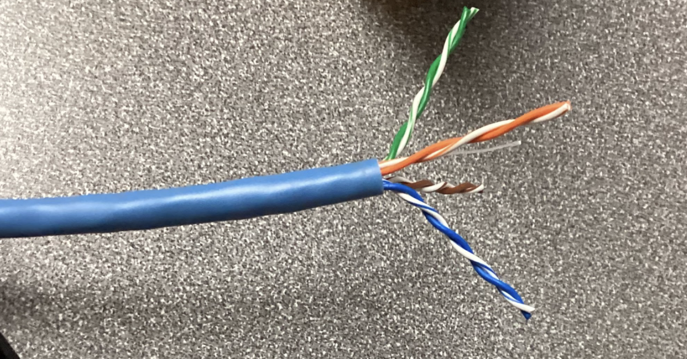

2. aligned wires

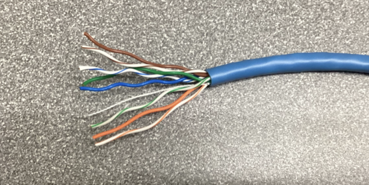

3. Stripped Cable

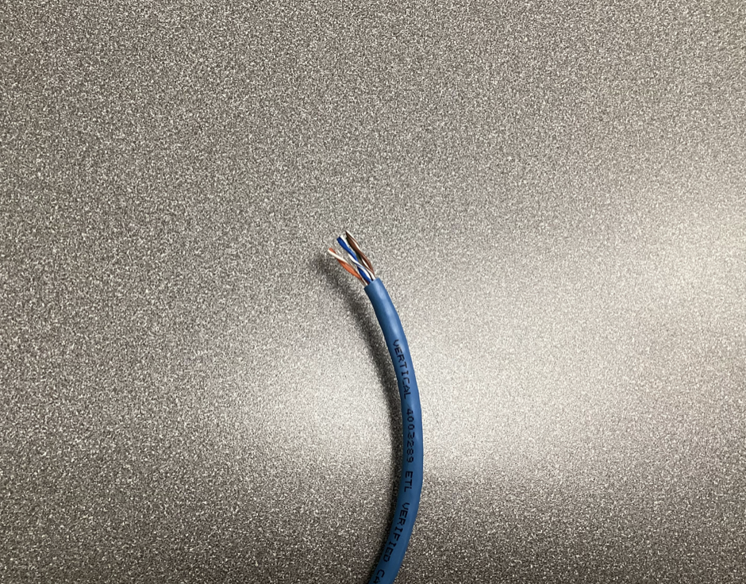

#### Reflection: 

When I was making the Ethernet cable, the part that gave the most trouble was getting the wires straight enough to actually slide into the connector. They kept bending and not staying in the right spot, so that took way longer than expected. Also, there were multiple times where I had gotten them in the correct order, but they came undone because i pulled too hard on one of the pieces when trying to take it off. The rest of the project was pretty easy, but I also did not know some of the names of the tools, which made it a little harder to follow the instructions. Another somewhat difficult part was stripping the wire since the tool did not always cut far enough, and you had to twist out the surrounding material to get the wires. Overall, though it was an interactive project that I found interesting, but maybe also a little bit frustrating. 

## OSI Layer Activity

1. Ip Link Show

The ip link show command displays all the network interfaces that the Ubuntu VM has available. The interface that was actually being used was enp0s1, which works as the VM’s virtual network card. The MAC address is what identifies that specific interface on the local network so other devices know what it is. The broadcast address is there so messages can be sent out to every device on the same LAN at once.

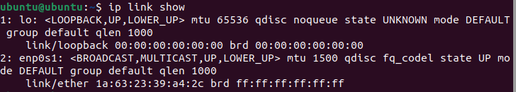

2. Arp n

The arp -n command shows a list of devices on the network along with the MAC addresses that match their IP addresses. These entries are basically the machines the VM has talked to recently. ARP is what lets a device figure out which physical address goes with which IP so the data actually reaches the right place on the local network.

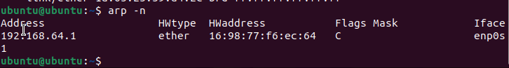

3. Ip s link

The ip s link command shows the amount of traffic moving through the active network interface, including how many packets were sent out and how many were received. It also lists extra details like errors, the connection speed, and whether the link can send and receive at the same time. The output showed a 1000Mb/s full-duplex connection, which means data can go both ways without waiting. The TX and RX numbers basically show how much the VM’s network has been doing.
   
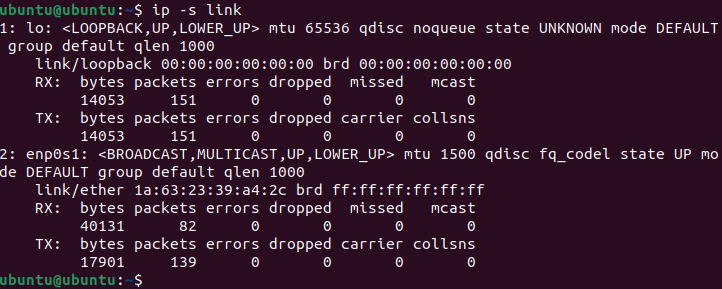

4. TCP dump

This command captured five packets of live network traffic. Each packet displays a source MAC address (sender) and a destination MAC address (receiver). The captured traffic included ARP and IP packets, showing that my VM was exchanging basic network information and possibly ping responses. This demonstrates how data physically moves between devices at OSI Layers 1 and 2.
   
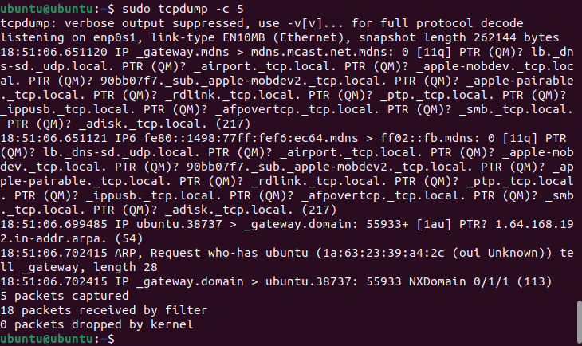

### Reflection:

This lab helped show how the Ubuntu VM talks on the network using its interface, IP address, and MAC address. The MAC address stays the same and identifies the device on the local network, while the IP address can change depending on the connection. ARP connects the two by matching each IP to the right MAC address so the VM knows where to send its frames. Watching the live packets with tcpdump made it easier to understand what is actually happening when data moves across the network. The capture showed real frames being sent and received, along with the addresses they were going to and from. It also made it clearer how Layer 1 deals with the signals themselves, while Layer 2 puts those signals into frames and makes sure they reach the right device. Seeing all of this together showed how these lower layers support everything else on the network.

#### What I Learned

Layers 1 and 2 work together to make sure devices can actually communicate on a network. The Physical Layer (Layer 1) deals with the signals that travel through cables or wireless connections, basically the raw bits being sent from one place to another. The Data Link Layer (Layer 2) takes those bits and forms them into frames, using MAC addresses to make sure the data reaches the right device on the local network. Commands like ip link show, ethtool, and tcpdump helped show what is happening behind the scenes when a device connects and sends traffic. Learning how these layers work is important for fixing network issues and understanding how data moves between devices in the first place.

## SOHO Network Activity

Screenshots

1. Computer A Ip

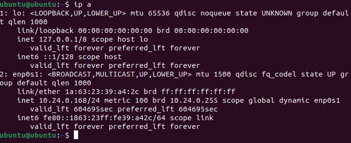

Computer B IP

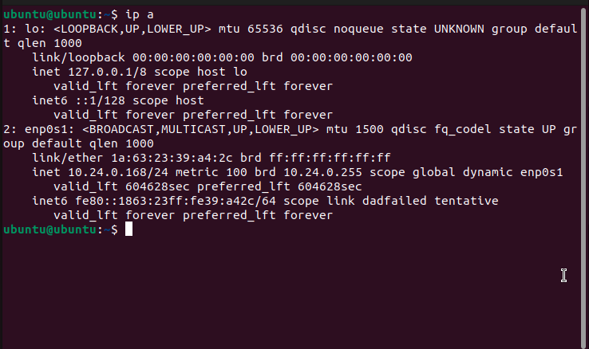

3. UFW Firewall
   
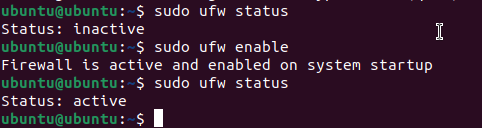

4. Traceroute

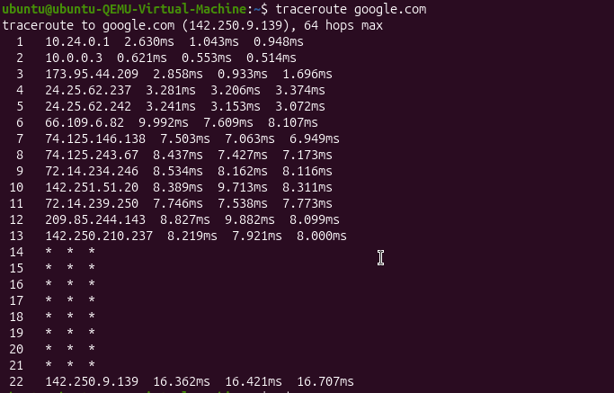

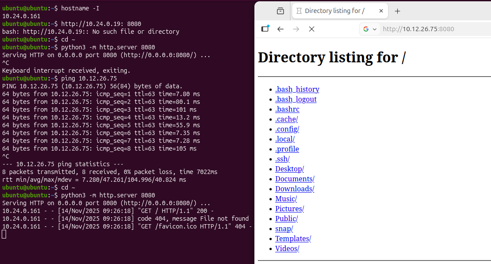
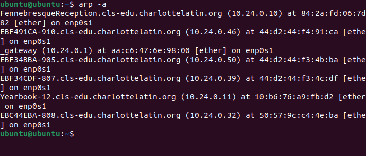
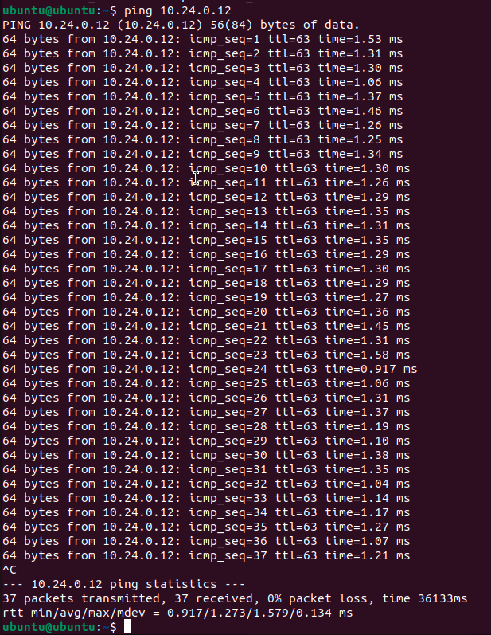
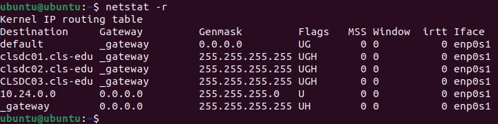
