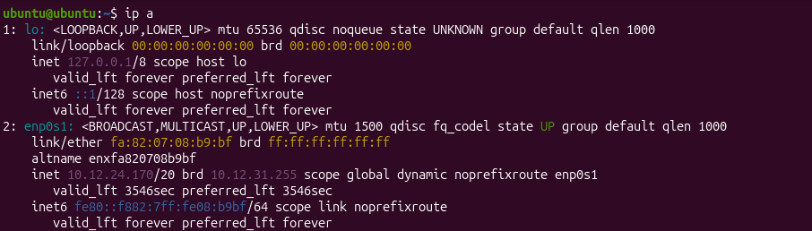
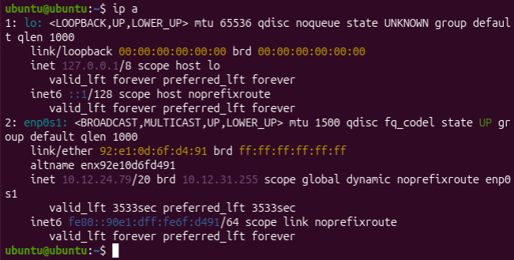
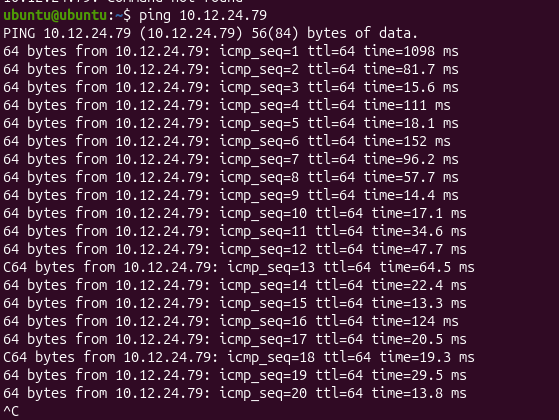
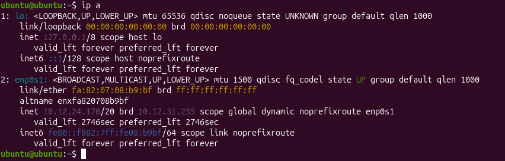
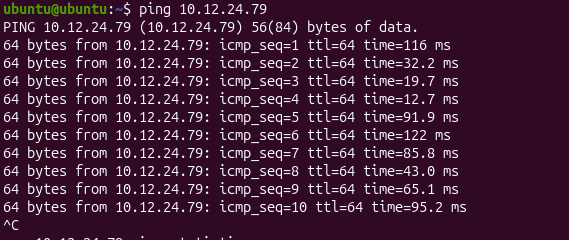

# Scenario

Your job today is to work with a partner to figure out why two computers connected directly with an Ethernet cable cannot communicate.

Both computers are currently running Ubuntu virtual machines.  
Both computers are connected with a working Ethernet cable.  
Yet—no matter what the teacher tries—they still cannot ping each other.

Your challenge is to diagnose the problem step-by-step, collect evidence, and explain why Layer 1, Layer 2, and Layer 3 are (or are not) functioning.

You will document all findings in your digital portfolio.

This is meant to simulate a real networking troubleshooting ticket.

# Learning Goals

By the end of this activity, you should be able to:

1. Examine networking behavior at OSI Layers 1, 2, and 3.  
2. Diagnose why two devices on a network cannot communicate.  
3. Check physical connections, MAC addresses, and IP addressing.  
4. Explain how switches, routers, and virtual networks impact direct device-to-device communication.  
5. Use ip a, ping, and network reasoning to justify your conclusion.

# PART 1 — Physical Layer Check (Layer 1)
**Time: 5 minutes**

1. With your partner, confirm that the Ethernet cable is:
   - firmly plugged into both Mac desktops  
   - the correct type (straight-through or crossover; pre-made cables will be straight-through)

2. In Ubuntu on each VM, open Terminal and type: ip a

3. Scroll and locate the wired interface, usually enp0s1.

4. Look for:
- state UP  
- link/ether <MAC address>

If the interface shows state DOWN, that means Layer 1 (physical) is not active.

### Digital Portfolio Evidence #1
Take a screenshot of ip a from both VMs, showing the wired interface status.




# PART 2 — Data Link Layer Check (Layer 2)

To communicate directly, both VMs must be on the same Layer 2 network.

1. Compare the MAC addresses on each VM:
- They should be different.  
- If identical: the VMs are using duplicated virtual NICs → communication will fail.

2. Try to ping each other using MAC broadcast behavior:
- Find your partner’s IP address (you will fix this in the next part).  
- Try:
  ```
  ping <partner_IP>
  ```

3. If you get: Destination Host Unreachable

that usually means Layer 2 cannot find the partner’s MAC address.

### Digital Portfolio Evidence #2
Screenshot your ping attempt AND write one sentence explaining what Layer 2 behavior you observed.



# PART 3 — Network Layer Check (Layer 3: IP Addressing)

Now you must determine whether the issue comes from IP configuration.

Direct connections only work if both computers are on the same subnet, for example:

- Computer A: 192.168.10.2/24  
- Computer B: 192.168.10.3/24  

BUT on virtual machines in UTM, you will likely see something like:

192.168.64.2  
on both machines, which looks the same — but they are NOT on the same network.

They are in two separate private host-only networks created automatically by UTM.

That means:
- They look like they share a subnet  
- But they are actually behind different invisible switches, so they cannot see each other.

This is the exact failure scenario.

### Task

1. On each VM, run: ip a

2. Compare the IPs.

3. Answer:
- Are the IPs identical?  
- If so, what does that suggest?  
- Are the VMs actually on the same network even if the IPs match?

(Hint: The answer is no. You should understand the reasoning.)

### Digital Portfolio Evidence #3
Insert both IP screenshots and write a paragraph explaining why Layer 3 addressing cannot work under this configuration.




# PART 4 — Test Ping Again (Confirming Failure)

Run: ping <partners_IP>

Record the result.

You will almost certainly get: Destination Host Unreachable

Explain why this happens in terms of OSI Layers.

### Digital Portfolio Evidence #4
Screenshot your ping failure  
AND  
Write 2–3 sentences describing which OSI layer is responsible.



# HOMEWORK → PART 5 — Final Reflection Paragraph

Using what you learned about:

- Layer 1 (physical link)  
- Layer 2 (MAC addressing & broadcast domain)  
- Layer 3 (IP networks, subnets)  
- Virtual networking inside UTM  

Write a well-structured reflection paragraph answering:

1. Why couldn’t the two computers communicate even though they were connected with a working Ethernet cable?  
2. Which OSI layer(s) caused the failure?  
3. Why does UTM prevent two VMs from communicating directly in Host-Only mode?  
4. What configuration change would allow communication between the two computers?  
5. In a real SOHO network, how do routers and switches prevent similar issues?
